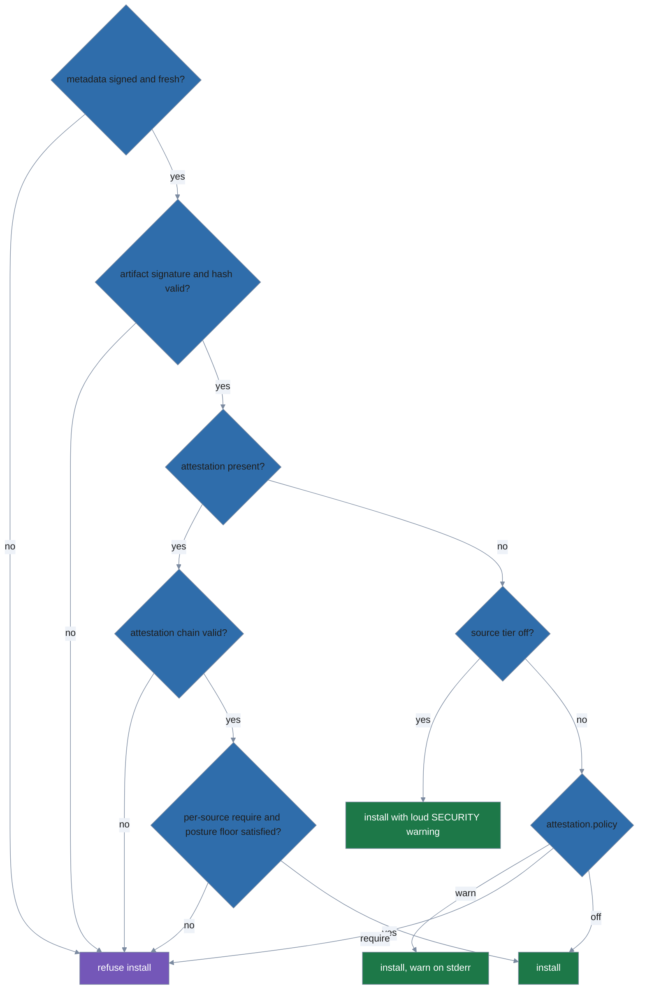

# polypkg

[](https://github.com/trevor-vaughan/polypkg/actions/workflows/test.yml)
[](https://github.com/trevor-vaughan/polypkg/actions/workflows/lint.yml)
[](https://github.com/trevor-vaughan/polypkg/actions/workflows/security.yml)
[](https://pkg.go.dev/github.com/trevor-vaughan/polypkg)
[](LICENSE)

`polypkg` is a declarative package manager for Linux, macOS, and FreeBSD. You describe what should be installed in a profile file; `polypkg apply` makes the system match it. Each apply creates an immutable generation, so if something breaks you can return to the previous state with a single command.

----

> 🤖 LLM WARNING 🤖
>
> This project was written with LLM (AI) assistance.
>
> 🤖 LLM WARNING 🤖

----

## Background

Why did I make this? Honestly, we have a ton of package managers that all have different warts from growing organically
over the years. I wanted to see what would happen if I let an LLM go ham trying to write the "perfect" package manager
with support for everything I could possibly think of. Will it be good? I have no idea?! But it's an interesting
experiment.

Try it, have fun, see if it sucks, throw rocks at it!

## Install

```
task build    # produces bin/polypkg
task install  # copies it to ~/.local/bin/polypkg
```

`task install` runs `build` first, then uses the system `install(1)` to place the binary at `~/.local/bin/polypkg` (mode 0755). Make sure `~/.local/bin` is on your `$PATH`.

Or install the latest tagged release straight from source with the Go toolchain:

```
go install github.com/trevor-vaughan/polypkg/cmd/polypkg@latest
```

This builds and drops `polypkg` into your `$GOBIN` (default `~/go/bin`); make sure that directory is on your `$PATH`.

This project uses [Task](https://taskfile.dev) as its task runner; run `task --list` to see all available targets.

## Quickstart

```
polypkg init                 # set up your profile (scope, source URL, trust key)
polypkg search <name>        # find a package in your sources
polypkg install <name>       # add it to the profile and apply
polypkg list                 # show what's installed
polypkg upgrade              # re-apply; range-constrained packages pick up newer versions
polypkg remove <name>        # remove it from the profile and apply
polypkg rollback             # revert to the previous generation
```

**`polypkg init`**: writes a profile at the scope's default location (`~/.config/polypkg/profile.yaml` for user scope). Without `--source-url` and `--trust-root-file` it presents an interactive wizard on a TTY. For non-interactive or CI use:

```
polypkg init --source-url <URL> --trust-root-file <path>
```

The source is recorded as `native` by default; if the repository was published
under a different name, pass `--source-name <name>` to match it — each source's
name must equal the name embedded in its signed trust document, and a mismatch
is refused at fetch time (with a hint naming the correct source).

**`polypkg search <name>`**: queries your configured source for packages whose name contains `<name>`. Marks packages that are already installed.

**`polypkg install <name>`**: resolves the package, writes it into the profile, and applies. A bare name (`hello`) pins the newest available version as a `>=` floor. `<name>@<version>` pins exactly (`hello@1.2.3` writes `=1.2.3`). `<name>@<constraint>` is written verbatim (`hello@">=1.2"`). Validation is all-or-nothing: if any requested package is unknown, nothing is written.

**`polypkg list`**: shows installed packages in the current generation, including any exact pins.

**`polypkg upgrade`**: re-applies the profile so range-constrained packages pick up newer versions. Exact pins (`=X.Y.Z`) with a newer version available are reported as held back. Pass one or more package names to bump those exact pins to the newest available version.

**`polypkg remove <name>`**: removes the package from the profile and applies. All-or-nothing: if any named package is absent from the profile, nothing is written.

**`polypkg rollback`**: activates the previous generation. Pass `--to <N>` to target a specific generation number.

## How it works (the declarative core)

The imperative verbs above are sugar: `install`, `remove`, and `upgrade` edit the profile file and then call `apply`. Power users can edit the profile by hand and run `plan`/`apply` directly.

`plan` shows what would change (exit 2 = changes pending, exit 0 = nothing to do). `apply` makes the system match the profile and records an immutable generation.

A profile looks like this:

```yaml
# polypkg profile: the single source of truth for what's installed.
# Edit this file to add or remove packages, then run:
#   polypkg plan    (preview changes)
#   polypkg apply   (apply them)
schema: polypkg.spec/v1

# A short identifier for this machine (alphanumerics, hyphens, underscores).
name: my-machine

scopes:
  user:                   # installs under your home directory; no root required
    substrate: store      # content-store backend (the default and recommended choice)

sources:
  order: [native]         # priority order: the first source that has a package wins
  native:
    type: polypkg-native
    # URL of the package repository.
    url: https://repo.example.com/polypkg
    # Path to the repository's minisign public key (.pub file).
    # Obtain this from your repository operator.
    trust_root: /etc/polypkg/repo.pub
    # Optional (air-gap grace): accept this source's EXPIRED signed metadata
    # until this RFC3339 deadline. See the note below.
    # accept_expiry_until: "2027-01-01T00:00:00Z"
    # Optional (supply-chain hardening): pin THIS source's sigstore trust root.
    # When set it is authoritative — the source's mirrored root is ignored. See
    # the note below.
    # sigstore_root:
    #   valid_from: "2024-01-01T00:00:00Z"
    #   fulcio_ca: ["<base64 DER Fulcio root cert>"]
    #   rekor_keys: ["<base64 Rekor public key>"]

packages:
  user:
    hello:
      version: ">=1.0.0"   # any 1.x or newer; use "=1.0.0" to pin exactly
```

Note: `trust_root` is a file path to the repository's minisign public key (`.pub` file), not an inline key. Obtain the key from your repository operator.

**`accept_expiry_until`** (optional, RFC3339). Freshness grace for an air-gapped or frozen mirror: when this source's signed metadata (index, trust document, trust bundle, revocation list) has expired, polypkg still accepts it as long as the current time is at or before this deadline.

Grace relaxes the wall-clock freshness bound **only** — the anti-rollback serial floor is still enforced, so a mirror can never be pinned to an *older* snapshot. Every `apply`/`plan` that uses grace prints an unsuppressible `SECURITY:` line, and each `apply` records a `metadata.expiry_graced` audit event.

`polypkg status` also surfaces the grace posture offline (recorded per source at the last fetch): a `grace: N source(s)` count on the default summary and, under `-v`, a `freshness grace:` section listing each source's graced documents and flagging `[window EXPIRED]` once the `accept_expiry_until` deadline itself has passed.

A graced revocation list is still fully enforced at its last-known state; only revocations published *after* the frozen snapshot are missed.

**`sigstore_root`** (optional). A consumer-pinned sigstore trust root for this source: `valid_from` (RFC3339), optional `valid_until` (RFC3339, open-ended if absent), `fulcio_ca` (base64 DER Fulcio CA cert chain), `rekor_keys` (base64 Rekor public keys), optional `ctlog_keys`. When set, it is **authoritative** for verifying this source's sigstore-format carried attestations — the root mirrored in the source's trust bundle is **not** consulted.

This closes a chain-degradation gap: a mirror that controls its own trust bundle could otherwise stand up a Fulcio CA and mint a certificate bearing any identity, forging a `verified-offline` binding; pinning the root defeats that, exactly as pinning a builder key (`builders.allow.key`) defends the builder-signature path.

The pin is window-checked against each attestation's Rekor integrated time, so a pin whose window excludes the attestation is not used (the binding falls back to `verified-transport-only`). When absent, the mirrored root is used (the default).

Default profile resolution: `$POLYPKG_PROFILE` if set, otherwise the first existing `profile.{yaml,yml,jsonc,json}` in the scope's config directory (`~/.config/polypkg` for user scope, `/etc/polypkg` for system scope).

### Weak dependencies

Package recipes may declare two kinds of optional dependency:

```yaml
# inside a polypkg.yaml (package recipe)
recommends:
  - name: jq             # install if satisfiable; skipped if it conflicts or is unavailable
    version: ">=1.6"
suggests:
  - name: bat            # surfaced in plan/apply output only; never installed automatically
```

`recommends` entries are pulled in automatically after the hard dependency solve succeeds. If a recommend conflicts with the already-selected set or cannot be found, it is dropped and reported — it never causes the overall install to fail. `suggests` entries are advertised but never installed regardless of policy.

**Policy.** By default recommends are installed. To disable them for a profile:

```yaml
# profile.yaml
recommends:
  install: false
```

To suppress them for a single run without editing the profile, pass `--no-recommends` to `plan` or `apply`. Flag takes precedence over the profile block.

**Output.** `plan` and `apply` list skipped recommends under "skipped recommended packages:" and surfaced suggests under "suggested (not installed):". `status -vv` shows each package's `[weak]` tag and which package(s) recommended it. `info <package>` shows the `recommends:` and `suggests:` lists from the newest catalog candidate.

### Multiple sources

`sources.order` is a priority list. When more than one source offers a package
with the same name, the **first source in `order` that has it wins**; lower
sources are shadowed for that name. To prefer a different source's build, move
it earlier in `order` or pin the package.

Pin a single package to a specific source with `source:`:

```yaml
sources:
  order: [stable, edge]
  stable:
    type: polypkg-native
    url: https://repo.example.com/stable
    trust_root: /etc/polypkg/stable.pub
  edge:
    type: polypkg-native
    url: https://repo.example.com/edge
    trust_root: /etc/polypkg/edge.pub

packages:
  user:
    tool:
      version: ">=1.0.0"
      source: edge      # always resolve `tool` from `edge`, ignoring order
```

Each source is verified independently against its own `trust_root`; an artifact
is only ever accepted under the signing keys of the source it came from. If any
configured source is unreachable, the operation fails rather than silently
falling back to a lower-priority source.

### Managing sources

`polypkg source` edits the profile's source list without hand-editing YAML. Comments and formatting are preserved.

```
polypkg source list
polypkg source add <name> --url <http(s)|file://>  --trust-root <path-to-.pub>
polypkg source add <name> --url <...> --trust-root-url <url> --trust-root-yes
polypkg source remove <name>
```

`add` validates the URL and trust root before writing; the trust root can be a local `.pub` file (`--trust-root`) or downloaded and TOFU-confirmed from a URL (`--trust-root-url`, confirm with `--trust-root-yes` when not on a TTY). `remove` blocks removal of the last source because a profile with no sources is invalid; it also deletes the trust-root key that `--trust-root-url` persisted for that source, while leaving externally-supplied `--trust-root` files untouched. Each named source must match the name embedded in its signed trust document.

#### Recovering after a repository is re-created

polypkg remembers the highest serial it has ever seen for a source's metadata (index, trust document, and — if published — trust bundle and revocation list) and refuses any fetch that looks like a rollback.

If a repository is legitimately rebuilt from scratch (new signing key, serials reset to 0), that protection will correctly but unhelpfully treat the rebuild as a downgrade and refuse it. `polypkg source remove <name>` clears the locally-remembered trust state for that source; re-adding it with `polypkg source add <name> ...` re-pins from scratch against the new trust root.

Publishers should never need this: always **increase** a serial to fix a bad release or ship an update — never reuse or lower one.

### Supply-chain verification

Everything a source serves is verified before it installs:

1. **Signed, fresh metadata.** A source's trust document and index are minisign-signed and carry a monotonic serial plus an `expires` bound. Metadata past its `expires` (with a small clock-skew tolerance) is refused with a "stale metadata refused; the publisher must re-sign" error — a mirror cannot pin you to an old-but-validly-signed catalog.
2. **Artifact signatures.** Every downloaded artifact is verified against the source's signing key and its BLAKE3 content hash from the signed index.
3. **Attestations.** Publishers sign a per-package [in-toto](https://in-toto.io/) lint attestation and reference it from the signed index (so it cannot be stripped without invalidating the index signature). When an index entry carries attestations, polypkg verifies the whole chain — the attestation signature under the dedicated `attestation` key role, the content-addressed hash bindings, and that the statement's subject digest matches the artifact — in **every** policy mode.

**What an attestation proves: provenance, not benignity.** A verified attestation means the package was lint-checked and published by the holder of the source's signing key and has not been substituted or tampered with since. It does not mean the package is safe to run — vet your sources.

**Policy.** The `attestation.policy` setting only governs packages whose index entry carries *no* attestation. A present-but-invalid attestation is always fatal, in every mode:

```yaml
# profile.yaml
attestation:
  policy: warn   # warn (default) | require | off
```

| Policy | Attestation absent | Attestation present but invalid |
|---|---|---|
| `warn` (default) | installs, warns on stderr | **refuses — always** |
| `require` | refuses | **refuses — always** |
| `off` | installs silently | **refuses — always** |

The whole install decision, end to end:



A present-but-invalid attestation lands on the `chain valid? → no` edge, so it
refuses in **every** policy mode; the policy setting is consulted only on the
attestation-*absent* branch.

**Strip-resistance ends at the signer.** In-index references defeat a mirror — it cannot remove an attestation without invalidating the index signature — but not the publisher key itself: a compromised key (or a publisher running `repo build --skip-attestations`) can sign a fresh index with no attestation refs, which the default `warn` policy installs with only a stderr warning. Operators who treat attestation presence as an acceptance criterion must set `policy: require`, which turns attestation disappearance into a refusal.

**Per-source requirements (advanced).** Beyond the global presence gate, a source may require specific, verified provenance and pin the identities it trusts:

```yaml
sources:
  order: [acme]
  acme:
    type: polypkg-native
    url: https://packages.acme.example/repo
    trust_root: /etc/polypkg/acme.pub
    attestation:
      require:
        - https://slsa.dev/provenance/v1   # must be present AND builder/offline-verified
      builders:
        allow:
          - key: <base64 ed25519 builder public key>
          - sigstore:
              issuer: https://token.actions.githubusercontent.com
              san: https://github.com/acme/repo/.github/workflows/release.yml@*
```

Each `require` predicate type must be carried, digest-bound to the installed bytes, and verified at an *anchored* tier — a builder-signed DSSE (`builder-verified`) or an offline-verified sigstore bundle (`verified-offline`). A missing or only transport-verified predicate refuses the install. `builders.allow` is the identities you trust: a `key` entry matches a builder-signed attestation's signing key; a `sigstore` entry matches a bundle's Fulcio identity (`issuer` exact; `san` exact or with a single trailing `*`). An empty or omitted allow-list accepts any identity the source's signed trust bundle blesses.

A `key` allow-list defends against a compromised publisher unconditionally — it pins the actual public-key bytes, and a publisher cannot forge a signature under a key it does not hold. A `sigstore` allow-list is weaker: it pins only issuer/SAN strings, whose authenticity rests on the source-mirrored Fulcio root, so a fully-compromised source could mint a certificate bearing any SAN. Prefer `key` entries for hard guarantees; pinning a consumer-side sigstore root is planned hardening.

**Posture floor (anti-downgrade for provenance).** polypkg remembers, per package, which provenance predicate types were verified at install time. If a later install of that package would regress — a predicate type that was verified before is now missing, or only transport-verified — the apply is refused, even without an explicit `require`.

This is a trust-on-first-use ratchet against a silent provenance downgrade (a compromised or swapped source quietly dropping SLSA), and it is keyed by package name across sources, so moving a package to a lower-provenance source is caught too.

To accept a legitimate drop (a publisher genuinely stopped shipping a predicate), pin the exact version in the profile — the same escape hatch as the version anti-downgrade guard. Note that `upgrade` and `install <pkg>@<version>` write exact pins, so they also waive the floor for the packages they touch.

**Disabling a source's gate (`tier: off`).** A source's `attestation` block may set `tier: off` to disable that source's attestation gating — an unattested package installs even under a global `require`, and the per-predicate `require` and posture floor are skipped.

`tier: off` is mutually exclusive with `require`/`builders` (a config carrying both is rejected). Unlike the global `attestation.policy: off` (which quietly accepts unattested packages), a per-source `tier: off` is deliberately LOUD: every `apply` prints an unsuppressible `SECURITY:` warning, the disabled gate is written to the audit log, and each affected package is marked in the generation manifest so `polypkg status -vv` and `polypkg info` keep showing it.

This is a safety valve for a source you must temporarily trust without provenance — not a way to silence attestation.

It is NOT a verification bypass: a package that DOES carry an attestation is still fully verified (a tampered or revoked attestation still refuses the install, from an `off` source too).

**Reading carried provenance tiers.** `polypkg status -vv` and `polypkg info` surface each carried attestation's tier (e.g. `builder-verified`, `verified-offline`, `verified-transport-only`). Treat only the anchored tiers (`builder-verified`, `verified-offline`) as trusted provenance; `verified-transport-only` and `bound-unverified` are for inspection only and carry no builder-identity assurance.

The install-time verdict is recorded in the generation manifest: `status -vv` tags each package `[attested]` (with its carried tiers), `[unattested]`, or `[attestation gate OFF]`, and `info <package>` shows an `attestation:` line with the verified predicate type(s) and the policy that was in force at install. Packages installed before attestations existed carry no record and no tag.

**Flagging retroactively revoked builders.** `polypkg status` also flags installed packages whose `builder-verified` binding was signed by a builder key that has since been revoked — a key that was trusted at install but appears on a source's revocation list at the last fetch.

The default summary adds a `revoked builders: N package(s)` count, `status -vv` tags each affected package `[builder revoked: <keyid>]`, the `--format json` output carries a `revoked_builders` field, and the command exits non-zero (exit code 3).

This is an offline check: it reflects the revocation state recorded per source **as of the last `plan`/`apply` fetch**, not a live lookup, and it covers **builder-verified** bindings only (retroactive builder-key revocation).

**Flagging retroactively revoked attestations.** `polypkg status` also flags installed packages carrying an attestation whose content-hash a configured source has since revoked — a hash that verified cleanly at install but appears on the source's revocation list at the last fetch. To make this match possible, the generation manifest records each carried binding's `attestation_hash`; the check compares those recorded hashes against the revoked set.

The default summary adds a `revoked attestations: N package(s)` segment (shown only when nonzero), `status -vv` tags each affected package `[attestation revoked: <hash>]`, and the `--format json` output carries a `revoked_attestations` array:

```
revoked attestations: 1 package(s)
```

```json
"revoked_attestations": [
  {"package": "hello", "version": "1.2.3", "attestation_hash": "blake3:445566"}
]
```

The command exits 5 when an installed package carries such a revoked attestation. This is the retroactive twin of install-time hash revocation, which refuses the install outright. Like the revoked-builder check, it is offline — the state recorded per source as of the last fetch, not a live lookup.

When more than one condition applies, the revoked-builder exit 3 takes precedence over the revoked-attestation exit 5, and exit 5 takes precedence over the expired-revocation-list exit 4 (3 > 5 > 4).

**Revocation-list freshness.** A source's revocation list is itself signed with an expiry. polypkg records the expiry seen at the last fetch and reports, offline, how close it is to lapsing. Once any source is affected, the default `polypkg status` summary gains a segment:

```
revocation data: 1 expired, 2 expiring soon
```

`status -v` adds a `revocation freshness:` section — one line per non-fresh source with its expiry and an `[EXPIRED 5d ago]` or `[expiring in 9d]` tag. An expired list that an operator grace window (`accept_expiry_until`) still covers also carries `[grace acknowledged]`. Under `--format json` the same data lands in a `revocation_freshness` array:

```json
"revocation_freshness": [
  {"source": "native", "expires": "2026-07-15T00:00:00Z", "state": "expired", "acknowledged": true}
]
```

`state` is `near_expiry` or `expired`. `status` exits 4 when an installed source's enforced revocation list is expired and no open `accept_expiry_until` window covers it; a `near_expiry` list never changes the exit code. A revoked builder (exit 3) or a revoked attestation (exit 5) takes precedence over this expired-list exit 4 (3 > 5 > 4).

How early "expiring soon" fires is set by the `revocation.near_expiry_threshold` config key (default `14d`; accepts the same forms as other age settings — `14d`, `2w`, `12h`). The same threshold drives a fetch-time warning: when `plan` or `apply` fetches a still-valid revocation list already inside the window, it prints a stderr line so you can nudge the publisher before consumers begin rejecting it.

```
WARNING: native revocation list expires 2026-08-01T00:00:00Z (within near-expiry window) — publisher should re-sign
```

**Auditing recorded provenance across generations.** `polypkg attestation report` aggregates this recorded evidence into a deterministic `polypkg.attestation-report/v1` JSON document, one entry per installed package across every retained generation: its content hash, verified predicate types, tier, verifying key id / builder identity / certificate identity+issuer, the policy in force at install, and the recorded install time.

```
polypkg attestation report --format json    # the canonical audit document
polypkg attestation report                   # a human-readable summary
polypkg attestation report --scope system    # audit the system-scope installs
```

The report is a faithful aggregation of evidence that was already recorded and individually anchored at install time — it is not signed by polypkg. Trust derives from the upstream signatures each recorded hash verifies against, not from any consumer signature. Output is reproducible: identical installed state yields identical bytes (packages are sorted; timestamps are the recorded install times, never the wall clock).

**Downgrade guard.** polypkg remembers the highest version each source has offered for every package. A plan that resolves a package *below* that high-water mark is refused only when the source has **withdrawn** its top — the current signed index no longer offers any version at or above the mark. Picking an older version the index still carries (an upper-bounded range, a dependency constraint, a profile pin) is ordinary constraint resolution and is never refused. To knowingly accept a real withdrawal — say the publisher pulled a broken release — pin the exact version in the profile (`version: "=1.2.3"`).

## Commands

### Profile-editing

| Command | Description |
|---|---|
| `init` | Create a profile at the scope's default location (wizard or `--source-url`/`--trust-root-file` flags). |
| `install` (alias: `add`) | Add packages to the profile and apply. |
| `remove` (aliases: `rm`, `uninstall`) | Remove packages from the profile and apply. |
| `upgrade` (alias: `update`) | Re-apply; bump exact pins to newest with named args. |

### Inspection

| Command | Description |
|---|---|
| `search` | Search configured sources for packages matching a term. |
| `list` (alias: `ls`) | List installed packages in the current generation. |
| `info` (alias: `show`) | Show installed and available versions for a package. |
| `status` | Show retained generations, drift, and GC preview (`-v`, `-vv`, `-vvv` for more detail). Exit 3 = an installed package's builder key has been revoked; exit 5 = an installed package carries a revoked attestation; exit 4 = an installed source's revocation list is expired and not under a grace window (precedence 3 > 5 > 4). |
| `plan` | Compute the apply plan and report what would change. Exit 2 = changes pending, 0 = nothing to do. |

### Audit

| Command | Description |
|---|---|
| `attestation report` | Aggregate recorded provenance for every installed package across all retained generations into a `polypkg.attestation-report/v1` document. |

### Lifecycle

| Command | Description |
|---|---|
| `apply` | Apply the profile, creating a new generation. |
| `rollback` | Activate the previous generation (or `--to <N>` for a specific one). |
| `gc` | Remove old generations from the store (`--count`, `--age` flags); also sweeps extracted-package dirs no retained generation references. |
| `generation pin` / `generation unpin` | Exempt or un-exempt a generation from automatic GC. |

### Integration

| Command | Description |
|---|---|
| `link` | Symlink the current generation's commands into `~/.local/bin`. |
| `unlink` | Remove all polypkg-created command links from `~/.local/bin`. |
| `alternatives` | Inspect and override which package provides a shared command name. |
| `completion` | Generate shell autocompletion scripts (bash, fish, zsh, powershell). |

### Maintenance

| Command | Description |
|---|---|
| `config reset` | Queue a config file for restore to package default on next apply. |
| `accept-drift` | Adopt the current on-disk state of a managed path as the new baseline. |
| `purge` | Delete a package's persistent state directory (destructive, irreversible; remove the package first). |

## Glossary

- **profile**: the YAML/JSONC file declaring what should be installed; the single source of truth.
- **generation**: an immutable snapshot created by each apply; rollback switches between generations.
- **drift**: a managed file changed on disk since its generation was applied; `status -vv` shows it, `accept-drift` adopts it.
- **scope**: where software installs: `user` (your home, no root) or `system` (machine-wide).
- **substrate**: the storage backend a scope installs into (the default is the content store).
- **alternatives**: when several packages provide the same command, the arbitration that picks which one wins; `polypkg alternatives` inspects and overrides it.
- **bridge**: the symlink farm that puts the current generation's commands on your `$PATH` (`~/.local/bin` or `/usr/local/bin`).

## Exit codes

`plan`: 0 = no changes pending, 2 = changes pending, 1 = error.

`status`: 0 = ok, 1 = error, 3 = an installed package's builder key has been revoked, 5 = an installed package carries a revoked attestation, 4 = an installed source's revocation list is expired and not under a grace window (precedence 3 > 5 > 4).

All other commands: 0 = ok, 1 = error.

## Scripting

All commands support `--format json`. Output is a versioned `polypkg.cli-result/v2` envelope; error objects carry a `hint` field when a suggested fix is available.

```
polypkg --format json plan profile.yaml
```

`NO_COLOR` is honored (suppresses ANSI color output).

`POLYPKG_PROFILE` overrides the default profile path for all commands that resolve a profile.

## Publishing a repository

`polypkg repo` builds and signs the repositories that `polypkg` installs from —
`repo init`/`add`/`build`, incremental rebuilds, prebuilt ingest, offline export
bundles, and `mirror pull`. See **[docs/publishing.md](docs/publishing.md)**.

## Authoring a package

`polypkg pkg` is the package author's inner loop — scaffold, lint, and build an
unsigned artifact before publishing it with `repo`. See
**[docs/authoring.md](docs/authoring.md)**.

## Verifying a release

Release archives on GitHub carry GitHub build provenance (SLSA), a Cosign
keyless signature over the checksum manifest, and a per-archive Syft SBOM. See
**[docs/verifying.md](docs/verifying.md)** for the verification commands.

## Developing

```
task build            # compile to bin/polypkg
task test             # run unit + in-process integration tests with race detector
task test:fips        # same suite under GODEBUG=fips140=on (Go FIPS 140-3 module)
task test:integration # container-based E2E across centos/ubuntu/alpine (needs podman)
task test:vm          # opt-in VM-based LSM-enforcement tier (boots guests under QEMU; needs qemu)
task lint             # run golangci-lint
task fmt              # gofmt all packages
```

`task test:integration` drives the real built binary through the full lifecycle
(build & publish a signed repo → user- and system-scope install → upgrades,
conflicts, drift, anti-rollback, gc) inside throwaway containers across a
distro matrix. It needs rootless `podman` + `podman-compose`. See
`tests/e2e/README.md` for the topology, suite coverage, and what the matrix
does and does not prove about LSM enforcement.

`task test:vm` is the other half of that LSM story: an **opt-in** tier
(excluded from `task test` and `task check`) that boots a guest with its own
kernel under QEMU, so an LSM can run enforcing regardless of the host. It runs
the real binary's install → upgrade → remove lifecycle as root on CentOS Stream
10 (SELinux enforcing) and Ubuntu 24.04 (AppArmor) and asserts **zero LSM
denials**. On a host without `/dev/kvm` it runs under TCG emulation (~100s per
guest), which is why it is opt-in. See `tests/vm/README.md` for the topology,
runtime cost, and honest enforcement scope.

Architecture notes and design decisions are in `docs/dev/` at the repository root.

## Contributing

Contributions are welcome — see [CONTRIBUTING.md](CONTRIBUTING.md) for how to build, test, and submit changes, and the [Code of Conduct](CODE_OF_CONDUCT.md) for community expectations. To report a security vulnerability, follow the [Security Policy](SECURITY.md) rather than opening a public issue.

Notable changes are tracked in [CHANGELOG.md](CHANGELOG.md).

## License

polypkg is free software, licensed under the **GNU General Public License v3.0**. See [LICENSE](LICENSE) for the full text.

Copyright (C) 2026 Trevor Vaughan.
