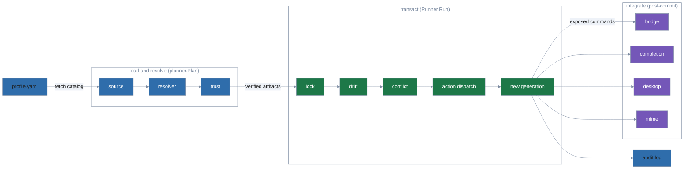
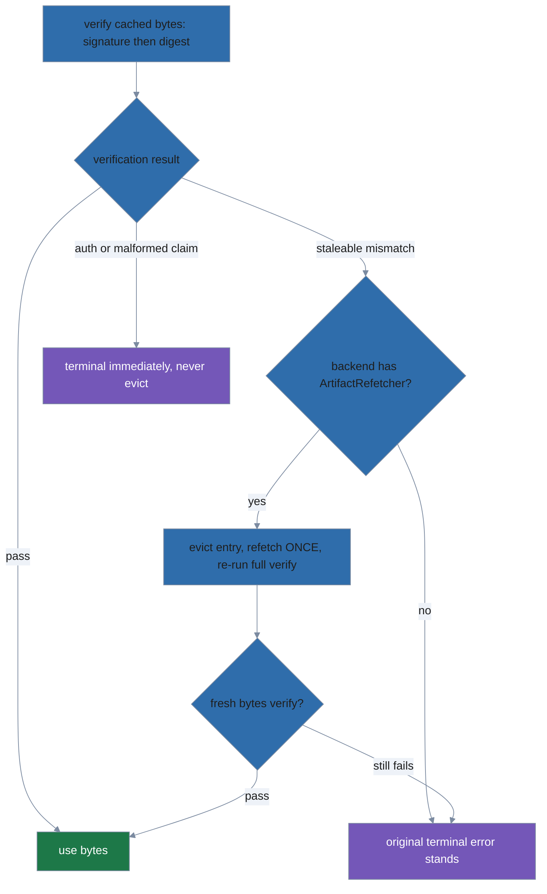
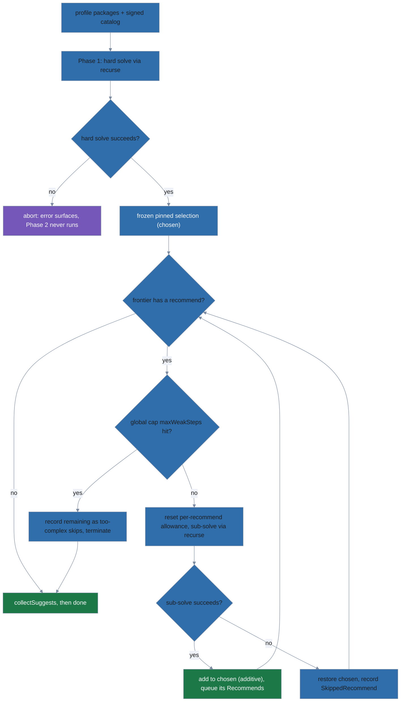

# Architecture

polypkg is a declarative package manager: a profile file states what should be
installed, and `polypkg apply` makes the system match it, recording each result
as an immutable generation. This document maps that flow onto the code and gives
a one-line role for every `internal/` package. It is aimed at maintainers; users
should start at the top-level [README.md](../../README.md).

The CLI is a [cobra](https://github.com/spf13/cobra) command tree built in
`internal/cli/root.go` (`NewRootCmd`) and launched from `cmd/polypkg/main.go`.
The imperative verbs (`install`, `remove`, `upgrade`) are sugar: they edit the
profile via `internal/profileedit`, then run the same `apply` pipeline a
power user reaches directly with `plan`/`apply`.

## The apply pipeline

`apply` runs in three stages. The first two are reusable library calls —
`planner.Plan` then `Runner.Run` — and `plan` shares the first stage to preview
changes without mutating anything.

1. **Load and resolve** — `planner.Plan` (`internal/planner/planner.go`) fetches
   each configured source's signed catalog, runs the `resolver` to pick versions
   and pull in transitive dependencies, verifies every artifact via `trust`, and
   extracts it into the content-addressed extract store (`extractstore`, below),
   returning the `(manifest, run entries, projected ownership)` tuple.
   It touches no live state, but it *does* advance the per-source trust serial
   high-water mark, so callers must hold the per-scope apply lock.

2. **Transact** — `Runner.Run` (`runner.New` → `(*Runner).Run` in
   `internal/runner/runner.go`) takes the per-scope `lock`, opens a `substrate`
   transaction, checks for `drift` against the active generation, runs `conflict`
   detection to refuse colliding ownership, dispatches each package's `action`s
   (the 12 registered verbs — `install`, `symlink`, `dir`, `perms`, `config`,
   `unmanaged`, `state`, `path`, `alternatives`, `completion`, `desktop`, `mime`)
   into the substrate, commits the manifest as a new immutable generation, writes
   the `audit` record, and releases the lock.

3. **Integrate** — after the generation commits, `apply` reconciles the
   user-visible surface: the `bridge` puts the generation's exposed commands on
   `$PATH`, and the `completion`, `desktop`, and `mime` integrators install shell
   completions, `.desktop` entries, and shared-mime-info files. `rollback` and
   `gc` re-run the same integration against whichever generation they activate.

## Package map

### Core pipeline

| Package | Role |
|---|---|
| `cli` | The cobra command tree, flag parsing, and the `polypkg.cli-result/v2` output envelope. |
| `schema` | Wire formats: the profile spec (`polypkg.spec/v1`) and the `polypkg.yaml` inside a package tarball. |
| `source` | Source-backend interface and the native fetcher for a source's signed catalog and artifacts. |
| `resolver` | Two-phase deterministic solver: hard backtracking (depends, `Provides`/virtuals, `Conflicts`, `Obsoletes`) followed by weak augmentation (Recommends). |
| `trust` | minisign signature verification for indexes, artifacts, and attestations (per-role keyring) plus the metadata freshness check (`CheckExpiry`). |
| `planner` | The load-and-resolve pipeline (`Plan`): fetch, verify (signatures, attestations, policy gate, downgrade guard), extract → manifest + run entries + ownership. |
| `extractstore` | The content-addressed extracted-package store under `<stateHome>/pkg-extract`: dir naming, and the manifest-driven `Sweep` (see "The extract store" below). |
| `action` | The declarative install-time actions — 12 registered verbs (`install`, `symlink`, `dir`, `perms`, `config`, `unmanaged`, `state`, `path`, `alternatives`, `completion`, `desktop`, `mime`) — with scope enforcement. |
| `runner` | Coordinates one transaction: lock, begin, drift check, action dispatch, commit, audit, release. |
| `substrate` | Substrate-backend interface plus the own-store content-store backend. |
| `conflict` | Pure cross-package collision detection over a generation's ownership set (no I/O, no policy). |

### Integration surface

| Package | Role |
|---|---|
| `bridge` | Reconciles `~/.local/bin` (user) or `/usr/local/bin` (system) against the generation's exposed commands. |
| `linkfarm` | Low-level symlink-directory reconciliation against a wanted set; the engine under `bridge` and `mime`. |
| `alternatives` | Arbitrates which package provides a shared command name when several claim it. |
| `completion` | Installs packages' shell-completion scripts. |
| `desktop` | Installs packages' `.desktop` application entries. |
| `mime` | Installs packages' shared-mime-info XML. |

### Inspection, lifecycle, and support

| Package | Role |
|---|---|
| `diff` | Computes the delta between two `(manifest, ownership)` pairs; backs `plan` and `status`. |
| `drift` | Detects divergence between a generation's recorded ownership and the live filesystem. |
| `gc` | Pure mark-and-sweep generation-retention algorithm (`--count`, `--age`, pins). |
| `lock` | Per-scope advisory file locking that serializes applies. |
| `merge` | Line-based three-way (diff3) merge used when reconciling managed config files. |
| `audit` | JSON Lines audit-log writer. |
| `config` | Layered configuration loading. |
| `paths` | Resolves polypkg's data, config, and state directories (XDG). |
| `profileedit` | Comment-preserving edits to an existing profile, used by `install`/`remove`/`source`. |
| `starlarkeval` | Evaluates a package's `!starlark` snippets in a sandboxed re-exec child process. |
| `repo` | The repository publisher (`polypkg repo`). See [repo-publisher.md](repo-publisher.md). |
| `mirror` | Bundle transport for `polypkg mirror`: `Pull` (verified upstream fetch + staging) and `VerifyBundle` (offline bundle verification). See [repo-publisher.md](repo-publisher.md). |
| `pkglint` | The package-source linter behind `polypkg pkg lint`/`pkg build`: layered structure/identity/action/param/content checks (`PKGxxx` rules) with human and canonical SARIF 2.1.0 output. |
| `attest` | Assembles and parses the predicate-agnostic in-toto Statement: `pkg build`'s unsigned `.att.json` preview, the byte-identical document `repo build` signs, and the consumer-side `ParseStatement`. |

## The extract store

`planner.Plan` extracts every verified artifact under
`<stateHome>/pkg-extract` before the runner ever opens a transaction; the
committed generation's symlinks then resolve through that tree for as long as
the generation is retained. `internal/extractstore` owns the layout and the
sweep; the invariants:

- **Content-addressed dirs.** Each artifact extracts to
  `pkg-extract/<name>-<version>+<hash16>`, where `<hash16>` is the first 16 hex
  chars of the artifact's BLAKE3 `content_hash` (the full hash is enforced by
  artifact verification before extraction ever runs). A same-version republish
  is a *different* artifact and lands in a *different* dir, so it can never
  rewrite the tree a retained or pinned generation symlinks through — the
  integrity bug the previous `RemoveAll`+extract-in-place layout had.
- **Atomic extraction, idempotent reuse.** `ensureExtracted` extracts into an
  `.extract-*` temp sibling and lands it via atomic rename: a dir either exists
  complete or not at all, and a crash leaves only a temp dir for the sweep.
  Because the dir is content-addressed, an existing dir already holds the
  correct bytes and is reused as-is — reuse refreshes the dir's mtime so it
  counts as recent activity for the sweep's grace window.
- **Manifest-driven sweep.** `gc` and every successful `apply` run
  `sweepExtracts`: the keep-set is the union of every retained generation's
  manifest entries, and anything else older than `extractstore.DefaultMinAge`
  (one hour) is removed. The grace window exists because extraction happens
  *before* the runner takes `apply.lock` — a young unreferenced dir (or
  in-flight `.extract-*` temp) may belong to a concurrent apply whose
  generation has not committed yet.
- **Legacy layout kept while referenced.** Generations committed by older
  binaries recorded symlink targets under the pre-content-addressed
  `<name>-<version>` name; the sweep keeps both spellings for every retained
  manifest entry.
- **Fail-safe on unreadable manifests.** If any retained generation's manifest
  cannot be read, the sweep is skipped entirely (with a warning) — deleting a
  dir a generation might still reference would recreate exactly the bug the
  content-addressed store fixed.

## The supply chain: v2 metadata, attestations, freshness, anti-downgrade

The publisher and consumer share three v2 wire formats (hard cutover — v1
readers and schemas were removed):

| Schema | Carries |
|---|---|
| `polypkg.index/v2` | `expires`, per-entry content-addressed `artifact` pool paths, an informational `revision` republish ordinal, and `attestations[]` refs (`predicate_type`, `artifact`, `content_hash`). Living inside the signed index makes attestations strip-resistant: removing one invalidates the index signature. |
| `polypkg.trust/v2` | `expires`, monotonic `serial`, and the key list with roles `["index", "artifact", "attestation"]`. |
| `polypkg.manifest/v2` | Per-entry install-time `attestation` record (`status`, `predicate_types`, `attestation_hash`, `policy_at_install`), plus `carried_bindings` recording external provenance bound to the installed bytes at a `bound-unverified` tier. Only `verified` or `unattested` ever persist — a failed verification never installs. |

**Verification chain order** (per resolved package, in `planner.Plan`):

1. Source metadata: index/trust signatures, monotonic serial vs. the
   per-source high-water mark, and `trust.CheckExpiry` on both documents
   (5-minute skew tolerance; absent/unparseable `expires` is itself fatal).
   This closes the TUF freeze attack — a mirror cannot pin clients to a
   stale-but-validly-signed catalog.

   - **Freshness grace (phase 2e-1, spec §10.9 E-3).** `SourceBackend.AcceptExpiryUntil`
     threads a per-source RFC3339 deadline to `CheckExpiry`, which now returns
     `(graced, err)`: an expired document within the deadline is accepted and
     reported graced.
   - Crucially, `CheckExpiry` runs *before* the serial-floor check in every
     `Load*` method (and the index's serial check precedes its expiry check in
     `fetchOneSource`), so grace relaxes wall-clock freshness without ever
     weakening anti-rollback — a lower-serial document still refuses.
   - A malformed/empty `accept_expiry_until` grants no grace (fail closed).
     Graced docs surface via `FetchResult.FreshnessGraced` →
     `Result.FreshnessGraced` → a loud `SECURITY:` line on `apply`/`plan` and a
     `metadata.expiry_graced` audit event on `apply`.
2. Artifact: minisign signature under the `artifact` role, then the BLAKE3
   digest against the signed index's `content_hash`.
3. Attestation (when the index entry carries refs): fetch each `.att.json` +
   `.minisig`, verify the signature under the `attestation` role, check the
   trusted-comment claims (`name`/`version`/`hash`) against the resolved
   package and the recomputed BLAKE3 of the attestation bytes, check that
   hash against the index ref's `content_hash`, parse the in-toto Statement,
   and require its predicate type to match the ref and its subject digest to
   equal the artifact's `content_hash`. Any failure here is fatal in **every**
   policy mode.
4. Policy gate: only attestation *absence* consults `attestation.policy` —
   `warn` (default) installs with a stderr warning, `require` refuses, `off`
   installs silently. The verdict is recorded in the manifest entry and
   surfaced by `status -vv` (`[attested]`/`[unattested]`) and `info`.

**Per-source require gate (phase 2d-1).** `bindCarriedRefs` records each carried attestation's tier (`builder-verified`, `verified-offline`, `verified-transport-only`, `bound-unverified`) and identity without gating; `enforceAttestationPolicy` (`internal/planner/attestpolicy.go`), called from `Plan` immediately after binding, then refuses the install when a source's `attestation.require` list is unsatisfied.

A `require` is satisfied only by a carried binding at an anchored tier (`builder-verified`/`verified-offline`) whose identity matches the consumer `builders.allow` list, or — when no allow-list is set — by a native publisher-verified predicate. Transport-only and bound-unverified tiers never satisfy a `require` (their predicate type is self-declared).

This mitigates G1 (publisher-minted key, via the consumer-authoritative allow-list) and G2 (provenance strip, via per-predicate presence). The `key` and `sigstore` allow-list kinds are not equally strong: `key` pins public-key bytes (unconditional), while `sigstore` pins strings rooted in the source-mirrored Fulcio root (weaker); consumer-pinned sigstore roots are deferred.

**Posture floor (phase 2d-2, threat G3).** `enforcePostureFloor` (`internal/planner/attestpolicy.go`), called from `Plan` right after the 2d-1 require gate, refuses an install whose provenance regresses from the previous generation. `verifiedPredicateTypes` extracts a package's verified posture (native `PredicateTypes` union anchored-carried predicate types — transport-only and bound-unverified are excluded) from its `AttestationState`; the floor requires every prior-verified type to still be verified now, reusing `requireSatisfied` with an identity-agnostic empty allow-list.

The floor source is the current generation's manifest, loaded by `apply`/`plan` from the substrate and passed via `Options.PriorManifest` (nil on first apply or unreadable prior ⇒ no floor); it is trusted local state a mirror cannot influence, and the check runs on the final post-verification `attState`, so the refetch-once cache-healing path cannot smuggle a downgrade past it.

The exact-version pin (`isExactPin`, the D15 escape hatch — also written by `upgrade`/`install @version`) waives the floor for a consciously-accepted release. The floor is keyed by package name across sources, catching a source-switch downgrade.

**Per-source `off` + observability (phase 2d-3, threat G8).** A source whose `attestation.tier` is `off` (`schema.AttestationTierOff`, mutually exclusive with `require`/`builders` by schema) has its gate disabled in `Plan`: `srcOff` (computed once at the top of the per-package loop) lowers the EFFECTIVE absence policy passed to `verifyAttestations` to `off` and skips both the 2d-1 `enforceAttestationPolicy` and the 2d-2 `enforcePostureFloor`.

It is a POLICY relaxation only — `verifyAttestations` consults its policy argument solely on the absent branch, so a PRESENT attestation is still hard-verified (D-C10), revocation still refuses, and the P6 `bindCarriedRefs` binding still runs.

Because a silent kill-switch is the threat, `off` is loud and durable: `AttestationState.GateDisabled` records it per entry (distinct from the pre-existing silent global `attestation.policy: off`, which lands `PolicyAtInstall:"off"` with `GateDisabled:false`), `Result.AttestationGateDisabled` (a channel distinct from `AttestationWarnings`, carrying the package and its source as discrete `GateDisabledEntry` fields) drives an unconditional `SECURITY:` stderr line in `apply`/`plan`, and `apply` writes an `attestation.gate_off` audit event with discrete `package` and `source` fields.

`status`/`info` surface `GateDisabled` and each carried binding as `predicate — tier [identity]` (`attestationTag`/`attestationLine`) so an operator never reads a `verified-transport-only` carried ref as trusted, and sees the verifying identity of an anchored one. `transport-ok` is deferred (spec §10.8 G-3, YAGNI). No schema version bump (additive `gate_disabled`); stdlib only.

**Cache healing (steps 2 and 3).** Artifact and attestation fetches may be
served from the consumer's download cache, which is keyed by base name with no
validation — a repository that republishes different bytes under the same path
would otherwise wedge the client on the poisoned entry forever.

When verification fails *staleably* (a signature or digest mismatch, i.e.
possibly wrong cached bytes), the planner evicts the cache entry and refetches
ONCE via the backend's optional `source.ArtifactRefetcher` capability (used for
both artifacts and attestation blobs), re-running the full verify chain on the
fresh bytes; if they still fail — or the backend lacks the capability, or the
refetch errors — the original terminal error stands.

Authorization failures (no key holding the required role) and malformed signed
claims are trust-configuration problems no refetch can fix; they are terminal
immediately and never evict.

Strip-resistance is scoped to mirrors, not the signer: whoever holds the index
key can publish a fresh, validly-signed index with no attestation refs (key
compromise, or a legitimate `repo build --skip-attestations`), and under the
default `warn` policy consumers install it with only a stderr warning. Only
`policy: require` converts attestation disappearance into a refusal.

Note: the manifest record's `AttestationHash` stores the hash of the LAST
verified attestation ref. That is exact while there is a single predicate
type (SARIF lint) per entry; revisit the field when a second predicate ships.

**Anti-downgrade (per-package high-water mark).** `FetchCatalog` folds every
verified index into a per-source, per-package version high-water map persisted
in the trust state. `Plan` refuses a resolved version below its source's mark
only when the source has WITHDRAWN its top — no version ≥ the mark remains in
the current signed index — and the profile does not exact-pin the selected
version (`x.y.z`, `=x.y.z`, or `==x.y.z`, the operator's escape hatch for a
pulled release). Selecting an older entry the index still offers is ordinary
constraint resolution and never refused; cross-source masking is structurally
impossible because catalog merging is a per-name all-or-nothing overlay.

**Pool.** Artifacts and attestations are content-addressed under
`<output>/pool/<blake3>.{tar.zst,att.json}`. A republish writes a new blob and
repoints the index; old blobs persist immutably (rollback keeps resolving)
until pool GC lands (future work). Blobs and their signatures are written
before the index/trust metadata batch, so a signed index never references a
missing blob.

### Export bundles & the pool manifest (phase 2e-2)

`repo export-bundle` (`internal/repo/export.go`, method `(*Builder).ExportBundle`)
reads the already-built, already-signed published repository and packs it into a
single tarball mirror for offline transport. It resolves a package selection to
its reachable blob set — each selected `IndexEntry`'s artifact + `.minisig` plus
its carried attestation blobs + `.minisig`s — and always includes the signed
metadata documents (`index.json`, `trust.json`, optional
`trust-bundle.json`/`revocations.json`) and `trust_root.pub`.

It emits `pool-manifest.json`, a `polypkg.pool-manifest/v1` bill of materials listing
every bundled file as `{path, content_hash, kind}` (BLAKE3), signed with the
**same key that signs the index** (`Keypair.SignPoolManifest`), then packs
everything into one deterministic tar (`archive/tar`, PAX, sorted names, zeroed
mtimes — the `pack.go` recipe). The carried `index.json`/`trust.json` are
byte-verbatim (their existing signatures still validate); only the new manifest
is signed here.

The manifest inherits `serial`/`issued_at` from `trust.json` and
`expires` from `index.json`, so a bundle carries no independent clock — its
freshness tracks the repo snapshot (making re-exports byte-identical), and the
phase 2e-1 `accept_expiry_until` grace covers it uniformly.

`mirror verify` (`internal/mirror/verify.go`, `VerifyBundle`) reads the tar
(rejecting path-traversal names, duplicate paths, and any non-regular member so
nothing can be smuggled past extraction), verifies the manifest signature
against a pinned `--trust-root` or the bundle-carried `trust_root.pub`
(self-consistency fallback), runs `trust.CheckExpiry` (with optional grace),
then asserts every manifest entry is present and BLAKE3-matches **and** that no
un-listed file rides along besides the manifest and its signature — one missing,
tampered, or extra blob fails the whole verify.

The manifest itself and its
`.minisig` are the only files not self-listed (a manifest cannot contain its own
hash); they are covered out-of-band by the signature.

The completeness contract
is manifest-defined, not index-defined, so a subset export whose carried index
still names unmirrored packages verifies cleanly and simply 404s those packages
when re-served as a `file://` source.

### Trust bundle and revocation list (foundational primitive)

The trust bundle is a third anchor-signed document sitting alongside `trust.json`,
signed by the same source `trust_root` that verifies `polypkg.trust/v2`. It
carries the provenance-verification material — a builder keyring plus sigstore
trust roots — that a later phase will use to check *carried* external provenance.
Both documents are now optional inputs to `FetchCatalog` (phase 2c-0: fetched,
verified, and floored on every fetch), but the builder keyring itself is still
inert — no fetch/verify path consumes a builder key or checks a builder-key
revocation yet. Only the revocation list's *attestation*-hash entries are
enforced today (see below).

- **`polypkg.trust-bundle/v1`** holds builder keys and sigstore roots, both
  time-windowed and append-only. Builder keys authenticate how an artifact was
  built and are **not** minisign signing roles — the `polypkg.trust/v2` role
  model (`index`/`artifact`/`attestation`) is untouched. Lookups are temporal:
  `Bundle.BuilderKeyAt(keyID, buildTime)` returns a key only if `buildTime` fell
  in its `[valid_from, valid_until]` window, and `Bundle.SigstoreRootAt(buildTime)`
  selects the root live at that instant — validity is judged at the attestation's
  build timestamp, not at verification time.
- **`polypkg.revocation-list/v1`** is a *separate* signed document with its own
  `serial` and `expires`, revoking builder keys and attestations by BLAKE3
  content-hash (`Revocations.IsBuilderKeyRevoked` / `IsAttestationRevoked`). Being
  separate, a revocation ships without republishing the whole bundle, so it
  propagates faster.
- Both loaders (`LoadBundle` / `LoadRevocationList` on the `trust.Verifier`) are
  anchored by the same source `trust_root` as `LoadTrust` and enforce freshness
  (`expires`, D13) **before** the serial anti-rollback floor, so a stale document
  can never advance the serial high-water mark.
- `fetchOneSource` (`internal/planner/fetchcatalog.go`) loads both documents
  after the index and folds their serials into the per-source `trust.Seen`
  state (`BundleSerial`, `RevocationSerial`) alongside the existing
  `TrustSerial`/`IndexSerial`. The revocation list it returns is consulted
  during artifact verification: an attestation whose content-hash is on the
  list refuses the install in **every** `attestation.policy` mode, the same
  fail-closed treatment as an invalid signature. The bundle's keys are parsed
  and floored but otherwise discarded — nothing binds a carried attestation's
  builder signature against them yet (that consumption is phase 2c-1).

### Trust-bundle & revocation-list anti-rollback (2c-0)

The bundle and revocation list are optional per source, but once a source has
published one, the anti-rollback rule for the index and trust documents
(§ "Anti-downgrade" above; D13/D15) applies to them too — the consumer's
`trust.Seen` state tracks a high-water serial for each and refuses a fetch that
would move either backward:

- **Never seen + absent ⇒ OK.** A source that has never published a bundle or
  revocation list installs normally: there is no builder keyring yet, and any
  carried external provenance stays bound at the `bound-unverified` tier (§
  "consumer install-time binding" above). This keeps pre-bundle repositories
  working unchanged.
- **Seen once + absent ⇒ refused.** Once a source has published a bundle (or
  revocation list) at serial N, a later fetch where the backend reports it
  absent (`source.ErrMetadataAbsent`) is treated as a rollback/strip and
  refuses the fetch. This closes the "delete the revocation list to un-revoke a
  key" channel: a publisher (or a compromised mirror) cannot silently retract a
  revocation once it has shipped.
- **Serial below the floor, or an expired document, ⇒ refused,** identically to
  the index/trust anti-rollback check — verified first, then checked for
  freshness, and only then allowed to advance the stored floor.
- **A revoked attestation content-hash is refused in every attestation-policy
  mode.** Unlike the `warn`/`require`/`off` policy gate that governs attestation
  *absence*, revocation is absolute: it is checked regardless of policy and
  cannot be downgraded to a warning.

Builder-key *verification* is explicitly out of scope for 2c-0: the bundle is
loaded, floored, and its keys parsed, but nothing yet checks a builder
signature against them, and a revoked builder key is not yet enforced (only a
revoked attestation hash is). That consumption lands in phase 2c-1.

**Recovery.** The anti-rollback floors are deliberately strict — once a source
has shown a bundle or revocation list, it can never look like it hasn't — so
two escape hatches exist for the two ways that strictness can bite:

- *Publisher — roll forward, never back.* Fix a bad publish, or ship an
  emergency revocation, by republishing the corrected state at serial **N+1**,
  never by decrementing a serial or reusing one. Consumers accept forward
  progress as ordinary republication; there is no way to make a serial go down
  once it has shipped.
- *Consumer — re-pin a legitimately re-created repository.* If a repository is
  rebuilt from scratch (new `trust_root`, all serials reset), the consumer's
  stored floors will correctly — but unhelpfully — read that as a downgrade and
  refuse every document. Run `polypkg source remove <name>` followed by
  `polypkg source add <name> ...`: `remove` clears the persisted floors
  (`trust.ForgetSeen`, in `internal/trust/seen.go`) for that source name, and
  the subsequent `add` re-establishes trust-on-first-use against the new root.

### Provenance carriage representation and binding (phase 2b-1)

`AttestationRef` (in `internal/schema/index.go`) can now describe *carried*
external provenance alongside polypkg's own attestations. This is representation
plus a binding primitive only: nothing publishes a carried ref (publisher
carriage is phase 2b-2), no fetch/verify path consumes one (consumer binding is
phase 2b-3), and no predicate is actually verified per format (DSSE/SLSA/SBOM/
sigstore verification is phase 2c).

- The ref gains four **optional** fields — `kind` (`native-jcs` vs
  `carried-opaque`), `format` (a closed vocabulary: `polypkg-sarif`,
  `polypkg-link`, `slsa-provenance`, `spdx`, `cyclonedx`, `in-toto-generic`,
  `sigstore-bundle`), `subject_scope` (`artifact` or `content:<path>`), and an
  advisory `subject_digests` (algorithm→hex). These are additive to
  `polypkg.index/v2`; existing indexes stay valid and there is **no** version
  bump.
- `ParseStatement` (in `internal/attest/statement.go`) is generalized to accept
  an in-toto Statement whose subjects carry *any* digest algorithm, so a carried
  SLSA statement (sha256 subjects) parses. Native-jcs (blake3) statements are
  unaffected — this only relaxes the prior requirement that `subject[0]` carry a
  blake3 digest.
- `MatchSubjectDigests(data, subject, floor)` (in `internal/attest/binding.go`)
  is the fail-closed binding primitive. It recomputes, from the raw bytes, every
  **supported** algorithm the subject lists (sha256, blake3, sha512), requires
  them *all* to agree, and binds only when at least one matched algorithm is
  at/above the floor (default sha256). Forbidden weak algorithms (sha1/md5) in a
  subject are rejected outright; unknown or uncomputable algorithms are ignored
  (they can neither create nor break a binding); a subject with no supported
  algorithm at/above the floor is unbindable and rejected.
- Because the matcher recomputes from bytes rather than trusting a stored digest,
  the single function serves both binding points: pack-time (when a publisher
  will carry a ref) and install-time (when a consumer will bind one).

### Provenance carriage foundations (phase 2b-2a)

Two behavior-preserving foundations prepare the publisher to carry provenance
without touching the publish path yet. The build cache (`internal/repo/cache.go`)
now holds a *list* of attestation refs, and `ExtractCarriedSubjects` (in
`internal/attest/carried.go`) shallow-reads what an externally supplied
attestation claims to cover. Nothing yet intakes, binds, stores, or emits carried
provenance — that is phase 2b-2b — and no predicate is verified per format
(builder-signature and per-format verification is phase 2c).

- The cache schema bumps `polypkg.repo-cache/v2` → `v3` and stores
  `[]AttestationRef` in place of the former single-attestation fields. Behavior is
  unchanged today: `repo build` still emits exactly one SARIF `native-jcs` ref,
  now recorded as a one-element list — but the shape is multi-ref-ready, so once
  carriage lands, external provenance is no longer silently stripped on rebuild.
- An older (`v2`) cache cold-resets on load. The reset is safe because packing is
  deterministic: the rebuild reproduces byte-identical artifacts and a stable
  serial, so a cold-reset costs work but never changes what is published.
- `ExtractCarriedSubjects` reads the in-toto subjects a carried envelope covers —
  a DSSE envelope wrapping a Statement, or a bare Statement — **without** verifying
  its signature, and classifies the format as SLSA / SPDX / CycloneDX / generic
  in-toto (raw SBOMs and sigstore bundles are out of scope here). The
  classification is advisory: a shallow mis-read cannot forge a binding, because
  the extracted digests are re-bound against polypkg-packed bytes later via the
  fail-closed matcher (§ phase 2b-1).

### Provenance carriage: publisher intake (phase 2b-2b)

`repo build` now carries external provenance into the signed index. It discovers
`attestations/*.json` in a package source and, for each envelope, performs the
pack-time half of the two-point binding: it matches the attestation's subjects —
by *digest*, via the fail-closed matcher — against the shipped artifact and each
content file, and refuses to publish provenance that binds to nothing packed. The
consumer install-time half is phase 2b-3.

- Binding is by digest, not by name: the subject name is advisory (threat G5) and
  selection is purely by matching a recomputed digest of packed bytes. A carried
  ref here is *bound* (its digests match what shipped) but **not** builder-verified
  — DSSE/SLSA/SBOM/sigstore per-format signature verification is phase 2c.
- Refusal is fail-closed at publish: an envelope whose subjects match no packed
  bytes aborts the build rather than shipping unbound provenance.
- Carried envelopes are stored **verbatim** in the content-addressed pool under a
  publisher *transport* signature (minisign) — the ref records `kind: carried-opaque`.
  The transport signature attests only that this publisher relayed these bytes; it
  is not a check of the builder/DSSE signature.
- A `polypkg-link` `native-jcs` attestation binds the shipped artifact (blake3) to
  the covered materials, tying the carried provenance back to what was published.
- The SARIF, carried, and link refs are recorded as a multi-ref list **stably
  sorted by content hash**, so a no-op rebuild reproduces a byte-identical,
  serial-stable index.

`pkg build` author-preview parity for this carriage is a deferred follow-up.

### Provenance carriage: consumer install-time binding (phase 2b-3)

`planner.Plan` now completes the two-point binding (spec P6) on the consumer.
After the BLAKE3-verified tarball is extracted, `bindCarriedRefs`
(`internal/planner/planner.go`) re-extracts each carried envelope's subjects and
re-binds them **by digest** against the bytes that actually landed — the fetched
tarball and the extracted content tree — via the shared `attest.BindSubjects`
kernel at the sha256 floor. If a carried attestation binds nothing installed, the
install is **refused** (fail closed) — this catches a repository that ships a
signed index referencing carried provenance whose subjects do not match the
delivered bytes.

- The carried envelope is **transport-verified** pre-extraction (its publisher
  signature, claims, and content hash are checked against the signed index like
  any ref, via the shared `fetchVerifiedAttestation` scaffold), then **subject-bound**
  post-extraction. The external builder/DSSE signature is **not** verified yet —
  that is phase 2c — so a bound carried ref is recorded at the `bound-unverified`
  tier in the manifest's `attestation.carried_bindings`.
- Extraction hardening: a content file that extracted as a symlink is never
  offered as a binding target (a provenance subject must be concrete bytes, not a
  redirect), so a subject pointed at one fails to bind. Hard links are dropped by
  the extractor and surface as absent files, also failing closed.
- Binding ≠ verification: this proves the carried subjects describe the installed
  bytes; trusting the external signer is phase 2c.

### Prebuilt ingest and trust-bundle carry-forward (phase 2e-3a)

A repo-manifest package entry (`internal/schema/repomanifest.go`) is now
either `source:` (unchanged) or `prebuilt: {artifact, attestations,
trust_bundle?}` — mutually exclusive via the `repo-v1.json` `oneOf`. The
`prebuilt` shape is INGEST only: it consumes an already-fetched
`.tar.zst`, a directory of its carried attestation blobs, and an optional
upstream `trust-bundle.json`. The NETWORK step that produces those three
inputs from an upstream repository — fetching and generating the `prebuilt:`
entry itself — is a separate, not-yet-implemented phase (2e-3b/2e-4); nothing
in this phase fetches anything over the network.

- **`emitPackage` is the shared author-pass seam** (`internal/repo/emit.go`).
  - Both the source-build and the prebuilt-ingest paths resolve to a
    `packageWork{artifact, *schema.Package, attRefs, attBlobs, …}` before calling
    it, so `emitPackage` writes the pool artifact + `.minisig`, writes every
    attestation blob + its `.minisig`, and returns the `schema.IndexEntry` /
    `CacheEntry` identically regardless of provenance.
  - The two paths differ only in how `packageWork` is assembled:
    `Builder.sourceAttestations` runs pkglint and discovers `attestations/*.json`
    under the source tree; `Builder.prebuiltAttestations` skips lint entirely and
    discovers attestation files under the staged `prebuilt.attestations` directory.
  - Both funnel through the shared `bindCarriedSet` (§ "Provenance carriage:
    publisher intake" above) for the actual per-envelope binding, so a carried
    attestation is bound identically whether it arrived with a source tree or a
    prebuilt artifact.
- **The ingest path** (`Builder.ingestPackage`, `internal/repo/ingest.go`).
  - reads the fetched artifact, extracts it into a scratch directory via
    `source.ExtractTarZst`'s hardened confinement guards (the same extractor the
    consumer install path uses — path-traversal, symlink, and hard-link
    rejection apply equally here), then reuses `ReadPackageSource` to parse the
    extracted `polypkg.yaml` and `bindCarriedSet` to bind every staged
    attestation against the extracted tree.
  - Every carried attestation is therefore **independently re-bound against the
    exact fetched bytes** — the local repo does not trust the upstream index's
    digest claims at all; it recomputes and re-checks the two-point binding
    (spec P6) from scratch on its own copy of the bytes, preserving that property
    through a mirror hop.
  - An envelope binding nothing extracted is refused, aborting the build
    (`bindCarried`'s fail-closed contract, unchanged from the source path).
- **Trust-bundle carry-forward** (`mergeCarriedBundle`, `buildCarriedBundle`,
  `publishedBundleMatches` in `internal/repo/ingest.go`, wired into the
  `Build` loop in `internal/repo/build.go`).
  - For every `prebuilt` entry that stages a `trust_bundle`, the builder keys
    are deduped by `key_id` — an identical repeat is idempotent, a conflicting
    repeat (same id, different key/algo/validity) fails the build closed rather
    than silently picking one — and sigstore roots are deduped by exact
    structural equality.
  - If anything was staged, `Build` re-signs exactly one repo-level
    `trust-bundle.json` (+ `.minisig`) under the LOCAL key, stamped with the
    repo's own `source` and the FINAL build serial/expires (computed after the
    bundle-changed check, so the bundle and the index always agree on serial).
  - `publishedBundleMatches` folds the carry-forward into the existing
    changed-detection: `bundleChanged` compares the merged keys/roots against
    what is currently published (ignoring serial/expires, which are derived), so
    a no-op rebuild with unchanged carried material stays serial-stable, while
    any change in the merged builder keys or sigstore roots bumps the serial
    like any other content change.
  - A repository with no `prebuilt` entries staging a `trust_bundle` never emits
    `trust-bundle.json` — this is purely additive.
- **Cache key.** A prebuilt entry is cache-keyed on the artifact's own
  content hash (`ContentHash(artifact)`), not `pkg.Source` (which is absent
  for a prebuilt entry) — `ingestPackage`'s cache hit path checks
  `cache.Get(ch)` and short-circuits re-extraction/re-binding when the staged
  artifact bytes are unchanged and the pooled blob is still present, mirroring
  the source path's fingerprint-keyed cache hit.
- **Deferred / known limitations.**
  - The network fetch that generates a `prebuilt:` manifest entry now exists as
    the `internal/mirror.Pull` library primitive (below); the one-command CLI
    that composes it with `repo build` and `repo export-bundle` is still 2e-4.
  - Revocation-list carry-forward is not implemented — only trust bundles are
    merged and carried forward.
  - If a repository has previously published a carried-forward
    `trust-bundle.json` and every `prebuilt.trust_bundle` reference is later
    removed from the manifest, `Build` does not delete the now-orphaned
    `trust-bundle.json`/`.minisig`: metadata-removal transitions (as opposed to
    metadata-addition/update) are a broader mirror-lifecycle concern deferred to
    a later phase.
  - An operator retracting carry-forward must delete those two files from the
    output directory manually.

### Mirror pull: verified fetch and staging (phase 2e-3b)

`internal/mirror.Pull` (`internal/mirror/pull.go`) is the network half that
the previous section's `prebuilt:` ingest deliberately left out of scope. It
is a **library primitive with no CLI wiring yet** — `mirror pull` as a
runnable command, multi-source composition, and the `--fresh` strip are all
2e-4.

- **Reuses the trust crypto kernel, not the planner's install path.**
  - `Pull` calls `trust.NewVerifier` → `Verifier.LoadTrust`/`LoadBundle` and
    `Keyring.Verify` — the same shared kernel `apply`/`plan` use — and fetches
    through `source.Backend` (`source.NewNativeBackend`), the same interface the
    planner's install path fetches through.
  - It does **not** reuse `planner.Plan`/`verifyArtifact` directly: the
    planner's install path is entangled with resolver selection, generation
    state, and posture-floor policy that a one-shot mirror fetch has no use for.
  - `pull.go`'s own `verifyClaim` re-states the same small "signed claim matches
    the index entry" assertion `planner.verifyArtifact` makes, against the shared
    `Claims.Artifact()` accessor, so the two call sites can't drift on what
    "verified" means even though they don't share a call path.
- **Verify-inbound-but-defer-binding.**
  - `Pull` verifies that fetched bytes are authentically the source's
    (signature, claims, and blake3 against the signed index) before staging
    them, but it does **not** perform the P6 digest re-binding of carried
    attestations against extracted content — that remains `repo build`'s ingest
    job (`Builder.ingestPackage`, previous section), which re-derives the binding
    from its own extraction of the fetched artifact rather than trusting anything
    the pull recorded.
  - This keeps the "recompute from scratch on your own copy of the bytes"
    property (spec P6) intact across a mirror hop: the pull's verification and
    the ingest's binding are independent checks on the same bytes, not one
    trusting the other's output.
- **Enforces upstream revocations (anti-laundering).**
  - `Pull` fetches the source's `revocations.json` (when published, with the
    same absence/error semantics as the consumer's `fetchOneSource`) and refuses
    the pull if any selected attestation's `content_hash` is revoked, or if any
    builder key carried in the trust bundle is revoked.
  - Because `repo build` does not carry the revocation list forward (only the
    trust bundle) and the consumer install path treats revocation as absolute
    (checked regardless of policy, never downgraded to a warning), a pull that
    silently dropped a revoked attestation would *launder* the revocation across
    the mirror hop — so it fails closed here rather than re-publish revoked
    provenance.
  - Fetched with no anti-rollback floor (like the index and bundle), so it
    enforces the source's current revocation state.
- **One version per package name** (`resolvePullSelection`). Empty selectors
  pick the latest semver of every package in the index; a bare `name` picks
  the latest of that name; `name@version` pins an exact version. Selecting
  the same name twice among explicit selectors is refused — a `repo build`
  manifest keys `packages:` by name, so the staged output can only hold one
  version per name regardless.
- **No anti-rollback serial floor.**
  - Unlike `apply`/`plan`, which track a `last_serial` per source and refuse a
    metadata regression, `Pull` has no persisted floor: it is a stateless
    one-shot fetch of whatever the upstream index currently publishes.
  - This is intentional, not an oversight — the anti-rollback property is
    re-established downstream: the republished repo mints its own fresh serial at
    `repo build`, and that repo's own consumers re-verify (and track their own
    floor) against it normally at install.
  - A pull that happens to fetch a stale-but-validly-signed upstream snapshot
    produces a staleness problem for the mirror operator to notice, not a
    security bypass for a downstream consumer.
- **`stagedPkgDir` traversal guard.** Index package names are map keys with no
  charset constraint in `index-v2.json`, so a signature-valid index from a
  compromised source could in principle name a package `../../evil`.
  `stagedPkgDir` rejects any name or version containing a path separator, a
  literal `.`/`..` segment, or that resolves outside the staging root, before
  any file is written under it — defense in depth mirroring `source`'s
  `readTar` traversal rejection on the consumer install path, applied here to
  index-entry names instead of tar member names.
- **Native → carried-opaque re-classification on re-publish.**
  - A pull stages every attestation blob the upstream index references for a
    selected entry — the upstream's own native SARIF and polypkg-link
    attestations included — into the same flat `attestations/` directory,
    indistinguishable from any externally-carried provenance file.
  - `Builder.prebuiltAttestations` (previous section) treats everything under
    that directory as carried: it runs no native lint and calls `bindCarriedSet`
    uniformly, so every one of those blobs is re-bound and re-published under
    `schema.KindCarriedOpaque`, not `KindNativeJCS`, in the republished index.
  - This is an honest label, not a loss of information — the mirror carried these
    attestations, it did not natively produce them.
  - The provenance weight that actually matters for policy purposes rides on
    carried *external* provenance (e.g., an SLSA statement DSSE-signed by the
    upstream builder key): that carries forward through the same re-binding and
    keeps re-verifying against the carried-forward trust bundle's builder keys
    (phase 2c), independent of how the upstream's own native attestation gets
    reclassified.
- **Deferred.** Multi-source composition (fetching from more than one
  upstream into a single republish) and the `mirror pull` CLI command
  (fetch → stage → `repo build` → `repo export-bundle`, plus a `--fresh`
  strip) are both 2e-4.

## Two-phase resolution

`resolver.ResolveWithWeak` (in `internal/resolver/weak.go`) splits dependency
resolution into two phases.

**Phase 1 — hard solve.** The existing deterministic backtracking solver runs
unchanged: it satisfies every `depends` relation, resolves virtual packages via
`provides`, and refuses on `conflicts` or `obsoletes` violations. The result is
a frozen, pinned selection (`chosen`). If Phase 1 fails, the error surfaces
immediately; Phase 2 never runs.

**Phase 2 — weak augmentation.** Starting from the `Recommends` of every
package in the Phase-1 closure, augmentation works over a breadth-first
frontier. Each recommend is sub-solved by calling the existing `recurse`
function against the shared `chosen` map — the same solver function Phase 1
uses, relying on its documented contract that it restores `chosen` exactly on
failure. Phase 2 is **purely additive**: it can only add entries to `chosen`,
never remove or replace them.

When a sub-solve fails for any reason (missing package, constraint conflict,
budget exhausted), `chosen` is left unmodified and the recommend is recorded as
a `SkippedRecommend` with a human-readable reason. A failed recommend never
aborts the overall install. Newly added weak packages have their own
`Recommends` queued into the frontier, so the process is transitive.

Phase 2 uses a two-tiered budget (independent of Phase 1). Each recommend
sub-solve gets its **own fresh per-recommend allowance** (`defaultWeakSteps`),
reset to zero before every `recurse` call, so a heavy earlier recommend cannot
starve a later benign one. A **global cap** (`maxWeakSteps`) bounds total
Phase-2 work summed across all sub-solves: once the cap is hit, the remaining
(and any in-flight unsatisfied) recommends are recorded as "too complex" skips
and augmentation terminates cleanly — it never hangs and never aborts a
successful hard install.

**Suggests.** After Phase 2, `collectSuggests` gathers the `Suggests` relations
of every selected package (both hard and weak) into a deduplicated `Suggestion`
list. Suggests are surfaced in the plan/apply output and `info` command but are
never installed, regardless of policy.

**Determinism.** Before each frontier pass, candidates are sorted by
`(Name, VersionRange, recommender)`. Within a pass, the `chosen` map is only
ever grown, never reordered. The Phase-1 result is a pure function of the
profile's declared packages and the signed catalog; Phase 2 is a pure function
of that frozen Phase-1 result plus the `Recommends` fields in the catalog. Two
runs with the same inputs produce identical manifests.

**Provenance.** `ManifestEntry` carries `weak: true` and `recommended_by: [...]`
for every weakly-added package. The manifest also records `weak_deps_policy`
(`"on"`; field is absent entirely when policy is off, per `omitempty`) so the
applied policy is auditable from the stored generation. `status -vv` reads
these fields to annotate the package list with `[weak] recommended by <names>`.

**Non-goals / future work.** Reverse weak dependencies (`Supplements`,
`Enhances`) and feature-group triggers are not implemented and are explicit
non-goals for the current design.
