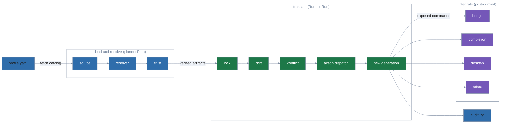
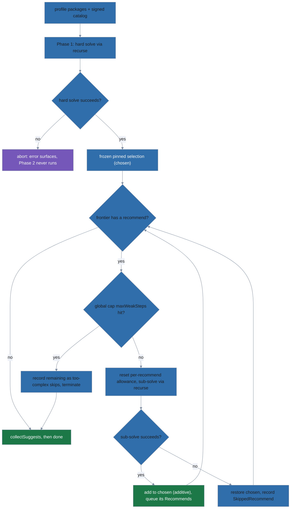

# Architecture

polypkg is a declarative package manager: a profile file states what should be
installed, and `polypkg apply` makes the system match it, recording each result
as an immutable generation. This document maps that flow onto the code and gives
a one-line role for every `internal/` package. It is aimed at maintainers; users
should start at the top-level [README.md](../../README.md).

The CLI is a [cobra](https://github.com/spf13/cobra) command tree built in
`internal/cli/root.go` (`NewRootCmd`) and launched from `cmd/polypkg/main.go`.
The imperative verbs (`install`, `remove`, `upgrade`) are sugar: they edit the
profile via `internal/profileedit`, then run the same `apply` pipeline a
power user reaches directly with `plan`/`apply`.

Eight of those commands are pure groups with no behaviour of their own:
`alternatives`, `attestation`, `config`, `generation`, `mirror`, `pkg`, `repo`,
and `source`. Each pairs `requireSubcommand`
(`internal/cli/commandgroup.go`) as its `RunE` with `cobra.ArbitraryArgs` as
its `Args`.

- **What cobra does by default.** A command with no `Run` is a help request as
  far as cobra is concerned. `polypkg repo` would print the group's help to
  stdout and exit 0 — a script silently succeeds having done nothing, and a
  `--format json` consumer receives English prose.
- **What replaces it.** `requireSubcommand` returns a `CLIError` through
  `WrapError`: message and hint on stderr, a `polypkg.cli-result/v2` error
  envelope under `--format json`, and a non-zero exit. A missing subcommand and
  an unrecognised one both take that path, matching what an unknown top-level
  command already did.
- **Why `ArbitraryArgs`.** It is what lets an unrecognised subcommand name
  reach `RunE` instead of being rejected on arg count first. `attestation` and
  `generation` pass a group-specific recovery hint for that case; the other six
  point at their own `--help`.

## The apply pipeline

`apply` runs in three stages. The first two are reusable library calls —
`planner.Plan` then `Runner.Run` — and `plan` shares the first stage to preview
changes without mutating anything.



1. **Load and resolve** — `planner.Plan` (`internal/planner/planner.go`) fetches
   each configured source's signed catalog, keeps only the entries this host
   can install (see "Platform-aware catalogs" below), runs the `resolver` to pick versions
   and pull in transitive dependencies, verifies every artifact via `trust`, and
   extracts it into the content-addressed extract store (`extractstore`, below),
   returning the `(manifest, run entries, projected ownership)` tuple.
   It touches no live state, but it *does* advance the per-source trust serial
   high-water mark, so callers must hold the per-scope apply lock.

2. **Transact** — `Runner.Run` (`runner.New` → `(*Runner).Run` in
   `internal/runner/runner.go`) takes the per-scope `lock`, opens a `substrate`
   transaction, checks for `drift` against the active generation, runs `conflict`
   detection to refuse colliding ownership, dispatches each package's `action`s
   (the 12 registered actions — `install`, `symlink`, `dir`, `perms`, `config`,
   `unmanaged`, `state`, `path`, `alternatives`, `completion`, `desktop`, `mime`)
   into the substrate, commits the manifest as a new immutable generation, writes
   the `audit` record, and releases the lock. The commit's durability order is
   described in [Generation commits and incomplete
   generations](#generation-commits-and-incomplete-generations).

3. **Integrate** — after the generation commits, `apply` reconciles the
   user-visible surface: the `bridge` puts the generation's exposed commands on
   `$PATH`, and the `completion`, `desktop`, and `mime` integrators install shell
   completions, `.desktop` entries, and shared-mime-info files. `rollback` and
   `gc` re-run the same integration against whichever generation they activate.

### Generation commits and incomplete generations

`OwnStore.CommitGeneration` (`internal/substrate/ownstore.go`) makes a
generation durable in a fixed order, and only then switches to it:

1. Each of `ownership.json` and the config-base snapshots is written to a temp
   file, fsynced, and renamed into place; then their directories are fsynced.
2. The package payload that actions placed under `active/` is flushed. On Linux
   that is one `syncfs(2)` of the store's filesystem. It flushes every dirty
   page on that filesystem, not only this generation's, and it reports
   writeback errors only on Linux 5.8 and later; an older kernel can return
   success after a failed writeback. Other platforms fsync each file and
   directory under `active/` instead. On Linux the `syncfs` also covers the
   files of step 1; their individual fsyncs are there for the non-Linux path.
3. The generation directory is fsynced.
4. `manifest.json` is written last, the same way as step 1, stamped with the
   generation id. Then the generation directory, `generations/` and the store
   root are fsynced.
5. The `active` symlink is swapped by rename, and the store root is fsynced
   again. A failure of that last fsync is logged, not returned: the switch is
   already visible and cannot be undone.

A generation is in one of three states, decided by `ReadManifest`:

- **Complete:** `manifest.json` exists, parses, and records the generation's
  own id (0 is accepted from older binaries, which did not stamp it).
- **Incomplete** (`ErrIncompleteGeneration`): `manifest.json` is missing. An
  apply was interrupted before step 4. `rollback` and `generation pin` refuse
  it, the default `rollback` target skips it, `gc` removes it whatever
  `--count` and `--age` say (unless it is current or pinned), `status -v`
  marks it `[incomplete]`, and `attestation report` skips it and lists it
  under `skipped_incomplete`. An apply still in progress has not written its
  manifest yet either, so `status -v` run alongside it shows that apply's
  generation as `[incomplete]` too.
- **Damaged** (`ErrDamagedGeneration`): `manifest.json` exists but does not
  parse, fails its schema, or records another generation's id. A crash cannot
  cause this: step 4 renames the manifest into place only after it is fsynced
  and stamped, so a crash leaves it missing, never torn or misplaced. Damage
  means corruption or tampering, and the generation is evidence. `rollback`
  and `generation pin` refuse it with their own error, the default `rollback`
  target skips it with a warning, `gc` never removes it (at any age, under any
  `--count`) and names it with a hint to inspect it and delete it by hand,
  `status -v` marks it `[damaged]`, `attestation report` fails naming it, and
  the store sweep keeps every extract dir and cached download while it exists.

A manifest that exists but cannot be read (EACCES, EIO) is none of these: it
is an error reported as such, never a reason to delete or skip. So is a
manifest a newer polypkg wrote (`schema.NewerSchemaError`, detected before the
damage checks): it is not corrupt, this binary just cannot judge it.
`ListGenerations` fails naming it, so `gc` removes nothing, and `rollback`,
`generation pin` and `attestation report` refuse with the upgrade message.

Removing a generation (`gc`, or `Abort` after a failed apply) deletes
`manifest.json` and fsyncs the directory before deleting the rest, so a removal
cut short also leaves an incomplete generation, never a complete-looking one
over a partial payload.

**Orphaned complete generation.** A power loss after step 4 but before the swap
in step 5 is durable leaves generation N complete but not active: `active`
still names N-1. Nothing repairs this, because nothing is broken: N is a valid
generation. `status -v` lists it as a retained generation newer than the
current one. A default `rollback` ignores it, because it only looks below the
current generation, but `rollback --to N` activates it. `gc` keeps or removes it
under the normal `--count` and `--age` rules, and the next apply creates N+1,
because generation ids are never reused.

## Package map

### Core pipeline

| Package | Role |
|---|---|
| `cli` | The cobra command tree, flag parsing, and the `polypkg.cli-result/v2` output envelope. |
| `schema` | Wire formats: the profile spec (`polypkg.spec/v1`) and the `polypkg.yaml` inside a package tarball. |
| `platform` | The platform identifier: `Host()` (`GOOS/GOARCH` of the running binary), the consumer grammar (`ValidateConsumer`), and the producer check against an allow-list generated from `go tool dist list` (`ValidateProducer`). Imports nothing from `internal/`. |
| `source` | Source-backend interface and the native fetcher for a source's signed catalog and artifacts. |
| `resolver` | `BuildCatalog` turns a signed index into this host's candidate set (name validation, platform filtering; see "Platform-aware catalogs" below). Then a two-phase deterministic solver: hard backtracking (depends, `Provides`/virtuals, `Conflicts`, `Obsoletes`) followed by weak augmentation (Recommends). |
| `trust` | minisign signature verification for indexes, artifacts, and attestations (per-role keyring) plus the metadata freshness check (`CheckExpiry`). Also owns the two extra anchor-signed documents: the trust bundle (`LoadBundle`, then the temporal lookups `BuilderKeyAt`/`BuilderKey`/`SigstoreRootAt`/`SelectSigstoreRoot`) and the revocation list (`LoadRevocationList`, `IsBuilderKeyRevoked`, `IsAttestationRevoked`). |
| `planner` | The load-and-resolve pipeline (`Plan`): fetch, verify (signatures, attestations, policy gate, downgrade guard), extract → manifest + run entries + ownership. |
| `extractstore` | The content-addressed extracted-package store under `<stateHome>/pkg-extract`: dir naming (`Root`, `Dir`, `DirName`, `LegacyDirName`) and the manifest-driven `Sweep` (see "The extract store" below). |
| `action` | The declarative install-time actions — 12 entries in `action.Registry` (`install`, `symlink`, `dir`, `perms`, `config`, `unmanaged`, `state`, `path`, `alternatives`, `completion`, `desktop`, `mime`) — with scope enforcement. |
| `runner` | Coordinates one transaction: lock, begin, drift check, action dispatch, commit, audit, release. |
| `substrate` | Substrate-backend interface plus the own-store content-store backend. |
| `conflict` | Pure cross-package collision detection over a generation's ownership set (no I/O, no policy). |

`trust`, `attest`, and the verification half of `planner` are documented at
length in [supply-chain.md](supply-chain.md); the rows above are the one-line
version.

### Integration surface

| Package | Role |
|---|---|
| `bridge` | Reconciles `~/.local/bin` (user) or `/usr/local/bin` (system) against the generation's exposed commands. |
| `linkfarm` | Low-level symlink-directory reconciliation against a wanted set; the engine under `bridge` and `mime`. |
| `alternatives` | Arbitrates which package provides a shared command name when several claim it. |
| `completion` | Installs packages' shell-completion scripts. |
| `desktop` | Installs packages' `.desktop` application entries. |
| `mime` | Installs packages' shared-mime-info XML. |

### Inspection, lifecycle, and support

| Package | Role |
|---|---|
| `diff` | Computes the delta between two `(manifest, ownership)` pairs; backs `plan` and `status`. |
| `drift` | Detects divergence between a generation's recorded ownership and the live filesystem. |
| `gc` | Pure mark-and-sweep generation-retention algorithm (`--count`, `--age`, pins). |
| `lock` | Per-scope advisory file locking that serializes applies. |
| `merge` | Line-based three-way (diff3) merge used when reconciling managed config files. |
| `audit` | JSON Lines audit-log writer. Rotates `audit.log` by size (`DefaultRotation`: 10 MiB, three old files kept) under an flock on the `audit.log.lock` sidecar, because `applyProfile` writes some events before the runner takes `apply.lock`. |
| `config` | Layered configuration loading (defaults → config file → env → flags). `setDefaults` registers a key only once a consumer exists: `revocation.near_expiry_threshold` and the four integrator `*.enabled` toggles, nothing else. |
| `paths` | Resolves polypkg's data, config, and state directories (XDG). |
| `profileedit` | Comment-preserving edits to an existing profile, used by `install`/`remove`/`source`. |
| `starlarkeval` | Evaluates a package's `!starlark` snippets in a sandboxed re-exec child process. |
| `repo` | The repository publisher (`polypkg repo`). See [repo-publisher.md](repo-publisher.md). |
| `mirror` | Bundle transport for `polypkg mirror`: `Pull` (verified upstream fetch + staging) and `VerifyBundle` (offline bundle verification). See [supply-chain.md](supply-chain.md); the publisher half of the round trip is in [repo-publisher.md](repo-publisher.md). |
| `pkglint` | The package-source linter behind `polypkg pkg lint`/`pkg build`: layered structure/identity/action/param/content checks (`PKGxxx` rules) with human and canonical SARIF 2.1.0 output. |
| `attest` | The provenance kernel, with no dependency on `trust` (callers inject keys and revocation lookups). Four groups: the predicate-agnostic in-toto Statement (`AssembleStatement`, `CanonicalJSON`, `ParseStatement` — `pkg build`'s unsigned `.att.json` preview and the byte-identical document `repo build` signs); the fail-closed digest binding (`MatchSubjectDigests`, `BindSubjects` in `binding.go`, plus `AssembleLinkStatement` in `link.go`); shallow envelope interpretation (`InspectCarried`, `ExtractCarriedSubjects`, raw SPDX/CycloneDX and sigstore-bundle readers in `carried.go`); and signature verification (`VerifyBuilderSignature` — the DSSE PAE kernel in `dsse.go`; `SigstoreTrustedMaterial`, `VerifySignedEntity`, `VerifySigstoreBundle` — offline sigstore in `sigstore.go`). |

## The extract store

`planner.Plan` extracts every verified artifact under
`<stateHome>/pkg-extract` before the runner ever opens a transaction. The
`install` action copies from that tree into the generation by default; under
`policy: symlink` (or `hardlink`) the generation instead links into it and
depends on it for as long as the generation is retained.

Ownership is split. `internal/extractstore` is the naming-and-sweep library:
it exports `Root`, `DirName`, `LegacyDirName`, `Dir`, `Sweep`, and
`DefaultMinAge`, and nothing else. The two callers own the policy — the
planner's unexported `ensureExtracted` (`internal/planner/planner.go`) writes
into the store, and the CLI's unexported `sweepStores`
(`internal/cli/gc.go`) assembles the keep-set and calls `Sweep`. The
invariants:

- **Content-addressed dirs.** Each artifact extracts to
  `pkg-extract/<name>-<version>+<hash16>`, where `<hash16>` is the first 16 hex
  chars of the artifact's BLAKE3 `content_hash` (the full hash is enforced by
  artifact verification before extraction ever runs). A same-version republish
  is a *different* artifact and lands in a *different* dir, so it can never
  rewrite the tree a retained or pinned generation was installed from (and,
  under `policy: symlink`, still resolves through) — the integrity bug the
  previous `RemoveAll`+extract-in-place layout had.
- **Index names cannot steer the path.** `<name>` comes from the signed
  index, so it is checked before it reaches the store. The index schema
  limits package keys to the slug `^[a-zA-Z0-9_-]+$`, and `BuildCatalog`
  checks every key and relation name again. After extraction, before any
  action runs, the artifact's own `polypkg.yaml` must name the same name,
  version, and platform as the entry.
- **Atomic extraction, verified reuse.** The planner's `ensureExtracted`
  extracts into an
  `.extract-*` temp sibling and lands it via atomic rename: a dir either exists
  complete or not at all, and a crash leaves only a temp dir for the sweep.
  The store is user-writable, so an existing dir is reused only after
  `source.VerifyExtractedTarZst` confirms it still matches the verified
  artifact bytes. It checks the same paths, types, symlink targets, and file
  content, and that no file has gained a permission bit (losing one to the umask
  is expected). Directory modes are not compared. A modified dir is replaced:
  the artifact is extracted to a fresh `.extract-*` temp, the old dir is renamed
  to another `.extract-*` name, the fresh one is renamed into place, and the old
  one is removed, with a warning logged. Verification decompresses and hashes
  every reused package on each `plan`/`apply`. Reuse refreshes the dir's mtime so
  it counts as recent activity for the sweep's grace window.
- **Manifest-driven sweep.** `gc` and every successful `apply` run the CLI's
  `sweepStores`, which builds the keep-set — the union of every retained
  generation's manifest entries — and hands it to `extractstore.Sweep`.
  Anything else older than `extractstore.DefaultMinAge` (one hour) is removed.
  The grace window exists because extraction happens
  *before* the runner takes `apply.lock` — a young unreferenced dir (or
  in-flight `.extract-*` temp) may belong to a concurrent apply whose
  generation has not committed yet.
- **Accepted residual risk: the post-apply sweep runs unlocked.** `gc` sweeps
  under `apply.lock`, but `applyProfile` sweeps after the runner has released
  it. A concurrent plan that reuses an extract dir older than the grace
  window can therefore race that sweep: the sweep may judge the dir
  unreferenced and remove it after the plan verified it and before the plan's
  apply installs from it. Under `policy: copy` the install then fails on the
  missing source and the apply aborts, so a retry re-extracts and succeeds.
  Under `policy: symlink` the apply could commit links into the removed dir;
  they dangle, and drift detection reports them.
- **Legacy layout kept while referenced.** Generations committed by older
  binaries recorded symlink targets under the pre-content-addressed
  `<name>-<version>` name; the sweep keeps both spellings for every retained
  manifest entry.
- **Fail-safe on unusable manifests.** A generation with no manifest
  (incomplete) records no references and is skipped. A concurrent apply's
  not-yet-committed generation looks the same, and the grace window above keeps
  its dirs. The exception is the current generation: if it has no manifest,
  the sweep is skipped, because it is live and nothing records what its payload
  links to. If any retained generation's manifest is damaged, the sweep is
  skipped entirely, keeping every dir (with a warning naming the generation).
  Its references cannot be known, it may be the current generation, and the
  dirs it used may be evidence. A manifest that cannot be read at all also skips
  the sweep. Deleting a dir a generation might still reference would recreate
  exactly the bug the content-addressed store fixed.
- **The artifact cache is swept in the same pass.** `NativeBackend.Fetch`
  caches HTTP downloads at `<stateHome>/cache/<source>/<artifact base name>`
  (`source.CacheRoot`). `sweepStores` keeps `path.Base(SourceURL)` and
  `<hex>.att.json` for each recorded attestation hash of every retained entry,
  and `source.SweepArtifactCache` removes any other regular file older than
  the same `DefaultMinAge`. The signed metadata documents (`index.json`,
  `trust.json`, `trust-bundle.json`, `revocations.json`) are never removed.
  The fail-safe rules above apply unchanged: whenever the extract sweep is
  skipped, so is the cache sweep. Deleting a cached file is always safe for
  correctness: `Fetch` reads the whole file at once and re-downloads on a miss.
  Only the attestation hash each generation records is kept: the manifest
  records the last verified native attestation and each carried binding, so
  any other cached `.att.json` (e.g. a package's second native ref) may be
  pruned after the grace period. The next plan re-fetches and re-verifies it,
  and a plan always needs the network anyway, because `FetchIndex` never reads
  the cached `index.json`.

## The supply chain

Everything between a publisher's signed index and a file on disk — the signed wire
formats, the per-package verification chain, carried external provenance,
freshness, anti-rollback, prebuilt ingest, and the mirror hop — has its own
document: [supply-chain.md](supply-chain.md). It is the largest subsystem in the
tree, and most of what `trust`, `attest`, and the verification half of `planner`
do exists to serve it.

The shape of it, for orientation:

- **Three wire formats.** `polypkg.index/v3` (expiry, pool paths, per-entry
  platform, attestation refs), `polypkg.trust/v2` (expiry, monotonic serial, key roles),
  and `polypkg.manifest/v2` (the install-time attestation record). Attestation
  refs live inside the signed index, so stripping one invalidates the
  signature.
- **A five-step verification chain**, run per resolved package inside
  `planner.Plan`: source metadata, artifact, attestation transport, carried
  binding and tier, then the policy gate. Only the last step consults
  `attestation.policy`, and only for absence — everything before it is fatal in
  every mode.
- **Four tiers for carried provenance.** `bound-unverified`,
  `verified-transport-only`, `builder-verified`, `verified-offline`. The last
  two are the anchored ones: only they satisfy a `require` and only they count
  toward the posture floor.
- **Two independent staleness gates.** Wall-clock `expires` is
  operator-relaxable through `accept_expiry_until`; the monotonic per-document
  serial floor never is. A graced fetch can be held still, never rolled back.
- **Recompute at every hop.** A mirror re-verifies what it fetched, then
  `repo build` re-derives every carried binding from its own extraction rather
  than trusting what the pull recorded.

Read that document before touching `internal/trust`, `internal/attest`,
`internal/planner`, or `internal/mirror`.

## Platform-aware catalogs

An index can list several entries for one version, one per platform. The
resolver never sees the entries this host cannot install.
`resolver.BuildCatalog` (`internal/resolver/catalog.go`) builds the candidate
set from a signed index in three steps:

1. **Validate names.** Every package key and every relation name (`depends`,
   `recommends`, `suggests`, `provides`, `conflicts`, `obsoletes`) must pass
   `schema.ValidatePackageName`. One bad name fails the whole catalog. The
   index is signed, so a malformed one is a publisher fault, not an entry to
   skip. The same applies to `repo build`'s publishing rules: a name may list
   each `(version, platform)` pair once, and a version is either one
   platform-agnostic entry or one entry per platform, never both. Either
   violation would give a host two candidates for one version.
2. **Filter by platform.** An entry is kept when its `platform` is empty
   (platform-agnostic) or equals the host passed in. Production callers pass
   `platform.Host()`, which is `runtime.GOOS + "/" + runtime.GOARCH` with no
   normalisation and no fallback between architectures.
3. **Record what was dropped.** For each `(name, version)` the catalog keeps
   the platforms it dropped. `Catalog.OtherPlatforms` returns them sorted.
   `Catalog.NewestUnavailable` supports the error for a name that has
   entries but none for this host:

   ```
   rg 14.1.1 is published for darwin/arm64, linux/amd64; this host is freebsd/amd64
   ```

   It names the newest version published for any platform. A name with no
   entries at all keeps the ordinary not-found error. The same error covers a
   version constraint that no host build satisfies but another platform's
   does (`rg@=14.1.1` when this host has only 14.0.0): it names the newest
   such version. Only when no platform publishes a satisfying version is it
   reported as a version mismatch.

Everything downstream works on the filtered set, including the planner's
downgrade high-water map. A version published only for another platform
therefore cannot trigger a false "refusing to downgrade". The marks are also
stored per host platform in the source's seen-state file (`trust.Seen`), so
machines of different platforms sharing one state home keep separate marks.

**Ownership across sources.** `resolver.MergeCatalogs` overlays the
per-source catalogs in `sources.order`. The first source that publishes a
name for **any** platform owns it, whether or not it has a build for this
host. When the owner publishes the name only for other platforms, the
merged catalog has no candidate for it and carries the owner's record of
those platforms, so resolution fails with the message above. A
lower-priority source's host build is never substituted unless the profile
pins the package to that source. Ownership therefore does not depend on the
host: otherwise a public source lower in `order` could stand in for a
private package on every host the private source does not build for
(dependency confusion).

Consumers accept any well-formed platform (two or three `[a-z0-9]+`
segments) and skip entries that do not match. An index that adds
architecture variants later therefore stays readable. Producers are
stricter; see [repo-publisher.md](repo-publisher.md#per-platform-entries).

## Two-phase resolution

`resolver.ResolveWithWeak` (in `internal/resolver/weak.go`) splits dependency
resolution into two phases.



**Phase 1 — hard solve.** The existing deterministic backtracking solver runs
unchanged: it satisfies every `depends` relation, resolves virtual packages via
`provides`, and refuses on `conflicts` or `obsoletes` violations. The result is
a frozen, pinned selection (`chosen`). If Phase 1 fails, the error surfaces
immediately; Phase 2 never runs.

**Phase 2 — weak augmentation.** Starting from the `Recommends` of every
package in the Phase-1 closure, augmentation works over a breadth-first
frontier. Each recommend is sub-solved by calling the existing `recurse`
function against the shared `chosen` map — the same solver function Phase 1
uses, relying on its documented contract that it restores `chosen` exactly on
failure. Phase 2 is **purely additive**: it can only add entries to `chosen`,
never remove or replace them.

When a sub-solve fails for any reason (missing package, constraint conflict,
budget exhausted), `chosen` is left unmodified and the recommend is recorded as
a `SkippedRecommend` with a human-readable reason. A failed recommend never
aborts the overall install. Newly added weak packages have their own
`Recommends` queued into the frontier, so the process is transitive.

Phase 2 uses a two-tiered budget (independent of Phase 1). Each recommend
sub-solve gets its **own fresh per-recommend allowance** (`defaultWeakSteps`),
reset to zero before every `recurse` call, so a heavy earlier recommend cannot
starve a later benign one. A **global cap** (`maxWeakSteps`) bounds total
Phase-2 work summed across all sub-solves: once the cap is hit, the remaining
(and any in-flight unsatisfied) recommends are recorded as "too complex" skips
and augmentation terminates cleanly — it never hangs and never aborts a
successful hard install.

**Suggests.** After Phase 2, `collectSuggests` gathers the `Suggests` relations
of every selected package (both hard and weak) into a deduplicated `Suggestion`
list. Suggests are surfaced in the plan/apply output and `info` command but are
never installed, regardless of policy.

**Determinism.** Before each frontier pass, candidates are sorted by
`(Name, VersionRange, recommender)`. Within a pass, the `chosen` map is only
ever grown, never reordered. The Phase-1 result is a pure function of the
profile's declared packages and the signed catalog; Phase 2 is a pure function
of that frozen Phase-1 result plus the `Recommends` fields in the catalog. Two
runs with the same inputs produce identical manifests.

**Provenance.** `ManifestEntry` carries `weak: true` and `recommended_by: [...]`
for every weakly-added package. The manifest also records `weak_deps_policy`
(`"on"`; field is absent entirely when policy is off, per `omitempty`) so the
applied policy is auditable from the stored generation. `status -vv` reads
these fields to annotate the package list with `[weak] recommended by <names>`.

**Non-goals / future work.** Reverse weak dependencies (`Supplements`,
`Enhances`) and feature-group triggers are not implemented and are explicit
non-goals for the current design.
