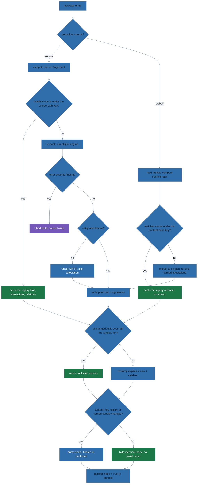

# repo publisher: design and internals

`polypkg repo` is the producer counterpart to the consumer's fetch/verify path.
This document describes the on-disk format, the trust model, revocation, the
key container, the incremental build system, prebuilt ingestion, manifest
edits, and the FIPS posture. It is aimed at maintainers who need to understand
or modify the publisher code, not users of the CLI.

Package layout: `internal/repo/` (signer, keystore, pack, cache, build/Builder +
Inspector, revoke, scaffold, manifest\_edit, error, and the mirror carriage path
— carried, ingest, emit, export) and `internal/cli/repo*.go` (thin command
wrappers).

**Scope.** Everything here is producer-side. The consumer's transport for
`polypkg mirror` lives in `internal/mirror/` (`Pull`, `VerifyBundle`) and is
documented in [supply-chain.md](supply-chain.md), not here. What this file does
cover is the publisher half of the mirror round trip, which
`internal/cli/mirror.go` drives:

- `Builder.Build` ingesting fetched prebuilt artifacts — see
  [Prebuilt ingestion](#prebuilt-ingestion).
- `Builder.PropagateRevocations` re-emitting upstream revocations under the
  mirror's own key — see [Revocation](#revocation).
- `Builder.ExportBundle` writing the signed offline bundle (`export.go`).

---

## On-disk repository layout

After a successful `repo build`, the published directory (`output`, default
`./public`) contains:

```
public/
  trust_root.pub          # minisign Ed25519 public key (distributed to clients)
  trust.json              # polypkg.trust/v2 JSON document (serial, expires, key roles)
  trust.json.minisig      # detached minisig over trust.json
  index.json              # polypkg.index/v2 JSON document (expires, pool refs, attestations)
  index.json.minisig      # detached minisig over index.json
  pool/
    <blake3>.tar.zst           # content-addressed packed artifact (zstd tar)
    <blake3>.tar.zst.minisig   # detached minisig over the artifact
    <blake3>.att.json          # one attestation envelope (see below)
    <blake3>.att.json.minisig  # detached minisig over the attestation bytes
```

Two more root-level documents are conditional — absent from a plain first build,
but part of the served set once their producing path has run:

```
public/
  trust-bundle.json          # polypkg.trust-bundle/v1: carried upstream builder keys
  trust-bundle.json.minisig  #   + sigstore roots, re-signed under the local key
  revocations.json           # polypkg.revocation-list/v1: revoked builder keys
  revocations.json.minisig   #   and attestation content-hashes
```

`trust-bundle.json` appears only when at least one prebuilt package carries an
upstream bundle (`build.go`, `writeAtomicBatch` call site); a build that carries
none prunes any bundle a prior build left behind. `revocations.json` appears
only after `repo revoke` or a mirror's `PropagateRevocations` has published one.

A `pool/<blake3>.att.json` is *not* necessarily a lint attestation, and not
necessarily canonical. Two kinds share the path (`schema.AttestationRef.Kind`):

- `native-jcs` — a polypkg-authored in-toto Statement, JCS-canonicalized before
  hashing and signing. Either the pkglint SARIF attestation
  (`emit.go`, `sourceAttestations`) or the link attestation binding carried
  materials to the artifact.
- `carried-opaque` — an external builder's envelope written **verbatim**, never
  re-canonicalized (`emit.go`, `bindCarriedSet`; `schema/index.go`). Its
  `format` may be `slsa-provenance`, `spdx`, `cyclonedx`, `sigstore-bundle`,
  `in-toto-generic`, or `in-toto-unclassified`. Re-canonicalizing one would
  break the upstream signature over its own bytes, so the publisher only adds a
  transport signature on top.

Pool blobs are named by the BLAKE3 hash of their own bytes. Republishing
a changed build of the same version writes a NEW blob and repoints the index;
old blobs persist immutably so previously signed indexes (and consumer
rollbacks) keep resolving. The pool grows monotonically until pool GC lands
(future work).

The index entry's `revision` field is an informational ordinal counting
republishes of one version. It derives from the build cache, floored against
the published index, so a lost cache continues the published ordinal instead of
resetting to 1 (`content_hash` is the disambiguator, not `revision`).

Blobs and their signatures are always written before the index/trust metadata
that references them, so a published index never points at a missing blob.

### Signature format

Signatures use minisign's legacy `Ed` format: pure Ed25519 over the raw bytes of
the signed payload (no prehash). A `.minisig` file has four lines:

```
untrusted comment: <human label>
<base64("Ed" + keyID[8] + sig[64])>
trusted comment: <binding metadata>
<base64(globalSig[64])>
```

The *global signature* covers `sig[:] || trustedComment` (no prefix), preventing
the trusted comment from being swapped post-hoc. This matches what
[go-minisign](https://pkg.go.dev/github.com/jedisct1/go-minisign) verifies.
Public keys and signatures produced here verify with the stock `minisign` CLI.

**Trusted-comment bindings:**

| File | Trusted comment |
|---|---|
| artifact | `name=<name> version=<ver> hash=blake3:<hex>` (hash of the artifact bytes) |
| attestation | `name=<name> version=<ver> hash=blake3:<hex>` (hash of the `.att.json` bytes) |
| `index.json` | `serial=<N> ts=1970-01-01T00:00:00Z` |
| `trust.json` | `serial=<N>` |
| `trust-bundle.json` | `serial=<N>` |
| `revocations.json` | `serial=<N>` |
| export-bundle pool manifest | `serial=<N>` |

The consumer constrains only the first three forms. The serial in the last four
is carried for operator legibility; the authoritative serial is the one inside
the signed document body, which is what the anti-rollback floor compares.

The content hash in the artifact trusted comment is `blake3:` followed by the
lowercase hex of a 32-byte BLAKE3 digest (`lukechampine.com/blake3`). The
consumer verifies this hash before using the artifact.

The build timestamp is fixed to `1970-01-01T00:00:00Z` (not wall time), making
repeated no-op builds byte-identical. The monotonic serial provides ordering
for consumers instead.

---

## Trust model

The trust chain is self-anchoring with a single key:

1. `trust_root.pub` is the minisign public key file given to clients at setup time.
2. `trust.json` (schema `polypkg.trust/v2`) lists the active signing key with
   roles `["index", "artifact", "attestation"]`. It carries a monotonic
   `serial`, an `issued_at` timestamp (fixed to the epoch, informational), an
   `expires` freshness bound shared with the index, and a `source` name.
3. `trust.json.minisig` is signed by the **same key** that is listed inside the
   document — the key self-certifies. The consumer verifies the signature using
   the trust root they already hold.

`schema.TrustDoc` also defines a `revoked []string` field, but **this publisher
never emits it**: `build.go` assembles the `TrustDoc` literal with `Keys` only,
so every document `Build` signs leaves `revoked` empty. That is a statement
about the publisher, not about the field. The consumer side still honors it —
`Keyring.Verify` is contracted to enforce active + role + not-revoked
(`trust/verifier.go`) — so a `trust.json` from some other producer that does
populate `revoked` would be enforced as written. What polypkg's own repos carry
revocation in is the separate signed `revocations.json` document, described in
the next section.

The `source` field is load-bearing on the publisher side, not just the consumer
side. Documents are refused when their `source` does not match the manifest's:
`loadPublishedRevocationList` (`revoke.go`) fails closed rather than overwrite
another source's published list that happens to sit in the same output
directory.

That three-step chain describes only how `trust.json` itself is anchored.
**Four served document types hang off the same key**, and each brings its own
monotonic serial with its own anti-rollback floor, persisted in the consumer's
per-source `Seen` state:

| Document | Publisher signer (`signer.go`) | Consumer loader (`trust/verifier.go`) | Serial floor (`trust/seen.go`) |
|---|---|---|---|
| `trust.json` | `SignTrust` | `LoadTrust` | `Seen.TrustSerial` |
| `index.json` | `SignIndex` | (keyring `Verify`, `index` role) | `Seen.IndexSerial` |
| `trust-bundle.json` | `SignTrustBundle` | `LoadBundle` | `Seen.BundleSerial` |
| `revocations.json` | `SignRevocationList` | `LoadRevocationList` | `Seen.RevocationSerial` |

`SignPoolManifest` signs a fifth document, the export-bundle completeness
manifest, but that one travels inside a bundle tar rather than being served from
the output root, and it deliberately reuses the index role: the manifest is
trusted exactly when the repo's index signature is.

A missing bundle or revocation list is refused only once its floor is above
zero — absence is the trust-on-first-use baseline, but a source that has ever
shown you one can never stop showing you one.

This is a valid minimal trust chain: the consumer already trusts the public key
(out-of-band), so the trust document's purpose is to enumerate roles, enable
key rotation, and carry the serial that gates replay attacks. A compromised
index, artifact, or attestation cannot be injected without also possessing the
private key.

**What `expires` actually guarantees.** Wall-clock freshness is
operator-relaxable; the serial floor is not. `trust.CheckExpiry` (`expiry.go`)
resolves in three steps:

1. An empty or non-RFC3339 `expires` is a hard failure. There is no path that
   treats a missing bound as "fresh".
2. The document is fresh — and no grace is consulted — for as long as `now` has
   not passed `expires` plus `ExpirySkew` (5 minutes). The predicate is
   `!timeNow().After(t.Add(ExpirySkew))`, so the skew is a trailing allowance
   on top of the bound, not a window around it.
3. If it is past that, the document is expired — and is nonetheless **accepted**
   when the operator has set a per-source `accept_expiry_until` and `now` is at
   or before that deadline. `CheckExpiry` returns `graced = true` and no error.
   An empty or unparseable `accept_expiry_until` grants no grace at all (a
   malformed ceiling must never read as "forever").

So the freeze attack is bounded, not closed. Against a client with no grace
window configured, a mirror cannot pin a stale-but-validly-signed serial past
`expires + 5m`. Against a client whose operator has deliberately set
`accept_expiry_until` — the air-gapped/frozen-mirror case — the wall-clock bound
is suspended up to that deadline, and the only remaining protection is the
unconditional one: the monotonic serial floor, a separate gate that grace never
touches. A graced fetch cannot be rolled *back*; it can only be held *still*.
The grace posture is recorded in `Seen.Graced` so the offline `status` command
can report that a source was last fetched under grace.

The `attestation` role separates concerns for a future split-key setup: a
signing key that deliberately lacks the role publishes with
`--skip-attestations`, and consumers treat those packages per their
`attestation.policy` (absent ≠ invalid; a present-but-invalid attestation is
always fatal on the consumer side).

Key structure (`internal/repo/signer.go`, `Keypair`):

- `keyID`: 8 random bytes. Hex-encoded in the encrypted key file's `key_id`
  field and in `trust.json.keys[].id`; embedded **in binary form inside the
  base64 signature line** of every `.minisig` (`base64("Ed" + keyID[8] +
  sig[64])`, `signer.go` `SignWithComment`) — which is where the consumer's
  keyring reads it from to select a signing key. It is *not* in any trusted
  comment; the four trusted-comment forms tabulated above carry only
  name/version/hash or serial.
- `pub`: 32-byte Ed25519 public key.
- `PublicKeyBase64()`: `base64("Ed" + keyID[8] + pub[32])` — the form stored in
  `trust_root.pub` and `trust.json.keys[].pubkey`.

---

## Revocation

The trust document says which keys *may* sign. `revocations.json`
(`polypkg.revocation-list/v1`, `internal/repo/revoke.go`) says which artifacts
and keys a client must refuse even when the signature over them checks out. It
is a separate document from the trust bundle, with its own serial and its own
`expires`, so a revocation ships without republishing a full bundle.

```json
{
  "schema": "polypkg.revocation-list/v1",
  "source": "example",
  "serial": 3,
  "issued_at": "2026-01-14T09:00:00Z",
  "expires": "2026-02-13T09:00:00Z",
  "revoked_builder_keys": ["a1b2c3d4e5f60718"],
  "revoked_attestations": ["blake3:9f2c…"]
}
```

Both revoked lists are `omitempty`, so a list that revokes only keys carries no
`revoked_attestations` field at all.

**Cumulative merge.** `Revoke` loads the currently published list, folds the new
targets into it via `mergedSets`, and republishes the union — a revocation is
never silently dropped by a later call that forgot to repeat it. Additions and
removals cannot be mixed in one invocation (`repo revoke` errors with a hint to
run them separately), and `--remove` against a repo with no published list is an
error rather than a silent no-op.

**Serial rule.** `publishRevocationList` always stamps `prevSerial + 1` and
always stamps a fresh `expires = now + validFor`. It does not consult a
byte-compare the way the index build does, so the list's serial is strictly
monotonic per publish. Before signing, the authored document is round-tripped
through `schema.ParseRevocationList`: the publisher refuses to sign a document
its own consumers' strict parser would reject, which is what catches an
`--attestation` value that is not `blake3:<hex>`.

**Loading is fail-closed on identity.** A published `revocations.json` whose
`source` does not match the manifest is refused outright rather than extended or
overwritten — an output directory holding another source's list is an operator
error, not something to paper over.

### Mirror propagation

`PropagateRevocations` is the automated variant that `internal/cli/mirror.go`
calls after a mirror re-publish, feeding it the union of every upstream's
revoked keys and attestation hashes. It is additive-only (no `Remove*` path) and
it publishes on a narrower trigger than `Revoke`, so a cron-driven pull does not
churn the serial on every run:

- **Nothing upstream, nothing published → strict no-op.** When the merged set is
  empty *and* no list exists yet, it writes nothing and returns
  `emitted = false`. This refusal is deliberate: bringing an empty list into
  existence would saddle a clean mirror with a permanent
  revocation-freshness obligation — downstream clients would then record a
  non-zero `RevocationSerial` floor and refuse the source the moment that empty
  list went stale, all for no security benefit.
- **Otherwise, publish when there is a reason to.** Three of them, any one
  sufficient; a steady-state pull with an unchanged set and a fresh list emits
  nothing.

  - Membership changed.
  - No list exists yet.
  - The published list has dropped to at or below half its validity window
    (`revocationBelowHalfLife`, `revoke.go`).

  That last trigger is the same *shape* of rule the index uses, but a separate
  implementation taking a different input: it measures against the `validFor`
  this call was handed, not against the window the published list was stamped
  with. The mismatch is affordable here because `publishRevocationList` stamps
  a fresh serial and a fresh `expires` every time it runs — there is no
  byte-identical no-op republish to protect, which is the property the index's
  rule exists to preserve. See
  [§ "Freshness and expiry renewal"](#freshness-and-expiry-renewal).

Propagation is what gives retroactive coverage: a client of the mirror enforces
an upstream's revocation under the *mirror's* key, without having to trust or
even reach the upstream.

---

## Encrypted key container (`polypkg.repo-key/v1`)

Signing keys are never stored in plaintext. The container format is a JSON file.
`encryptedKey` (`keystore.go`) declares one struct for both KDFs, with all four
cost fields `omitempty`, so which fields appear depends on `kdf` — a reader who
only ever sees the scrypt form will not know `iter` exists.

`--kdf scrypt` (the default) writes `n`/`r`/`p` and omits `iter`:

```json
{
  "schema": "polypkg.repo-key/v1",
  "kdf": "scrypt",
  "salt": "<base64>",
  "n": 65536, "r": 8, "p": 1,
  "key_id": "<16 hex chars>",
  "nonce": "<base64>",
  "ciphertext": "<base64>"
}
```

`--kdf pbkdf2` writes `iter` and omits `n`/`r`/`p`:

```json
{
  "schema": "polypkg.repo-key/v1",
  "kdf": "pbkdf2",
  "salt": "<base64>",
  "iter": 600000,
  "key_id": "<16 hex chars>",
  "nonce": "<base64>",
  "ciphertext": "<base64>"
}
```

- **Encryption**: AES-256-GCM over the 32-byte Ed25519 seed.
- **KDF** (selectable at `repo init --kdf`):
  - `scrypt` (default): N=65536, r=8, p=1 — interactive-grade cost.
  - `pbkdf2`: PBKDF2-SHA256 with 600 000 iterations — FIPS 140-3 approved.
- **Additional data (AAD)**: the raw 8-byte key ID is passed as GCM AAD, binding
  the ciphertext to the key ID in the file header. Tampering the `key_id` field
  causes authentication failure.
- **File permissions**: 0600. Written via temp-file + rename (atomic).

**Cost-parameter bounds on load.** The KDF parameters come out of an
attacker-supplied file, so `LoadKey` validates all four before handing them to
the KDF. Each bound is well above what `SaveKey` writes, leaving headroom for a
future cost increase while keeping the worst case finite:

| Field | Written | Accepted range | Failure it prevents |
|---|---|---|---|
| `n` | 65536 | `>1` and `≤ 1<<20` (`scryptNCap`) | memory exhaustion via the `128*N*r` block array |
| `r` | 8 | `1..32` (`scryptRCap`) | memory exhaustion — `r` scales *both* scrypt buffers |
| `p` | 1 | `1..16` (`scryptPCap`) | memory exhaustion via the `p*128*r` buffer |
| `iter` | 600 000 | `1..100 000 000` (`pbkdf2IterCap`) | CPU DoS via an unbounded HMAC-SHA256 loop |

Do not "simplify" the `r` and `p` caps away on the theory that bounding `N` is
enough — it is not, and the comment above the constants in `keystore.go` says
so. scrypt enforces only its own `r*p < 2^30` invariant internally, which leaves
an unbounded `r` or `p` free to drive a multi-terabyte allocation while staying
inside that limit. All three scrypt bounds fire only when `kdf` is `scrypt`, and
the `iter` bound only when it is `pbkdf2`, each rejecting with a message naming
the offending field and its allowed range.

**Scope note**: the encrypted container format is intentionally *not* compatible
with the stock `minisign` secret-key file format. The public keys and detached
signatures it produces remain fully minisign-verifiable. Secret key interop with
`minisign` is out of scope by design.

---

## Incremental build cache (`polypkg.repo-cache/v3`)

The build cache lives beside the signing key (in `keyDir`, outside the served
output directory) as `<source>.build-cache.json`, where `<source>` is the
manifest's `source` name. `keyDir` comes from `--key-dir`; unset, it resolves
via `defaultKeyDir` (`internal/cli/repo.go`) to `repo-keys` under
`paths.UserDataHome()` — so on Linux the cache for a repo whose source is
`example` is:

```
${XDG_DATA_HOME:-~/.local/share}/polypkg/repo-keys/example.build-cache.json
```

macOS resolves `UserDataHome` to `~/Library/Application Support/polypkg`
instead. The file's structure:

```json
{
  "schema": "polypkg.repo-cache/v3",
  "serial": 5,
  "valid_for": 2592000000000000,
  "entries": {
    "./pkgs/hello": {
      "fingerprint": "<sha256 hex>",
      "content_hash": "blake3:<hex>",
      "artifact": "pool/<hex>.tar.zst",
      "version": "1.2.3",
      "revision": 1,
      "attestations": [
        {
          "predicate_type": "https://polypkg.dev/attestation/sarif/v1",
          "artifact": "pool/<hex>.att.json",
          "content_hash": "blake3:<hex>",
          "kind": "native-jcs",
          "format": "polypkg-sarif"
        },
        {
          "predicate_type": "https://slsa.dev/provenance/v1",
          "artifact": "pool/<hex>.att.json",
          "content_hash": "blake3:<hex>",
          "kind": "carried-opaque",
          "format": "slsa-provenance",
          "subject_scope": "artifact",
          "subject_digests": {"sha256": "<hex>"}
        }
      ],
      "depends": [{"name": "libc", "version": ">=2.31"}]
    }
  }
}
```

`valid_for` (`cache.go:78`) is the validity window the currently published
`index.json`/`trust.json` expiry was stamped with, held as a Go `time.Duration`
and so marshalled as an integer count of nanoseconds — the 2 592 000 000 000 000
above is the 720h default.
[§ "Freshness and expiry renewal"](#freshness-and-expiry-renewal) below is what
reads it, and why it is recorded here rather than recovered from the published
documents.

`attestations` holds `[]schema.AttestationRef` stored verbatim (`cache.go`), so
a real cache file carries every field the index does — not the three-field
subset a pre-carriage cache had. `kind` and `format` are set on every ref the
emit path produces; `subject_scope` and `subject_digests` only on carried refs
(`emit.go`, `bindCarriedSet`). Both of the latter are advisory: the
authoritative digests come from the verified payload, not from the index entry
pointing at it.

The example above is trimmed in one respect: any entry holding a carried ref
also holds a `polypkg-link` ref, which `bindCarriedSet` appends to bind the
carried materials to the artifact. Refs are sorted by `content_hash` before
publication (`attRefLess`), so their on-disk order is not the order they were
produced in.

**Two key spaces share one `entries` map.** The map key is not always a path.
`Build` forks at the top of its per-package loop, and the two branches key
differently:

| Package kind | `entries` key | `fingerprint` value |
|---|---|---|
| source tree | the manifest's `packages.<name>.source` path | `SourceFingerprint(srcDir)` — a SHA-256 over the tree |
| prebuilt ingest | the fetched artifact's `ContentHash` | the same content hash |

A prebuilt entry therefore stores its own map key again as its `fingerprint`,
and its cache hit compares bytes that were already read. That is the point: a
prebuilt package has no source tree to walk and no lint to run, so identity
*is* the artifact.

`Inspector.Pending` (`repo status`) forks the same way, computing the same
cache key per branch, so status never disagrees with what a build would do. If
you add a third package kind, both forks must learn it.

The per-build decision that this cache drives:



The prebuilt branch never reaches `lint`, `gate`, or `skip`. A prebuilt package
carries the upstream's attestations verbatim; there is no source tree to lint,
so the error-severity publish refusal does not apply to it — and
`--skip-attestations` does not either. `Build` threads `opts.SkipAttestations`
into `sourceAttestations` only; `ingestPackage` never receives it, so the flag
cannot strip a mirror's carried provenance.

The `attestations` list reconstructs the index's attestation refs on a cache
hit, and the relation fields (`depends`, `recommends`, `suggests`, `provides`,
`conflicts`, `obsoletes`, all `omitempty`) reconstruct the dependency edges.
Both are replayed verbatim by `CacheEntry.indexEntry` (`cache.go`), so the
source and prebuilt reuse paths cannot drift on the field set.

Storing attestations as a list (not a single ref) preserves carried external
provenance across rebuilds instead of silently stripping it; the list is empty
for entries built under `--skip-attestations`. That is the flag's cache-hit
CAVEAT: an unchanged package reuses the attestation decision it was built with,
so flipping `--skip-attestations` takes effect for a package only after its
source changes or the cache is cleared. Any schema other than v3 is treated as
a cold cache (full re-pack), never a fatal error — a v2 entry carries the old
single-attestation fields v3 no longer models, and a v1 entry a flat artifact
name that would leak into a pool-addressed index.

**Source fingerprint** (`SourceFingerprint` in `cache.go`): SHA-256 over the
sorted list of `relpath\x00size\x00mtimeNano` for every file under the source
directory. This is cheap to compute and changes whenever any file in the source
tree changes (content, size, or mtime). It does not re-read file content, so it
can give false negatives if mtime is reset without content change — acceptable
for a build cache, not for a security boundary.

**Serial bump policy**: the monotonic serial is incremented only when the
published output actually changes. A build that reuses every cache entry and
produces a byte-identical index does not bump the serial, leaving `repo status`
at exit 0. Five conditions bump it (`build.go`, the `if before == 0 || …`
guard):

1. **First-ever build** — the pre-build serial is 0.
2. **Any package (re)packed or (re)ingested** — the `changed` flag.
3. **Index bytes differ** from the published `index.json`. This is what catches
   an expiry restamp with no content change.
4. **`trust_root.pub` on disk does not match the currently loaded key** — key
   rotation detection; the stale trust root must be re-emitted under a new
   serial.
5. **Carried trust-bundle material moved.** Two distinct cases:
   - `bundleChanged` — this build carries builder keys or sigstore roots, and
     `publishedBundleMatches` says the published `trust-bundle.json` does not
     already hold exactly that material. The compare is on full key material
     (id, key, algo, validity window) and on roots by structural equality;
     serial and expires are excluded, since those are derived — otherwise a
     no-op rebuild could never be serial-stable.
   - `bundleOrphaned` — this build carries *no* bundle material, but a prior
     build published a `trust-bundle.json`. That orphan would keep vouching for
     upstream builder keys the operator has since dropped, so its removal counts
     as a change: the trust set is re-signed at a new serial, and
     `pruneOrphanTrustBundle` deletes the bundle and its `.minisig` after the
     publish batch commits.

The serial recorded in the cache is floored at the serial already published in
the output directory, so a lost or corrupt cache cannot regress — and thus
reuse — a serial.

**Attestation generation**: for every (re)packed *source* package the builder
re-runs `pkglint` — the package-source linter behind `polypkg pkg lint`, living
in [`internal/pkglint`](../../internal/pkglint), which applies layered
structure/identity/action/param/content rules (`PKGxxx`) and renders canonical
SARIF 2.1.0. The builder then:

1. Refuses to publish if any error-severity finding fires. There is no partial
   publish: `sourceAttestations` runs lint before `emitPackage` writes anything,
   so an aborted build leaves no pool blob behind.
2. Renders the SARIF and assembles the in-toto Statement, subject digest = the
   artifact's BLAKE3.
3. Canonicalizes (JCS) and signs it under the attestation role.

The resulting statement is byte-identical to `pkg build`'s unsigned `.att.json`
preview — the same bytes, now signed. `--skip-attestations` bypasses all of it
for newly built packages; see the cache caveat above for unchanged ones. The
prebuilt path never runs any of this (see [Prebuilt
ingestion](#prebuilt-ingestion)).

**Atomicity**: individual pool writes use temp-file + rename, so a partial
write is never visible to concurrent readers. The metadata set is published via
`writeAtomicBatch`: every file is staged to a temp sibling first, and only once
the whole batch is staged is any of it renamed into place. The batch is five
files — `index.json`, `trust.json`, their `.minisig`s, and `trust_root.pub` —
or **seven**, adding `trust-bundle.json` and its `.minisig` when this build
carries merged upstream trust material.

The two failure phases behave differently. A failure during the write phase (the
common out-of-space/permission case) aborts before any rename, leaving the
previously published set untouched and internally consistent. A rename-phase
failure (rare — same directory, no allocation) can still leave a partial set;
the cache is saved only on full success, so the next build re-publishes the full
set, self-healing it.

Note that `pruneOrphanTrustBundle` runs *after* the batch commits, not inside
it. Removing a stale bundle is not part of the all-or-nothing set — the newly
signed trust documents must land first, or a failed prune would leave the repo
with neither a current bundle nor a re-signed trust set.

### Freshness and expiry renewal

Every build threads one `expires` value into both the index and the trust
document. `--valid-for` sets the window; unset, it is `DefaultValidFor`, 720h.
The rule deciding whether to stamp a new one is a half-life: a published
document is reused while more than half its window remains, and restamped once
it is not.

`expiryFresh(now, publishedExpiry, window)` (`build.go:691`) is that rule, and
it is the only copy of it. Two callers ask it the same question for different
reasons:

- `computeExpires` (`build.go:707`) makes the publishing decision. It returns
  `(expires, reused)` — the currently published `expires` when nothing changed
  and the document is still fresh, which keeps a no-op rebuild byte-identical
  and therefore serial-stable, or `now + validFor` otherwise.
- `Inspector.Pending` (behind `repo status`) predicts that decision. A stale
  published expiry reports `metadata expiry refresh due` even with no content
  change, because a build would restamp it and bump the serial (condition 3 of
  the serial-bump policy above).

Note the two window parameters `computeExpires` takes. `validFor` is the window
to stamp *if* this call restamps. `publishedWindow` is the window the currently
published expiry was issued with, and it is the one the half-life is measured
against — a document is reused until it passes *its own* half-life. Measuring
against the caller's window instead would let a build with a short
`--valid-for` restamp a document that is still fresh, and `repo status`, which
has no `--valid-for` flag of its own, would have nothing to measure with at all.

**Where the published window comes from.** The build cache records it as
`valid_for`, and `effectiveWindow` resolves a zero back to the 720h default.
That fallback is exactly the assumption the rule made before the field existed,
which is why adding it needed no cache schema bump: an old
`polypkg.repo-cache/v3` file reads back zero, keeps its previous behaviour, and
no operator's cache is invalidated.

**Why the window is not recovered from the published documents.** A window is
`expires - issued_at`, and neither signed document can supply that pair.

- `schema.Index` is `{schema, expires, packages}`. There is no `issued_at` on it
  to subtract.
- `trust.json` has one, but it is pinned to `buildTimestamp`
  (`1970-01-01T00:00:00Z`, `build.go:19`) precisely so repeated no-op builds
  sign byte-identical documents. `expires - issued_at` off that is the age of
  the Unix epoch, not a validity window.
- Adding a field to the index is not a publisher-local change. `ParseIndex`
  (`internal/schema/index.go`) decodes with `DisallowUnknownFields`, so every
  already-deployed consumer would reject an index carrying a new key. The build
  cache is publisher-local state with no wire compatibility to keep, which makes
  it the cheap place to put the fact.

**What the previous duplicate cost.** `Pending` used to mirror the rule with a
hardcoded `DefaultValidFor/2`. Any repository published with `--valid-for`
under 360h was therefore below half of *the default* window from the moment it
was built: `repo status` reported an expiry refresh as pending immediately and
permanently, while `repo build` correctly did nothing. Both sides now read the
recorded window, so they agree at any window.

`Inspector.now` (`build.go:127`) is a clock seam — `time.Now` in production, a
fixture in tests, so a suite can cross the half-life of a real published window
without sleeping through it. `SetManifest` assigns into the existing
`Inspector` rather than replacing it, which is what keeps that clock alive
across a repoint.

**Reuse is reported, not silent.** Reusing the published expiry discards the
`--valid-for` the caller passed, so `Result` says so. `ValidForApplied` is false
exactly when the half-life rule reused the published window, and `RestampAfter`
carries the instant past which the next build stops reusing it — an instant not
derivable from `ValidFor`, since the reused window may be a different one.
`noteValidForNotApplied` (`internal/cli/repobuild.go`) prints both rather than
exiting 0 on a flag it dropped.

---

## Prebuilt ingestion

A repo package is declared with *either* a `source` tree or a `prebuilt` block,
never both (the repo manifest schema enforces the `oneOf`). The prebuilt block
is how a mirror re-publishes someone else's package under its own key:

```yaml
packages:
  hello:
    prebuilt:
      artifact: staging/hello-1.2.3.tar.zst   # required: the fetched .tar.zst
      attestations: staging/hello-atts/       # required: dir of carried *.json envelopes
      trust_bundle: staging/hello-bundle.json # optional: upstream bundle to carry forward
      native_attestation: staging/hello.att.json  # optional: JCS SARIF preview to sign
```

`ingestPackage` (`ingest.go`) handles the first three moves below; the fourth
happens in `Build`'s package loop, just before it calls `ingestPackage`.

**1. Cache-key on content, not path.** The artifact is read and hashed; that
`ContentHash` is both the cache key and the fingerprint. A hit whose pool blob
is still present short-circuits immediately — the tar is never extracted and the
attestations are never re-bound. Everything downstream replays from the cache
entry.

Because the key is the artifact's content hash rather than the manifest path,
editing `native_attestation` or `attestations` *without* changing the artifact
does not invalidate the entry. That is a real footgun: such a change needs a
cache-busting rebuild to take effect.

**2. Extract into scratch, then parse.** On a miss the tar is extracted into an
`os.MkdirTemp` directory — under the OS temp root, deliberately outside the
served output dir — through `source.ExtractTarZst`, which confines every
filesystem operation to an `os.Root` (kernel-enforced via
`openat2`/`RESOLVE_BENEATH` on Linux) and bounds total size and entry count
against decompression bombs. The extracted tree is then parsed for its inner
`polypkg.yaml`, and the package name inside must match the manifest key.

**3. Re-bind every carried attestation against the extracted bytes.** This is
the substantive difference from trusting the upstream's word.
`prebuiltAttestations` → `bindCarriedSet` → `bindCarried` matches each envelope's
subjects **by digest** at the sha256 floor against the packed artifact and every
regular file under `content/`. The subject *name* is advisory; digests decide.
An envelope that binds nothing polypkg packed is a hard error, not a warning.
The publisher does not verify the upstream builder's signature here — it adds
its own transport signature over bytes it stored verbatim.

If `native_attestation` is set, `nativeAttestationRef` additionally requires the
supplied document to be a valid in-toto Statement carrying polypkg's SARIF
predicate, to name a subject binding `<name>-<version>.tar.zst` at the
artifact's BLAKE3, and to be **already JCS-canonical** — it re-canonicalizes and
byte-compares, refusing anything reformatted. The bytes are then signed and
published exactly as supplied, which is what keeps a mirror's signed attestation
byte-identical to the upstream's `pkg build` preview.

**4. Merge the carried trust bundle, fail-closed.** For each prebuilt package
declaring `trust_bundle`, `Build` calls `mergeCarriedBundle` before ingesting
that package, folding the staged upstream bundle into one running set shared
across the whole build. Builder keys dedup by `key_id`:

- Same id, identical material → idempotent, folded once.
- Same id, **differing** material (key, algo, or validity window) → the build
  **aborts**: `carried trust bundles disagree on builder key_id`. Two upstreams
  vouching for the same key id with different bytes is a trust conflict, and
  silently picking one would launder it.

Sigstore roots are appended, deduped by exact structural equality. First-seen
key order is preserved so the merged bundle is deterministic. The result is
re-stamped with the *local* source name and this build's final serial and
expires, then signed under the local key — see the serial-bump policy above for
how `bundleChanged` and `bundleOrphaned` feed back into that serial.

---

## Manifest edits: `repo add` and `repo remove`

Both commands do two things — edit `polypkg-repo.yaml`, then reconcile the
repository against it — and the order is a correctness property, not a
preference.

**The invariant: a `repo add` or `repo remove` that exits non-zero has not
modified `polypkg-repo.yaml`.**

It used to run the other way round. The edit landed first, so anything that
failed after it turned a rejected command into a staged one: the operator got a
clear error and a non-zero exit, and the edit survived on disk for the next bare
`repo build` to publish — or unpublish. `repo remove hello --valid-for 0`
silently queued an unpublish that way, and a build that died while packing or
signing left a package half-added.

`internal/repo/manifest_edit.go` is what makes the other order possible. It
computes an edit without writing one:

- `PlanAddPackage(path, name, source)` (`:35`) and
  `PlanRemovePackage(path, name)` (`:49`) return a `*ManifestEdit` and touch no
  files. They replace the file-writing `AddPackage`/`RemovePackage`.
- `ManifestEdit.Manifest` is the edited manifest to work against, and
  `ManifestEdit.Commit` is the atomic write. Nothing else on the type writes
  anything.
- `planEdit` (`:69`) marshals the edited manifest to the exact bytes `Commit`
  will write, then re-parses *those bytes* through `schema.ParseRepoManifest`.
  The round trip buys two things: what a caller builds against is what will be
  persisted rather than a pre-serialization copy of it, and an edit that would
  produce a manifest the schema rejects fails here, before any work is spent on
  it.

On the builder side, `Builder.ReloadManifest` became
`Builder.SetManifest(m, manifestPath, keyDir)` (`build.go:260`), which repoints
an existing `Builder` at an in-memory manifest instead of re-reading one from
disk. `loadLayout` was split to serve it, leaving `layoutFor` (`build.go:99`) as
the pure path derivation both entry points share.

`buildPreflight.buildEdit` (`internal/cli/repobuild.go:142`) is the resulting
sequence: settle every precondition, `SetManifest`, build, and call
`edit.Commit()` only once the build has returned successfully.

**The residual.** Failure is not eliminated, only moved to the smallest window
available. If the atomic manifest write itself fails, the repository has been
rebuilt and `polypkg-repo.yaml` has not caught up; the operator is told exactly
that and re-runs the same command. New work in these commands belongs before the
commit, not after it.

---

## FIPS posture

The tool runs clean under `GODEBUG=fips140=on`, which activates Go's **native**
FIPS 140-3 module (the `crypto/internal/fips140` module built into the
toolchain). Run `task test:fips` to verify — that task sets exactly this GODEBUG
and nothing else.

This is not `GOEXPERIMENT=boringcrypto`. The two are separate mechanisms: the
boringcrypto experiment swaps in BoringSSL at build time and requires cgo;
`fips140=on` is a runtime GODEBUG over pure-Go code the Go project has
validated. polypkg uses only the latter, and nothing here requires cgo.

| Primitive | FIPS status under `fips140=on` |
|---|---|
| Ed25519 (`crypto/ed25519`) | Validated — supplied by the Go FIPS 140-3 module |
| AES-256-GCM (`crypto/aes`, `crypto/cipher`) | Validated |
| PBKDF2-SHA256 (`crypto/pbkdf2`) | Validated (when `--kdf pbkdf2` is used) |
| scrypt (`golang.org/x/crypto/scrypt`) | **Not validated** — outside the module (`x/crypto`, not stdlib) |
| BLAKE3 (`lukechampine.com/blake3`) | **Not validated** — outside the module (third-party, not stdlib) |

The boundary the table draws is **stdlib versus non-stdlib**, not
key-material versus hashing. `fips140=on` routes the standard library's crypto
through the validated module and leaves everything else running exactly as
before; it has no notion of which *purpose* a primitive serves, and it neither
rejects nor intercepts a third-party implementation. BLAKE3 and scrypt are not
"permitted exceptions" — the mode simply does not reach them.

Both are pure Go, incidentally. `lukechampine.com/blake3` ships Go plus
Avo-generated amd64 assembly (`guts/compress_amd64.s`); it contains no C sources
and no `import "C"`. Its exclusion is about which module validated it, not about
how it is implemented.

Operators targeting a FIPS environment should:

1. Use `polypkg repo init --kdf pbkdf2` so the key-encryption KDF is validated.
2. Accept that content hashes remain BLAKE3. This is a property of the index
   format, which the consumer shares — changing it is a wire-format break, not a
   publisher-local switch.

**`fips140=only` is not supported**, and the reason is more specific than "it
would reject BLAKE3 and scrypt". Under `only`, stdlib crypto refuses
non-approved *operations*; it still cannot see a third-party pure-Go hash. What
actually fails today is the key container: `keystore.go` calls
`cipher.NewGCM` and supplies its own stored nonce, and `only` mode rejects that
with `crypto/cipher: use of GCM with arbitrary IVs is not allowed in FIPS
140-only mode, use NewGCMWithRandomNonce`.

Every path that seals or opens a key
container trips it — `repo init` on `SaveKey`, and `repo build` / `repo revoke`
/ `repo add` / `repo remove` / `repo key show` on `LoadKey`. BLAKE3 and scrypt,
by contrast, run unimpeded under `only` — they are not what blocks the mode.
Migrating the content hash from BLAKE3 to SHA-256 remains a separate, deferred
breaking change to the index format.

---

## Package layout summary

```
internal/repo/
  signer.go          Keypair, GenerateKeypair, SignWithComment, SignArtifact, SignAttestation, SignIndex,
                     SignTrust, SignTrustBundle, SignRevocationList, SignPoolManifest, ContentHash
  keystore.go        SaveKey, LoadKey, KDF constants, cost-parameter caps, encrypted container format
  pack.go            PackArtifact, ReadPackageSource (packs source dir into .tar.zst)
  cache.go           BuildCache, CacheEntry, CacheEntry.indexEntry, LoadBuildCache, SourceFingerprint
  build.go           Inspector (Pending, now clock seam), Builder (Build, SetManifest), loadLayout, layoutFor,
                     expiryFresh, effectiveWindow, computeExpires, writeAtomic(Batch),
                     publishedTrustBundleExists, pruneOrphanTrustBundle
  revoke.go          Builder.Revoke, Builder.PropagateRevocations, mergedSets, publishRevocationList,
                     revocationBelowHalfLife (author + publish revocations.json)
  emit.go            emitPackage, nextRevision, sourceAttestations, prebuiltAttestations, bindCarriedSet
                     (build pool blobs + index/cache entry)
  ingest.go          ingestPackage, mergeCarriedBundle, buildCarriedBundle, publishedBundleMatches,
                     nativeAttestationRef (reuse prebuilt/mirror packages)
  carried.go         bindCarried, carriedTargets, discoverCarried, discoverCarriedDir, attRefLess
                     (bind carried external attestations to a source)
  export.go          Builder.ExportBundle, resolveSelectors, writeBundleTar (repo export-bundle)
  scaffold.go        InitRepo, InitOptions, InitResult
  manifest_edit.go   ManifestEdit (Commit), PlanAddPackage, PlanRemovePackage, planEdit
                     (compute a polypkg-repo.yaml edit without writing it)
  error.go           PublishError (structured error with Hint)

internal/cli/
  repo.go            newRepoCmd, newRepoInitCmd, repoKeyPassword, defaultKeyDir, mapPublishError
  repobuild.go       newRepoBuildCmd, newRepoStatusCmd, addRepoCommonFlags, resolveValidFor,
                     buildPreflight (build, buildEdit), noteValidForNotApplied
  repoaddremove.go   newRepoAddCmd, newRepoRemoveCmd
  repoexport.go      newRepoExportBundleCmd (repo export-bundle command wrapper)
  repokey.go         newRepoKeyCmd, newRepoKeyShowCmd
  reporevoke.go      newRepoRevokeCmd, runRepoRevoke (repo revoke command wrapper)
```
