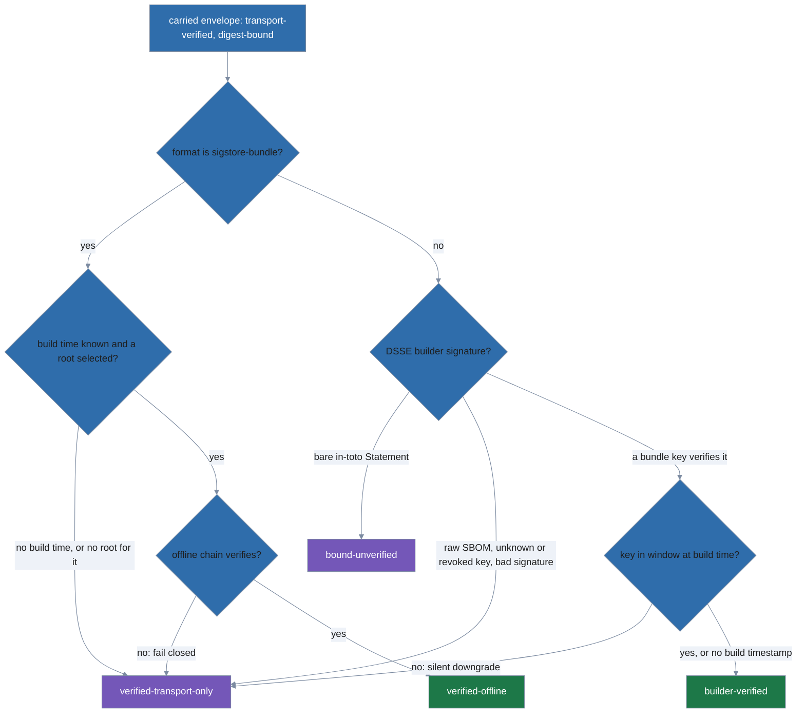
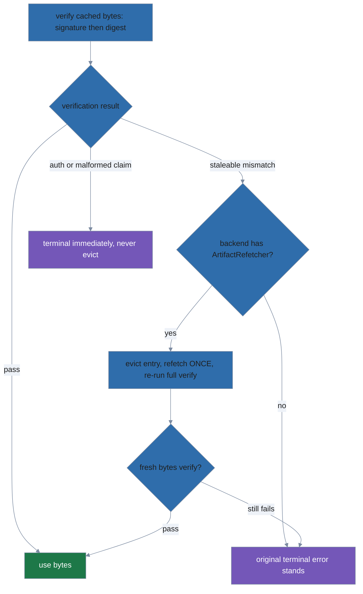

# The supply chain: v2 metadata, attestations, freshness, anti-downgrade

This document covers the path a package takes between a publisher's signed
index and an installed file: the v2 wire formats, the per-package verification
chain, the four tiers a carried external attestation can land in, the freshness
and anti-rollback floors, and how all of that survives a mirror hop. It is
aimed at maintainers working in `internal/trust`, `internal/attest`,
`internal/planner`, and `internal/mirror`.

Two neighbours: the producer half — how a repository is signed, cached, and
published — is [repo-publisher.md](repo-publisher.md), and the apply pipeline
this hangs off is [architecture.md](architecture.md).

The publisher and consumer share three v2 wire formats (hard cutover — v1
readers and schemas were removed):

| Schema | Carries |
|---|---|
| `polypkg.index/v2` | `expires`, per-entry content-addressed `artifact` pool paths, an informational `revision` republish ordinal, and `attestations[]` refs (`predicate_type`, `artifact`, `content_hash`). Living inside the signed index makes attestations strip-resistant: removing one invalidates the index signature. |
| `polypkg.trust/v2` | `expires`, monotonic `serial`, and the key list with roles `["index", "artifact", "attestation"]`. |
| `polypkg.manifest/v2` | Per-entry install-time `attestation` record (`status`, `predicate_types`, `attestation_hash`, `policy_at_install`, `gate_disabled`), plus `carried_bindings` recording external provenance bound to the installed bytes. Each `CarriedBinding` carries `predicate_type`, `format`, `subject_scope`, `tier`, its own `attestation_hash` (for offline revocation matching), and — depending on tier — `verifying_key_id` and `builder_identity` (builder-verified) or `certificate_identity` and `certificate_issuer` (verified-offline). Only `verified` or `unattested` ever persist — a failed verification never installs. |

**Verification chain order** (per resolved package, in `planner.Plan`):

1. Source metadata: index/trust signatures, monotonic serial vs. the
   per-source high-water mark, and `trust.CheckExpiry` on both documents
   (5-minute skew tolerance; absent/unparseable `expires` is itself fatal).
   This closes the TUF freeze attack — a mirror cannot pin clients to a
   stale-but-validly-signed catalog.

   - **Freshness grace.** The profile's per-source `accept_expiry_until`
     (`schema.SourceBackend.AcceptExpiryUntil`, read by `fetchOneSource` in
     `internal/planner/fetchcatalog.go`) threads an RFC3339 deadline to
     `CheckExpiry`, which returns `(graced, err)`: an expired document within
     the deadline is accepted and reported graced.
   - Crucially, `CheckExpiry` runs *before* the serial-floor check in every
     `Load*` method (and the index's serial check precedes its expiry check in
     `fetchOneSource`), so grace relaxes wall-clock freshness without ever
     weakening anti-rollback — a lower-serial document still refuses.
   - A malformed/empty `accept_expiry_until` grants no grace (fail closed).
     Graced docs surface via `FetchResult.FreshnessGraced` →
     `Result.FreshnessGraced` → a loud `SECURITY:` line on `apply`/`plan` and a
     `metadata.expiry_graced` audit event on `apply`.
   - **Near-expiry warning.** Grace is the after-the-fact escape hatch; the
     near-expiry warning is the before-the-fact nudge. When the scope config
     sets `revocation.near_expiry_threshold` (read by `scopeNearExpiryThreshold`
     in `internal/cli/scope.go` and passed as `planner.Options.RevocationNearExpiry`),
     `nearExpiryEntry` flags a *still-valid* revocation list whose `expires`
     falls inside that window. The entries ride out on
     `FetchResult.NearExpiry` → `Result.NearExpiry`, and `apply`/`plan` print
     one `WARNING:` line each telling the operator the publisher should
     re-sign. A zero threshold disables the check, and an already-expired
     document is not "near" — that is the expiry/grace path above.
2. Artifact: minisign signature under the `artifact` role, then the BLAKE3
   digest against the signed index's `content_hash`.
3. Attestation transport (when the index entry carries refs). Each ref's
   `.att.json` + `.minisig` is fetched, then:

   - The signature is verified under the `attestation` role.
   - The trusted-comment claims (`name`/`version`/`hash`) are checked against
     the resolved package and the recomputed BLAKE3 of the attestation bytes,
     and that hash against the index ref's `content_hash`.
   - A *native* ref (`kind: native-jcs`) additionally parses as an in-toto
     Statement whose predicate type must match the ref and whose subject digest
     must equal the artifact's `content_hash`.
   - A *carried* ref (`kind: carried-opaque`) stops here — a DSSE, SBOM, or
     sigstore envelope is not a bare in-toto Statement — and is handed to
     step 4 after extraction.

   Any failure here is fatal in **every** policy mode.

4. Carried binding and tier (post-extraction, `bindCarriedRefs` in
   `internal/planner/planner.go`): for each transport-verified carried
   envelope, re-read its subjects and re-bind them by digest against the bytes
   that actually landed, then classify it into one of four tiers. Two hard
   fails live here, both fatal in every policy mode:

   - **Binding failure.** An envelope whose subjects match neither the fetched
     tarball nor any extracted content file is refused.
   - **Predicate-type mislabeling.** The authoritative predicate type is the
     one inside the signed payload. When the signed index ref *positively*
     claims a different type, the artifact is mislabeled and the install is
     refused:
     `carried attestation … predicate type mismatch: index ref says "…", signed payload says "…"`.
     An empty index claim has nothing to mislabel, so the payload's type
     stands. Without this check a publisher could file an unsigned SBOM under
     a SLSA-provenance label and satisfy a `require` on the strength of the
     label alone.

   Tier assignment itself never refuses — see "Carried-attestation tiers"
   below. Refusing on a weak tier is the per-source require gate's job.

5. Policy gate: only attestation *absence* consults `attestation.policy` —
   `warn` (default) installs with a stderr warning, `require` refuses, `off`
   installs silently. The verdict is recorded in the manifest entry and
   surfaced by `status -vv` (`[attested]`/`[unattested]`) and `info`.

## Carried-attestation tiers

Step 4's classifier produces the vocabulary the rest of this document's policy
machinery is written in. A carried envelope always ends up in exactly one of
four tiers, recorded as `CarriedBinding.Tier` in the manifest
(`internal/schema/manifest.go`):

| Tier | Means |
|---|---|
| `bound-unverified` | The envelope is a bare in-toto Statement. Its subjects digest-bind the installed bytes, and that is all — there is no signature on it to check. |
| `verified-transport-only` | Digest-bound and publisher-transport-verified, but conveying no verified builder identity. Three routes land here: a `sigstore-bundle` that fails root selection or offline chain verification (which fails closed to this tier rather than refusing), a DSSE envelope whose builder signature did not verify against a live bundle key, or a recognized-but-unsigned SBOM document (raw SPDX/CycloneDX). |
| `builder-verified` | A non-revoked builder key from the source's trust bundle, valid at the attestation's build time, signed the DSSE envelope. `verifying_key_id` names the key; for SLSA provenance `builder_identity` records the `builder.id`. |
| `verified-offline` | A sigstore bundle whose full chain — Fulcio certificate to root, SCT when CT keys are present, Rekor inclusion proof and SET, and the inner DSSE signature — verified offline against a mirrored or consumer-pinned root. `certificate_identity` and `certificate_issuer` record the Fulcio SAN and OIDC issuer. |

`builder-verified` and `verified-offline` are the *anchored* tiers. Only they
satisfy a `require`, and only they count toward the posture floor.

Three packages divide the work. `internal/attest` is the kernel and holds no
dependency on `internal/trust`: `InspectCarried` shallow-reads the envelope
(predicate type, format, subjects, and — for SLSA provenance — the
`builder.id` and build timestamp `interpretSLSA` recovers);
`VerifyBuilderSignature` is the DSSE verifier; `VerifySigstoreBundle` and
`SigstoreTrustedMaterial` are the offline sigstore path. `internal/trust`
supplies the material (`Bundle.BuilderKey`, `Bundle.BuilderKeyAt`,
`Bundle.SigstoreRootAt`, `Revocations.IsBuilderKeyRevoked`).
`bindCarriedRefs` in the planner adapts one to the other through two
closures — a key lookup and a revocation predicate — so the kernel stays
testable without a signed trust document.



Read the diagram as two independent classifier paths and two silent
downgrades.

- **The sigstore path.** A `sigstore-bundle` envelope needs a Rekor integrated
  time before anything can happen, because the trust root is chosen *at that
  instant*, not at verification time.

  - Root selection prefers a consumer pin: when the profile sets
    `sources.<name>.sigstore_root`, that pin is authoritative and the
    source-mirrored root is not consulted at all. With no pin,
    `Bundle.SigstoreRootAt` supplies the mirrored one.
  - Every way this can go wrong — no bundle, no root whose window covers the
    build time, an unusable root (an empty Fulcio CA set is an error), or a
    chain that fails to verify — lands on `verified-transport-only`.
  - sigstore-go runs with identity and artifact matching deliberately off: the
    identity is *recorded* for the policy layer, and the subject-to-bytes
    binding already happened in step 4.
- **The DSSE path.** `VerifyBuilderSignature` recomputes
  `PAE("DSSEv1", payloadType, payload)` over the raw decoded payload and
  ed25519-verifies each signature against the key its `keyid` names.

  - The `keyid` is a selection hint only — the signature is the security
    decision — so a signature naming an unknown key is *ignored* rather than
    failed, and one naming a revoked key never counts.
  - A single undecodable signature block is skipped for the same reason: DSSE
    is multi-signature, and letting one bad block veto a good one would hand
    any third party a downgrade primitive.
  - Five conditions return a hard error, all of them still tiered
    transport-only so a caller that ignores the error fails closed: a duplicate
    JSON key anywhere in the envelope (a parser-differential vector); an
    envelope that is not parseable JSON at all (`parse DSSE envelope`); an
    object that is neither a DSSE envelope nor an in-toto Statement; a
    `payloadType` that is not `application/vnd.in-toto+json`; and an
    undecodable base64 `payload` (`decode DSSE payload`).
- **The window downgrade.** A verified signature is not enough on its own.
  `Bundle.BuilderKeyAt(keyID, buildTime)` re-asks whether that key was valid
  *when the artifact was built*; an out-of-window key, or a stored window that
  will not parse, demotes the binding to `verified-transport-only` and clears
  both `verifying_key_id` and `builder_identity`. An attestation carrying no
  parseable build timestamp no-ops the gate rather than failing it — a missing
  timestamp is a gap in the predicate, not evidence of a bad key.

Both downgrades are silent by design: the tier lands in the manifest, and the
policy layer below decides whether a weak tier is grounds for refusal.

**Per-source require gate.** `bindCarriedRefs` records tier and identity without gating; `enforceAttestationPolicy` (`internal/planner/attestpolicy.go`), called from `Plan` immediately after binding, then refuses the install when a source's `attestation.require` list is unsatisfied.

A `require` is satisfied only by a carried binding at an anchored tier (`builder-verified`/`verified-offline`) whose identity matches the consumer `builders.allow` list, or — when no allow-list is set — by a native publisher-verified predicate. Transport-only and bound-unverified tiers never satisfy a `require` (their predicate type is self-declared).

This mitigates two threats. A publisher who mints their own builder key gains nothing, because the allow-list the key must appear on is the consumer's, not the source's. And provenance stripping is caught by per-predicate presence: a required predicate that stops being published is a refusal, not a silent absence.

The `key` and `sigstore` allow-list kinds are not equally strong. `key` pins public-key bytes unconditionally. `sigstore` pins strings — a certificate SAN and issuer — and those strings are only as trustworthy as the Fulcio root they were checked against. By default that root is the source-mirrored one, which makes the pin weaker than a key pin. A profile that sets `sources.<name>.sigstore_root` closes that gap: the consumer-pinned root is authoritative and the mirrored root is not consulted (see "Carried-attestation tiers" above).

**Posture floor.** `enforcePostureFloor` (`internal/planner/attestpolicy.go`), called from `Plan` right after the require gate, refuses an install whose provenance regresses from the previous generation. `verifiedPredicateTypes` extracts a package's verified posture (native `PredicateTypes` union anchored-carried predicate types — transport-only and bound-unverified are excluded) from its `AttestationState`; the floor requires every prior-verified type to still be verified now, reusing `requireSatisfied` with an identity-agnostic empty allow-list.

The floor source is the current generation's manifest, loaded by `apply`/`plan` from the substrate and passed via `Options.PriorManifest` (nil on first apply or unreadable prior ⇒ no floor); it is trusted local state a mirror cannot influence, and the check runs on the final post-verification `attState`, so the refetch-once cache-healing path cannot smuggle a downgrade past it.

The exact-version pin (`isExactPin` — also written by `upgrade`/`install @version`) is the operator's escape hatch and waives the floor for a consciously-accepted release. The floor is keyed by package name across sources, catching a source-switch downgrade.

**Per-source `off` + observability.** A source whose `attestation.tier` is `off` (`schema.AttestationTierOff`, mutually exclusive with `require`/`builders` by schema) has its gate disabled in `Plan`: `srcOff` (computed once at the top of the per-package loop) lowers the EFFECTIVE absence policy passed to `verifyAttestations` to `off` and skips both `enforceAttestationPolicy` and `enforcePostureFloor`.

It is a POLICY relaxation only — `verifyAttestations` consults its policy argument solely on the absent branch, so a PRESENT attestation is still hard-verified, revocation still refuses, and the `bindCarriedRefs` two-point binding still runs.

Because a silent kill-switch is the threat, `off` is loud and durable: `AttestationState.GateDisabled` records it per entry (distinct from the pre-existing silent global `attestation.policy: off`, which lands `PolicyAtInstall:"off"` with `GateDisabled:false`), `Result.AttestationGateDisabled` (a channel distinct from `AttestationWarnings`, carrying the package and its source as discrete `GateDisabledEntry` fields) drives an unconditional `SECURITY:` stderr line in `apply`/`plan`, and `apply` writes an `attestation.gate_off` audit event with discrete `package` and `source` fields.

`status`/`info` surface `GateDisabled` and each carried binding as `predicate — tier [identity]` (`attestationTag`/`attestationLine`) so an operator never reads a `verified-transport-only` carried ref as trusted, and sees the verifying identity of an anchored one. No schema version bump (additive `gate_disabled`); stdlib only.

**Cache healing (steps 2 and 3).** Artifact and attestation fetches may be
served from the consumer's download cache, which is keyed by base name with no
validation — a repository that republishes different bytes under the same path
would otherwise wedge the client on the poisoned entry forever.



When verification fails *staleably* (a signature or digest mismatch, i.e.
possibly wrong cached bytes), the planner evicts the cache entry and refetches
ONCE via the backend's optional `source.ArtifactRefetcher` capability (used for
both artifacts and attestation blobs), re-running the full verify chain on the
fresh bytes; if they still fail — or the backend lacks the capability, or the
refetch errors — the original terminal error stands.

Authorization failures (no key holding the required role) and malformed signed
claims are trust-configuration problems no refetch can fix; they are terminal
immediately and never evict.

Strip-resistance is scoped to mirrors, not the signer: whoever holds the index
key can publish a fresh, validly-signed index with no attestation refs (key
compromise, or a legitimate `repo build --skip-attestations`), and under the
default `warn` policy consumers install it with only a stderr warning. Only
`policy: require` converts attestation disappearance into a refusal.

Note: the manifest record's `AttestationHash` stores the hash of the last
*native* attestation ref verified for that entry. That is no longer a
single-valued fact — `repo build` emits up to two native refs per package (the
SARIF lint statement and the `polypkg-link` statement), and refs are stably
sorted by content hash, so which one the field ends up naming is arbitrary.
Read `PredicateTypes` for the complete record of what verified;
`AttestationHash` is a single-sample breadcrumb. Carried refs never touch it:
each `CarriedBinding` carries its own `attestation_hash`, and that is what
offline revocation matching reads.

**Anti-downgrade (per-package high-water mark).** `FetchCatalog` folds every
verified index into a per-source, per-package version high-water map persisted
in the trust state. `Plan` refuses a resolved version below its source's mark
only when the source has WITHDRAWN its top — no version ≥ the mark remains in
the current signed index — and the profile does not exact-pin the selected
version (`x.y.z`, `=x.y.z`, or `==x.y.z`, the operator's escape hatch for a
pulled release). Selecting an older entry the index still offers is ordinary
constraint resolution and never refused; cross-source masking is structurally
impossible because catalog merging is a per-name all-or-nothing overlay.

**Pool.** Artifacts and attestations are content-addressed under
`<output>/pool/<blake3>.{tar.zst,att.json}`. A republish writes a new blob and
repoints the index; old blobs persist immutably (rollback keeps resolving)
until pool GC lands (future work). Blobs and their signatures are written
before the index/trust metadata batch, so a signed index never references a
missing blob.

## Export bundles & the pool manifest

`repo export-bundle` (`internal/repo/export.go`, method `(*Builder).ExportBundle`)
reads the already-built, already-signed published repository and packs it into a
single tarball mirror for offline transport. It resolves a package selection to
its reachable blob set — each selected `IndexEntry`'s artifact + `.minisig` plus
its carried attestation blobs + `.minisig`s — and always includes the signed
metadata documents (`index.json`, `trust.json`, optional
`trust-bundle.json`/`revocations.json`) and `trust_root.pub`.

It emits `pool-manifest.json`, a `polypkg.pool-manifest/v1` bill of materials listing
every bundled file as `{path, content_hash, kind}` (BLAKE3), signed with the
**same key that signs the index** (`Keypair.SignPoolManifest`), then packs
everything into one deterministic tar (`archive/tar`, PAX, sorted names, zeroed
mtimes — the `pack.go` recipe). The carried `index.json`/`trust.json` are
byte-verbatim (their existing signatures still validate); only the new manifest
is signed here.

The manifest inherits `serial`/`issued_at` from `trust.json` and
`expires` from `index.json`, so a bundle carries no independent clock — its
freshness tracks the repo snapshot (making re-exports byte-identical), and the
`accept_expiry_until` grace covers it uniformly.

`mirror verify` (`internal/mirror/verify.go`, `VerifyBundle`) reads the tar
(rejecting path-traversal names, duplicate paths, and any non-regular member so
nothing can be smuggled past extraction), verifies the manifest signature
against a pinned `--trust-root` or the bundle-carried `trust_root.pub`
(self-consistency fallback), runs `trust.CheckExpiry` (with optional grace),
then asserts every manifest entry is present and BLAKE3-matches **and** that no
un-listed file rides along besides the manifest and its signature — one missing,
tampered, or extra blob fails the whole verify.

The manifest itself and its
`.minisig` are the only files not self-listed (a manifest cannot contain its own
hash); they are covered out-of-band by the signature.

The completeness contract
is manifest-defined, not index-defined, so a subset export whose carried index
still names unmirrored packages verifies cleanly and simply 404s those packages
when re-served as a `file://` source.

## Trust bundle and revocation list

The trust bundle is a third anchor-signed document sitting alongside `trust.json`,
signed by the same source `trust_root` that verifies `polypkg.trust/v2`. It
carries the provenance-verification material — a builder keyring plus sigstore
trust roots — used to check *carried* external provenance. Both documents are
optional inputs to `FetchCatalog`: fetched, verified, and floored on every
fetch.

Both are live on the verification path. The builder keyring feeds the DSSE
tier classifier and the build-time window gate
([§ "Carried-attestation tiers"](#carried-attestation-tiers) above), the
sigstore roots feed offline sigstore verification, and both kinds
of revocation entry are enforced — an attestation content-hash on the list
refuses the install outright, and a revoked builder key can never raise a
binding above `verified-transport-only`. `internal/mirror.Pull` consults the
same list at the mirror hop.

- **`polypkg.trust-bundle/v1`** holds builder keys and sigstore roots, both
  time-windowed and append-only. Builder keys authenticate how an artifact was
  built and are **not** minisign signing roles — the `polypkg.trust/v2` role
  model (`index`/`artifact`/`attestation`) is untouched. Lookups are temporal:
  `Bundle.BuilderKeyAt(keyID, buildTime)` returns a key only if `buildTime` fell
  in its `[valid_from, valid_until]` window, and `Bundle.SigstoreRootAt(buildTime)`
  selects the root live at that instant — validity is judged at the attestation's
  build timestamp, not at verification time.
- **`polypkg.revocation-list/v1`** is a *separate* signed document with its own
  `serial` and `expires`, revoking builder keys and attestations by BLAKE3
  content-hash (`Revocations.IsBuilderKeyRevoked` / `IsAttestationRevoked`). Being
  separate, a revocation ships without republishing the whole bundle, so it
  propagates faster.
- Both loaders (`LoadBundle` / `LoadRevocationList` on the `trust.Verifier`) are
  anchored by the same source `trust_root` as `LoadTrust` and enforce freshness
  (`expires`) **before** the serial anti-rollback floor, so a stale document
  can never advance the serial high-water mark.
- `fetchOneSource` (`internal/planner/fetchcatalog.go`) loads both documents
  after the index and folds their serials into the per-source `trust.Seen`
  state (`BundleSerial`, `RevocationSerial`) alongside the existing
  `TrustSerial`/`IndexSerial`. Both documents it returns are then consulted
  during package verification.

  - An attestation whose content-hash is on the revocation list refuses the
    install in **every** `attestation.policy` mode, the same fail-closed
    treatment as an invalid signature.
  - The bundle's builder keys and sigstore roots are handed to
    `bindCarriedRefs`, which uses them to classify each carried envelope's
    tier. A revoked builder key is skipped during DSSE verification, so an
    envelope signed only by that key can never rise above
    `verified-transport-only`.

## Trust-bundle & revocation-list anti-rollback

The bundle and revocation list are optional per source, but once a source has
published one, the anti-rollback rule the index and trust documents follow (the
**Anti-downgrade** paragraph near the top of this document) applies to them
too — the consumer's `trust.Seen` state tracks a high-water serial for each and
refuses a fetch that would move either backward:

- **Never seen + absent ⇒ OK.** A source that has never published a bundle or
  revocation list installs normally: with no builder keyring to check against,
  a carried DSSE envelope classifies as `verified-transport-only` and a bare
  in-toto Statement as `bound-unverified`
  ([§ "Carried-attestation tiers"](#carried-attestation-tiers) above). This
  keeps pre-bundle repositories working unchanged.
- **Seen once + absent ⇒ refused.** Once a source has published a bundle (or
  revocation list) at serial N, a later fetch where the backend reports it
  absent (`source.ErrMetadataAbsent`) is treated as a rollback/strip and
  refuses the fetch. This closes the "delete the revocation list to un-revoke a
  key" channel: a publisher (or a compromised mirror) cannot silently retract a
  revocation once it has shipped.
- **Serial below the floor, or an expired document, ⇒ refused,** identically to
  the index/trust anti-rollback check — verified first, then checked for
  freshness, and only then allowed to advance the stored floor.
- **A revoked attestation content-hash is refused in every attestation-policy
  mode.** Unlike the `warn`/`require`/`off` policy gate that governs attestation
  *absence*, revocation is absolute: it is checked regardless of policy and
  cannot be downgraded to a warning.

The two revocation kinds are not enforced the same way, and the difference is
deliberate. A revoked *attestation hash* aborts the install: the bytes
themselves are repudiated, so there is nothing to fall back to. A revoked
*builder key* instead demotes — the envelope it signed drops to
`verified-transport-only`, keeping its digest binding but losing its claim to
a verified builder. That is enough for the require gate to refuse the install
when the source demands an anchored predicate, while leaving an ungated source
installable. Repudiating one signing key should not repudiate every artifact
that key ever touched.

Both kinds are also detected retroactively. `status` re-reads the current
generation's manifest against the stored revocation lists and exits non-zero
when an *already installed* package carries a now-revoked builder key (exit 3,
`collectRevokedBuilders`) or a now-revoked attestation hash (exit 5,
`collectRevokedAttestations`) — which is why each `CarriedBinding` stores its
own `attestation_hash`. The install-time check cannot help here; the revocation
arrived after the install.

**Recovery.** The anti-rollback floors are deliberately strict — once a source
has shown a bundle or revocation list, it can never look like it hasn't — so
two escape hatches exist for the two ways that strictness can bite:

- *Publisher — roll forward, never back.* Fix a bad publish, or ship an
  emergency revocation, by republishing the corrected state at serial **N+1**,
  never by decrementing a serial or reusing one. Consumers accept forward
  progress as ordinary republication; there is no way to make a serial go down
  once it has shipped.
- *Consumer — re-pin a legitimately re-created repository.* If a repository is
  rebuilt from scratch (new `trust_root`, all serials reset), the consumer's
  stored floors will correctly — but unhelpfully — read that as a downgrade and
  refuse every document. Run `polypkg source remove <name>` followed by
  `polypkg source add <name> ...`: `remove` clears the persisted floors
  (`trust.ForgetSeen`, in `internal/trust/seen.go`) for that source name, and
  the subsequent `add` re-establishes trust-on-first-use against the new root.

**The source name is a path component.** Every floor above is stored per source,
in a file `trust.seenPath` (`internal/trust/seen.go`) names by joining
`filepath.Base(source)` under the trust state directory. `Base` is what keeps a
name carrying a separator from escaping that directory, but it would also
collapse two distinct names onto one file — and one file is one set of floors.

So the grammar is pinned where the name is parsed rather than where it is used.
`schema.SourceNamePattern` (`^[a-zA-Z0-9_-]+$`, `internal/schema/sourcename.go`)
governs repo manifests, and `profile-v1.json` applies the same pattern as
`propertyNames` on both the `sources` and `packages` maps — enforced on the YAML
(`profile.go`) and JSONC (`jsonc.go`) parse paths alike. A test asserts the
schema's pattern string equals `SourceNamePattern`, so the grammar cannot drift
into a third copy.

## Provenance carriage: representation and the binding primitive

`AttestationRef` (in `internal/schema/index.go`) describes *carried* external
provenance alongside polypkg's own attestations. This subsection covers the
wire representation and the digest-matching primitive both ends share; the
publisher and consumer halves that use them follow below.

- The ref gains four **optional** fields — `kind` (`native-jcs` vs
  `carried-opaque`), `format` (a closed vocabulary: `polypkg-sarif`,
  `polypkg-link`, `slsa-provenance`, `spdx`, `cyclonedx`, `in-toto-generic`,
  `in-toto-unclassified`, `sigstore-bundle`), `subject_scope` (`artifact` or
  `content:<path>`), and an
  advisory `subject_digests` (algorithm→hex). These are additive to
  `polypkg.index/v2`; existing indexes stay valid and there is **no** version
  bump.
- `ParseStatement` (in `internal/attest/statement.go`) is generalized to accept
  an in-toto Statement whose subjects carry *any* digest algorithm, so a carried
  SLSA statement (sha256 subjects) parses. Native-jcs (blake3) statements are
  unaffected — this only relaxes the prior requirement that `subject[0]` carry a
  blake3 digest.
- `MatchSubjectDigests(data, subject, floor)` (in `internal/attest/binding.go`)
  is the fail-closed binding primitive. It recomputes, from the raw bytes, every
  **supported** algorithm the subject lists (sha256, blake3, sha512), requires
  them *all* to agree, and binds only when at least one matched algorithm is
  at/above the floor (default sha256). Forbidden weak algorithms (sha1/md5) in a
  subject are rejected outright; unknown or uncomputable algorithms are ignored
  (they can neither create nor break a binding); a subject with no supported
  algorithm at/above the floor is unbindable and rejected.
- Because the matcher recomputes from bytes rather than trusting a stored digest,
  the single function serves both binding points: pack-time (when a publisher
  will carry a ref) and install-time (when a consumer will bind one).

## Provenance carriage: publisher-side foundations

Two pieces underpin the publisher's carriage path. The build cache
(`internal/repo/cache.go`) holds a *list* of attestation refs, and
`ExtractCarriedSubjects` (in `internal/attest/carried.go`) shallow-reads what
an externally supplied attestation claims to cover. Neither verifies anything:
`internal/repo` calls only `ExtractCarriedSubjects`, never
`VerifyBuilderSignature` or `VerifySigstoreBundle`. Builder-signature and
sigstore verification is the *consumer's* job at install time — a publisher
relaying an envelope is not in a position to vouch for its signer.

- The cache schema bumps `polypkg.repo-cache/v2` → `v3` and stores
  `[]AttestationRef` in place of the former single-attestation fields. A
  package now routinely produces several refs — the SARIF lint statement, the
  `polypkg-link` statement, and one per carried envelope — so the multi-ref
  shape is what keeps external provenance from being silently stripped on
  rebuild.
- An older (`v2`) cache cold-resets on load. The reset is safe because packing is
  deterministic: the rebuild reproduces byte-identical artifacts and a stable
  serial, so a cold-reset costs work but never changes what is published.
- `ExtractCarriedSubjects` reads the in-toto subjects a carried envelope
  covers **without** verifying any signature, and classifies its format.

  - It is a thin wrapper over the shared `InspectCarried` reader, dropping the
    SLSA builder id and build timestamp the publisher has no use for. The
    recognized shapes are therefore the same on both sides — a DSSE envelope, a
    bare Statement, a raw SPDX or CycloneDX document, or a sigstore bundle.
  - The classification is advisory. A shallow mis-read cannot forge a binding,
    because the extracted digests are re-bound against polypkg-packed bytes
    later via the fail-closed matcher
    ([§ "representation and the binding primitive"](#provenance-carriage-representation-and-the-binding-primitive)
    above).

## Provenance carriage: publisher intake

`repo build` now carries external provenance into the signed index. It discovers
`attestations/*.json` in a package source and, for each envelope, performs the
pack-time half of the two-point binding: it matches the attestation's subjects —
by *digest*, via the fail-closed matcher — against the shipped artifact and each
content file, and refuses to publish provenance that binds to nothing packed. The
consumer install-time half is described below.

- Binding is by digest, not by name. A subject name is an advisory label an
  attacker controls; selection is purely by matching a recomputed digest of
  packed bytes. A carried ref here is *bound* (its digests match what shipped)
  but **not** builder-verified: `repo build` never checks a DSSE, SLSA, SBOM,
  or sigstore signature. That check happens on the consumer, at install, and
  determines the ref's tier
  ([§ "Carried-attestation tiers"](#carried-attestation-tiers) above).
- Refusal is fail-closed at publish: an envelope whose subjects match no packed
  bytes aborts the build rather than shipping unbound provenance.
- Carried envelopes are stored **verbatim** in the content-addressed pool under a
  publisher *transport* signature (minisign) — the ref records `kind: carried-opaque`.
  The transport signature attests only that this publisher relayed these bytes; it
  is not a check of the builder/DSSE signature.
- A `polypkg-link` `native-jcs` attestation binds the shipped artifact (blake3) to
  the covered materials, tying the carried provenance back to what was published.
- The SARIF, carried, and link refs are recorded as a multi-ref list **stably
  sorted by content hash**, so a no-op rebuild reproduces a byte-identical,
  serial-stable index.

`pkg build` author-preview parity for this carriage is a deferred follow-up.

## Provenance carriage: consumer install-time binding

`planner.Plan` completes the two-point binding on the consumer.
After the BLAKE3-verified tarball is extracted, `bindCarriedRefs`
(`internal/planner/planner.go`) re-extracts each carried envelope's subjects and
re-binds them **by digest** against the bytes that actually landed — the fetched
tarball and the extracted content tree — via the shared `attest.BindSubjects`
kernel at the sha256 floor. If a carried attestation binds nothing installed, the
install is **refused** (fail closed) — this catches a repository that ships a
signed index referencing carried provenance whose subjects do not match the
delivered bytes.

- The carried envelope is **transport-verified** pre-extraction (its publisher
  signature, claims, and content hash are checked against the signed index like
  any ref, via the shared `fetchVerifiedAttestation` scaffold), then **subject-bound**
  post-extraction. Binding decides only *whether* the ref is recorded; the
  external builder/DSSE or sigstore signature decides at which of the four
  tiers it lands in `attestation.carried_bindings`. A bare in-toto Statement
  — the one shape with no signature to check — is the case that stays at
  `bound-unverified`.
- Extraction hardening: a content file that extracted as a symlink is never
  offered as a binding target (a provenance subject must be concrete bytes, not a
  redirect), so a subject pointed at one fails to bind. Hard links are dropped by
  the extractor and surface as absent files, also failing closed.
- Binding ≠ verification. Binding proves the carried subjects describe the
  installed bytes. Whether to trust the external signer is a separate question,
  answered by the tier classifier and then by policy.

## Prebuilt ingest and trust-bundle carry-forward

A repo-manifest package entry (`internal/schema/repomanifest.go`) is either
`source:` or `prebuilt: {artifact, attestations, trust_bundle?,
native_attestation?}` — mutually exclusive via the `repo-v1.json` `oneOf`.
The `prebuilt` shape is INGEST only, and it fetches nothing: it consumes an
already-fetched `.tar.zst`, a directory of its carried attestation blobs, an
optional upstream `trust-bundle.json`, and an optional `native_attestation`
(see `nativeAttestationRef`, below). The network step that produces those
inputs from an upstream repository is `internal/mirror.Pull`, described in the
next section.

- **`emitPackage` is the shared author-pass seam** (`internal/repo/emit.go`).
  - Both the source-build and the prebuilt-ingest paths resolve to a
    `packageWork{artifact, *schema.Package, attRefs, attBlobs, …}` before calling
    it, so `emitPackage` writes the pool artifact + `.minisig`, writes every
    attestation blob + its `.minisig`, and returns the `schema.IndexEntry` /
    `CacheEntry` identically regardless of provenance.
  - The two paths differ only in how `packageWork` is assembled:
    `Builder.sourceAttestations` runs pkglint and discovers `attestations/*.json`
    under the source tree; `Builder.prebuiltAttestations` skips lint entirely and
    discovers attestation files under the staged `prebuilt.attestations` directory.
  - Both funnel through the shared `bindCarriedSet`
    ([§ "Provenance carriage: publisher intake"](#provenance-carriage-publisher-intake)
    above) for the actual per-envelope binding, so a carried
    attestation is bound identically whether it arrived with a source tree or a
    prebuilt artifact.
- **The ingest path** (`Builder.ingestPackage`, `internal/repo/ingest.go`).
  - reads the fetched artifact, extracts it into a scratch directory via
    `source.ExtractTarZst`'s hardened confinement guards (the same extractor the
    consumer install path uses — path-traversal, symlink, and hard-link
    rejection apply equally here), then reuses `ReadPackageSource` to parse the
    extracted `polypkg.yaml` and `bindCarriedSet` to bind every staged
    attestation against the extracted tree.
  - Every carried attestation is therefore **independently re-bound against the
    exact fetched bytes** — the local repo does not trust the upstream index's
    digest claims at all; it recomputes and re-checks the two-point binding
    from scratch on its own copy of the bytes, preserving that property
    through a mirror hop.
  - An envelope binding nothing extracted is refused, aborting the build
    (`bindCarried`'s fail-closed contract, unchanged from the source path).
  - `prebuilt.native_attestation`, when declared, takes a different route.
    `nativeAttestationRef` requires a JCS-canonical in-toto Statement carrying
    the polypkg SARIF predicate whose subject binds the artifact by name and
    blake3 digest. A non-SARIF predicate is refused with a hint to supply it
    through `prebuilt.attestations` as carried provenance instead. What passes
    is signed and published **verbatim** as a `native-jcs` ref, so the signed
    attestation is byte-identical to the `pkg build` preview the operator
    supplied.
- **Trust-bundle carry-forward** (`mergeCarriedBundle`, `buildCarriedBundle`,
  `publishedBundleMatches` in `internal/repo/ingest.go`, wired into the
  `Build` loop in `internal/repo/build.go`).
  - For every `prebuilt` entry that stages a `trust_bundle`, the builder keys
    are deduped by `key_id` — an identical repeat is idempotent, a conflicting
    repeat (same id, different key/algo/validity) fails the build closed rather
    than silently picking one — and sigstore roots are deduped by exact
    structural equality.
  - If anything was staged, `Build` re-signs exactly one repo-level
    `trust-bundle.json` (+ `.minisig`) under the LOCAL key, stamped with the
    repo's own `source` and the FINAL build serial/expires (computed after the
    bundle-changed check, so the bundle and the index always agree on serial).
  - `publishedBundleMatches` folds the carry-forward into the existing
    changed-detection: `bundleChanged` compares the merged keys/roots against
    what is currently published (ignoring serial/expires, which are derived), so
    a no-op rebuild with unchanged carried material stays serial-stable, while
    any change in the merged builder keys or sigstore roots bumps the serial
    like any other content change.
  - Retraction is a first-class transition, not a manual cleanup. When a build
    carries no bundle material at all but a `trust-bundle.json` is still
    published from a prior run, `bundleOrphaned` (`internal/repo/build.go`)
    makes that removal count as a change: the trust set is re-signed at a new
    serial, and after the metadata batch commits `pruneOrphanTrustBundle`
    deletes **both** `trust-bundle.json` and `trust-bundle.json.minisig`. It is
    idempotent — an absent file is not an error. Without this, a stale bundle
    would keep vouching for upstream builder keys the operator has since
    dropped.
  - A repository with no `prebuilt` entries staging a `trust_bundle` never emits
    `trust-bundle.json` — this is purely additive.
- **Cache key.** A prebuilt entry is cache-keyed on the artifact's own
  content hash (`ContentHash(artifact)`), not `pkg.Source` (which is absent
  for a prebuilt entry) — `ingestPackage`'s cache hit path checks
  `cache.Get(ch)` and short-circuits re-extraction/re-binding when the staged
  artifact bytes are unchanged and the pooled blob is still present, mirroring
  the source path's fingerprint-keyed cache hit.
- **Known limitation.** `Build` itself carries forward only trust bundles, not
  revocation lists. Revocation propagation is driven one level up, by the
  `mirror pull` CLI calling `Builder.PropagateRevocations` after `Build`
  returns (next section). A hand-written `prebuilt:` manifest run through
  `repo build` alone therefore carries no revocations forward.

## Mirror pull: verified fetch, staging, and re-publish

`internal/mirror.Pull` (`internal/mirror/pull.go`) is the network half that
the previous section's `prebuilt:` ingest deliberately left out of scope.
`polypkg mirror pull` (`newMirrorPullCmd`/`runMirrorPull`,
`internal/cli/mirror.go`) is the command that composes it into a whole
re-publish. One run does six things in order:

1. **Check the target, then fetch and stage.**

   - Under `--fresh`, `ensureCleanOutputDir` runs *before* the first fetch and
     refuses a non-empty `--output-dir` (`--fresh requires an empty
     --output-dir`), so that no prior upstream provenance survives the
     re-anchor and a doomed run wastes no network work.
   - One `mirror.Pull` per upstream, each into its own `src-<n>` subdirectory
     of the staging root so per-source trust bundles cannot clobber one
     another.
   - A single upstream comes from `--source-url` + `--trust-root`; several come
     from `--sources-file`, a YAML list of `mirror.SourceSpec`
     (`internal/mirror/sources.go`) that carries per-entry `url`, `trust_root`,
     `accept_expiry_until`, and `packages` selectors. The two input modes are
     mutually exclusive.
2. **Optionally strip.** `stripFresh` runs *after* every upstream has been
   fetched, and is the second half of `--fresh`. It drops all upstream
   provenance — attestations, builder keys, sigstore roots — so the re-publish
   re-anchors on the mirror's own key alone.

   - The ingest that follows runs against a throwaway build cache: a
     content-hash cache hit against a populated pool would re-surface the very
     refs the strip removed.
   - The honest consequence: a downstream `require` policy then fails closed on
     the missing provenance, which is the correct outcome for a clone that
     vouches for nothing it did not build.
3. **Generate and ingest.** `WritePrebuiltManifestMulti` writes a
   `prebuilt:`-shaped `polypkg-repo.yaml` over the staged tree, and
   `repo.Builder.Build` re-publishes it under the local key — which is where
   the previous section's independent re-binding happens.
4. **Propagate revocations.** `Builder.PropagateRevocations` re-signs the
   union of every upstream's revoked sets into the mirror's own
   `revocations.json`, before any export. See "Enforces upstream revocations"
   below.
5. **Write the management manifest.** `mirror.WriteManagementManifest` drops a
   second `polypkg-repo.yaml` — `mirror.ManagementManifestName` — into
   `--output-dir`, describing the mirror that was just published. It is written
   after step 4 so the trust bundle and revocation list it references already
   exist. Without it the mirror would be unmanageable: the *build* manifest
   from step 3 lives in the staging root, which this function deletes on
   return.
6. **Optionally export.** `-o/--bundle` calls `ExportBundle` on everything
   just re-published, and the success output prints the
   `polypkg mirror verify` command to check it.

What the run leaves behind in `--output-dir` is a self-managing repository: the
artifact pool, the signed `index.json` and `trust.json`, a merged
`trust-bundle.json` when any upstream carried one, the propagated
`revocations.json`, and the management `polypkg-repo.yaml`. The success output
points at that last one directly, on the line after the package count:

```text
Pulled 12 package(s) into /srv/mirror
Manage it with: polypkg repo <command> --manifest /srv/mirror/polypkg-repo.yaml
```

`repo revoke`, `repo status`, `repo build`, `repo key show`, and
`repo export-bundle` therefore run against the mirror with no further setup.

The rest of this section is about the `Pull` primitive itself: what it
verifies, what it deliberately does not, and how it stages.

- **Reuses the trust crypto kernel, not the planner's install path.**
  - `Pull` calls `trust.NewVerifier` → `Verifier.LoadTrust`/`LoadBundle` and
    `Keyring.Verify` — the same shared kernel `apply`/`plan` use — and fetches
    through `source.Backend` (`source.NewNativeBackend`), the same interface the
    planner's install path fetches through.
  - It does **not** reuse `planner.Plan`/`verifyArtifact` directly: the
    planner's install path is entangled with resolver selection, generation
    state, and posture-floor policy that a one-shot mirror fetch has no use for.
  - `pull.go`'s own `verifyClaim` re-states the same small "signed claim matches
    the index entry" assertion `planner.verifyArtifact` makes, against the shared
    `Claims.Artifact()` accessor, so the two call sites can't drift on what
    "verified" means even though they don't share a call path.
- **Verify-inbound-but-defer-binding.**
  - `Pull` verifies that fetched bytes are authentically the source's
    (signature, claims, and blake3 against the signed index) before staging
    them, but it does **not** perform the digest re-binding of carried
    attestations against extracted content — that remains `repo build`'s ingest
    job (`Builder.ingestPackage`, previous section), which re-derives the binding
    from its own extraction of the fetched artifact rather than trusting anything
    the pull recorded.
  - This keeps the "recompute from scratch on your own copy of the bytes"
    property intact across a mirror hop: the pull's verification and
    the ingest's binding are independent checks on the same bytes, not one
    trusting the other's output.
- **Enforces upstream revocations, then propagates them (anti-laundering).**
  - `Pull` fetches the source's `revocations.json` (when published, with the
    same absence/error semantics as the consumer's `fetchOneSource`) and refuses
    the pull if any selected attestation's `content_hash` is revoked, or if any
    builder key carried in the trust bundle is revoked.
  - It also *returns* what it saw, as `PullResult.RevokedAttestations` and
    `RevokedBuilderKeys`. `runMirrorPull` unions those sets across every
    upstream and hands them to `Builder.PropagateRevocations`
    (`internal/repo/revoke.go`) after `Build` and **before** any bundle export,
    so the mirror re-signs them into its own `revocations.json` and downstream
    clients of the mirror enforce them too.
  - Propagation is additive and cumulative. It merges into the published list
    rather than replacing it; it re-signs only when the set changed, no list
    exists yet, or the published one has fallen to its freshness half-life; and
    it never brings an empty list into existence on a clean mirror.
  - Refusing at pull time and propagating afterwards close the same hole from
    two sides. The consumer install path treats revocation as absolute —
    checked regardless of policy, never downgraded to a warning — so a mirror
    that quietly dropped a revoked attestation, or that re-published without
    forwarding the revocation, would *launder* it across the hop. Downstream
    clients follow the mirror's revocation list, not the upstream's, and would
    never learn.
  - The list is fetched with no anti-rollback floor (like the index and
    bundle), so a pull always enforces the source's current revocation state.
- **One version per package name** (`resolvePullSelection`). Empty selectors
  pick the latest semver of every package in the index; a bare `name` picks
  the latest of that name; `name@version` pins an exact version. Selecting
  the same name twice among explicit selectors is refused — a `repo build`
  manifest keys `packages:` by name, so the staged output can only hold one
  version per name regardless.
- **No anti-rollback serial floor.**
  - Unlike `apply`/`plan`, which track a `last_serial` per source and refuse a
    metadata regression, `Pull` has no persisted floor: it is a stateless
    one-shot fetch of whatever the upstream index currently publishes.
  - This is intentional, not an oversight — the anti-rollback property is
    re-established downstream: the republished repo mints its own fresh serial at
    `repo build`, and that repo's own consumers re-verify (and track their own
    floor) against it normally at install.
  - A pull that happens to fetch a stale-but-validly-signed upstream snapshot
    produces a staleness problem for the mirror operator to notice, not a
    security bypass for a downstream consumer.
- **`stagedPkgDir` traversal guard.** Index package names are map keys with no
  charset constraint in `index-v2.json`, so a signature-valid index from a
  compromised source could in principle name a package `../../evil`.

  - Before any file is written under it, `stagedPkgDir` rejects a name or
    version that is empty, is `.` or `..`, contains a path separator or the
    substring `..`, or resolves outside the staging root.
  - It then applies a stricter charset floor than traversal alone requires: the
    name must match `safePkgName` (`[A-Za-z0-9_-]+`) and the version must match
    `safePkgVersion`. That is what makes `<name>/<version>` two unambiguous
    path segments, so two distinct packages can never collide into one
    `attestations/` directory.
  - It is defense in depth mirroring the traversal rejection in `readTar`
    (`internal/mirror/verify.go`, the bundle reader), applied here to
    index-entry names instead of tar member names. The equivalent guard on the
    consumer install path lives in `extractTarZst`
    (`internal/source/extract.go`).
- **Native → carried-opaque re-classification on re-publish.**
  - A pull stages every attestation blob the upstream index references for a
    selected entry — the upstream's own native SARIF and polypkg-link
    attestations included — into the same flat `attestations/` directory,
    indistinguishable from any externally-carried provenance file.
  - `Builder.prebuiltAttestations` (previous section) treats everything under
    that directory as carried: it runs no native lint and calls `bindCarriedSet`
    uniformly, so those blobs are re-bound and re-published under
    `schema.KindCarriedOpaque`, not `KindNativeJCS`, in the republished index.
  - This is an honest label, not a loss of information — the mirror carried these
    attestations, it did not natively produce them.
  - The reclassification is not unconditional. `prebuilt.native_attestation`
    is the deliberate opt-out: an operator who declares one gets it published
    as a `native-jcs` SARIF ref (previous section). What `mirror pull`
    generates never sets that field, so an *automated* mirror hop always
    reclassifies; a hand-written `prebuilt:` manifest need not.
  - The provenance weight that actually matters for policy purposes rides on
    carried *external* provenance — say an SLSA statement DSSE-signed by the
    upstream builder key. That carries forward through the same re-binding and
    keeps re-verifying against the carried-forward trust bundle's builder keys
    at install, independent of how the upstream's own native attestation gets
    reclassified.

