# Mirroring a repository

> Operator guide to `polypkg mirror`: cloning an upstream source under your own
> signing key, and shipping the result to an air-gapped site. Building a
> repository from your own package sources is
> [Publishing a repository](publishing.md). What a consumer checks on the far
> end is [Trust policy](trust-policy.md).

`polypkg mirror` is a top-level command group, not a `repo` subcommand. It has
two commands: `mirror pull` fetches an upstream repository and re-publishes it
locally, and `mirror verify` checks an exported bundle before you serve it.


<sub>Rendered from [`.taskfiles/demo/mirror.tape`](../.taskfiles/demo/mirror.tape); regenerate with `task demo:render SCENARIO=mirror`.</sub>

Everything a mirror publishes is signed by **your** key. A mirror never
republishes an upstream signature, and `repo init` is the only thing that mints
the key it signs with — so generate one before the first pull.

## Pulling from an upstream

`polypkg mirror pull` folds the fetch, `repo build` re-publish, and
`repo export-bundle` steps into one command: it fetches selected packages from
one or more upstream sources, verifies them inbound against the pinned trust
root(s), re-publishes them verbatim into a local repository signed by your key,
and (with `--bundle`/`-o`) exports a signed mirror bundle for an air-gapped
site.

```mermaid
%%{init: {'theme': 'base', 'themeVariables': {
  'primaryColor': '#2f6dab',
  'primaryTextColor': '#1e1e1e',
  'primaryBorderColor': '#7c8ba1',
  'lineColor': '#7c8ba1',
  'edgeLabelBackground': '#eef2f8',
  'clusterBkg': 'transparent',
  'clusterBorder': '#7c8ba1',
  'titleColor': '#7c8ba1',
  'fontFamily': 'system-ui, sans-serif'
}, 'themeCSS': '.node .nodeLabel{color:#ffffff!important;fill:#ffffff!important;}'}}%%
flowchart LR
  subgraph fanout["per upstream source"]
    fetch["fetch: trust, index, artifacts, attestations"]
    verify["verify inbound: signatures, hashes, revocations"]
    stage["stage prebuilt: artifact, attestations, trust bundle"]
    fetch --> verify --> stage
  end
  stage --> build["repo build: re-bind by digest, re-sign under your key"]
  build --> exportq{"-o given?"}
  exportq -->|yes| bundle["repo export-bundle: signed offline tarball"]
  exportq -->|no| repo["local mirror repository"]
  bundle --> repo
  classDef sysA fill:#2f6dab,color:#ffffff,stroke:#7c8ba1
  classDef sysB fill:#1d7848,color:#ffffff,stroke:#7c8ba1
  class fetch,verify,stage sysA
  class build,bundle,repo sysB
```



Generate the mirror's key first, then pull:

```bash
polypkg repo init ./mirror-scaffold --source mymirror --key-dir ./mirror-keys
#   -> ./mirror-keys/mymirror.key   (the scaffold directory itself is disposable;
#      `mirror pull` publishes its own tree and its own manifest)

export POLYPKG_REPO_KEY_PASSWORD='...'   # mirror pull unlocks the key as well
polypkg mirror pull \
  --source-url https://upstream.example/repo \
  --trust-root upstream-root.pub \
  --source-name upstream \
  --package nginx --package podman \
  --repo-source mymirror \
  --output-dir ./mirror-repo \
  --key ./mirror-keys/mymirror.key \
  -o mirror-bundle.tar
```
```
Pulled 2 package(s) into /srv/mirror-repo
Manage it with: polypkg repo <command> --manifest /srv/mirror-repo/polypkg-repo.yaml
Exported mirror bundle to mirror-bundle.tar
Verify with: polypkg mirror verify mirror-bundle.tar
```

Relative `--output-dir`, `--key`, and `--key-dir` resolve against your current
directory, not against the temporary staging directory the pull works in.

Three flags in that command name a source, and they are not interchangeable:

- `--source-name` names the **upstream** being pulled from. It must match the
  source name bound into the upstream's signed trust document, or the pull is
  refused.
- `--repo-source` names the **mirror** being published — the name the mirror's
  own clients must configure. It is a slug (`^[a-zA-Z0-9_-]+$`), not a URL, and
  a URL is rejected before any upstream is contacted:

  ```
  error: --repo-source "https://mymirror.local/repo" is not a valid slug
  hint: --repo-source is the local source NAME stamped into your signed index (e.g. mymirror), not a URL; it must match ^[a-zA-Z0-9_-]+$
  ```

- `repo init --source` plays the `--repo-source` role for a repository you build
  from scratch rather than mirror. Use the same name in both places when, as
  above, `repo init` is only there to mint the key.

`--package` is repeatable and takes `name` (latest version) or `name@version`
(pinned); with no selectors the latest version of every upstream package is
pulled. Selecting more than one version of the same name (`--package
foo@1.0.0 --package foo@1.1.0`) pulls both. If an upstream has published more
than one version of a name and you did not pin it, the pull takes the
newest and says so on stderr:

```
note: upstream https://upstream.example/repo: foo: mirrored 1.1.0, did not mirror 1.0.0 (select it with --package foo@1.0.0)
```

Pin the versions a downstream client depends on rather than relying on the
default. Verify the exported bundle with `polypkg mirror verify
mirror-bundle.tar`.

Pass `--all-versions` to mirror every published version of an unpinned
package instead of only the latest: with no `--package` it is every version
of every package; combined with a bare `--package foo` it is every version of
`foo`. An explicit `name@version` selector still wins: the pin already says
which version you want, so it is honoured as written. Because nothing is
left behind under `--all-versions`, an unpinned selection resolved under it
produces no narrowing note. Bundles grow with every version mirrored, so
reach for this only where the air-gapped site's clients hold pins against
exact versions.

## What gets re-signed

Carried provenance (SLSA/sigstore/SARIF attestations) keeps its **statement
bytes verbatim**, so it still verifies against the **original** builder keys
once those carry forward in the trust bundle. The signatures *around* those
bytes are fresh: the artifact and every attestation blob are re-signed under
your key, exactly as the `prebuilt:` ingest in
[Publishing a repository](publishing.md) describes. A mirror never republishes
an upstream signature.

Revocations propagate under the mirror's key too: every pull re-emits the union
of its upstreams' revoked attestation hashes and builder key-ids as a
`revocations.json` signed by the mirror, cumulatively. See the revocation
section of [Publishing a repository](publishing.md) for how to prune one back
down.

## Managing the mirror afterwards

Every pull writes `<output-dir>/polypkg-repo.yaml`, the default `--manifest` of
the `repo` subcommands, so `repo status`, `repo build`, `repo key show`,
`repo export-bundle`, and revocation prunes all work against the mirror. Each
package in it points at the mirror's *own* published pool blob with an absolute
path, so a `repo build` there is a genuine no-op. Pass the same `--key-dir` the
pull used — `./mirror-keys` above, since `mirror pull` defaults `--key-dir` to
the directory holding `--key`. That is not about locating the key; the
manifest's `key.path` settles that. It is the build cache the pull left behind,
and the second caveat below is what happens without it:

```bash
polypkg repo status --manifest ./mirror-repo/polypkg-repo.yaml --key-dir ./mirror-keys
```
```
Up to date
```

(`mirror pull -f json` reports the same path as `data.manifest`.)

Two things to know about that file:

- **It is inside the served tree**, next to `index.json`, so any client can
  fetch it. It exposes the mirror's `output` directory and its `key.path` — a
  local filesystem path, not key material — but that is still a layout
  disclosure. Exclude `polypkg-repo.yaml` at the web server if your threat model
  cares.
- **It leans on the build cache in `--key-dir`.** Its `prebuilt.attestations`
  points at the shared `pool/` directory rather than a per-package one. Nothing
  reads it while the cache holds an entry for every package. Lose the cache on a
  mirror carrying more than one package and the next `repo build` tries to bind
  one package's attestation to another and refuses, loudly, rather than
  silently dropping provenance:

  ```
  error: carried attestation 07bd49284f65593cc4b694b77bfa39622c8cb7ba01a8e3bee34fd3fbaff744e4.att.json for package "hello"
  hint: the carried provenance must describe the packed artifact or a content file (matched by digest)
  ```

  Re-running `mirror pull` repairs both the cache and the manifest, and it is
  the mirror's normal refresh path anyway.

## Multiple upstreams

List them in a YAML file and pass `--sources-file` (mutually exclusive with
`--source-url`); selection is per entry:

```yaml
# sources.yaml
- url: https://a.example/repo
  trust_root: a-root.pub
  source_name: upstream-a
  packages: [nginx]
- url: https://b.example/repo
  trust_root: b-root.pub
  source_name: upstream-b
  packages: [podman@5.0.0]
```

Add `all_versions: true` to an entry for the same widening `--all-versions`
gives single-source mode: every version of every package in that entry's
`packages` list (or of every upstream package, if `packages` is omitted),
except a `name@version` entry, which still selects only that version.

Parsing enforces only `url` and `trust_root`; `source_name`, `source_type`,
`accept_expiry_until`, `packages`, and `all_versions` are all optional to the
schema. In practice, set `source_name` on every entry anyway. It has to match
the source name bound into that upstream's signed trust document, and it names
that upstream's rollback record, so it must be a slug (`^[a-zA-Z0-9_-]+$`). An
omitted one is not caught at parse time, but the pull refuses that entry
before fetching anything from it. Every error from a pull is prefixed with the
upstream's name and its URL (credentials redacted):

```
error: upstream "" (https://a.example/repo): upstream source name: source name "" is not a valid slug (must match ^[a-zA-Z0-9_-]+$)
```

The same package name may not be pulled from more than one source, because a
repository keys packages by name.

## Upstream rollback protection

A mirror re-signs whatever it pulls, so its clients can only be as current as
the mirror. Every successful `mirror pull` records the serial of each signed
upstream document it accepted: the trust document, the index, the trust
bundle, and the revocation list. A later pull refuses an upstream that:

- serves any of those documents at a lower serial than the recorded one (a
  replayed older snapshot, even one that has not expired yet), or
- stops serving a trust bundle or revocation list that the mirror has already
  seen. A stripped revocation list would otherwise drop the upstream's
  revocations from your mirror.

```
error: upstream "upstream" refused: revocation list serial 1 is below last-seen 2
hint: this upstream's anti-rollback record is /srv/mirror-keys/mymirror.mirror-state/trust/upstream.<key id>.json; only if the upstream's operator confirms it was legitimately re-created, delete that file and pull again (docs/mirroring.md, "Resetting after an upstream is re-created")

error: upstream "upstream" no longer publishes its revocation list (last seen at serial 2)
```

Each refusal names the upstream it came from, and the hint names that
upstream's record file.

An upstream that has never published a trust bundle or revocation list is
fine. Absence is refused only after one has been seen. The serials are written
only after the whole pull succeeds (re-publish, revocation propagation, and any
`-o` export included), so a failed run never advances them.

The records live beside the build cache, one file per upstream:

```
<key-dir>/<repo-source>.mirror-state/trust/<source-name>.<trust-root key id>.json
```

With the example above that is `./mirror-keys/mymirror.mirror-state/trust/`.
`--key-dir` defaults to the directory holding `--key`. Keep pulling with the
same `--key-dir` and `--repo-source`. A pull pointed at a different pair finds
no records, and it accepts whatever the upstream serves, as a first pull
does. Each record is keyed by the upstream's pinned trust-root key as well as
its name, so pinning a new trust root starts a new record. A record that
cannot be read or parsed stops the pull. It is never treated as empty.
A pull holds `<repo-source>.mirror-state/lock` for its whole run, so a second
pull into the same mirror started meanwhile is refused at once. Because the
records must never be served, a pull refuses before fetching anything if
`--key-dir` is inside `--output-dir`, or if `--output-dir` is inside the
`.mirror-state` directory or contains it.

### Resetting after an upstream is re-created

If an upstream is legitimately rebuilt from scratch under the same trust-root
key, its serials restart and every pull is refused as a rollback. That
refusal is exactly what a replay attack looks like, so first confirm with the
upstream's operator that the rebuild is genuine. Then delete that upstream's
record and pull again:

```bash
ls ./mirror-keys/mymirror.mirror-state/trust/
#   upstream.<key id>.json
rm ./mirror-keys/mymirror.mirror-state/trust/upstream.<key id>.json
polypkg mirror pull ...   # same flags as before
```

The next pull re-baselines on whatever the upstream currently serves, with no
rollback check. That is the same trust-on-first-use exposure as the mirror's
very first pull. A damaged record stops the pull with `cannot read the
rollback record for upstream "…"`, and the hint names its file. Restore it
from a backup if you have one; otherwise delete it the same way, accepting the
same re-baseline.

## Re-anchoring on your key alone (`--fresh`)

**`--fresh`** drops **all** upstream attestations and builder keys/roots,
re-anchoring the clone entirely on your key; the verbatim upstream artifact
bytes still ship, vouched for by your index signature alone. A downstream
install under a `require` provenance policy then correctly fails closed, because
the re-published packages carry no upstream provenance. `--fresh` requires an
empty `--output-dir`, so no prior upstream provenance (e.g. a published
`trust-bundle.json`) survives the re-anchor.

## Offline bundles

`polypkg repo export-bundle -o bundle.tar` packs the built repository into a
single, signed tarball for offline transport to an air-gapped site. Here `-o` is
short for `--output`, and it is required. (`mirror pull` also takes a `-o`, but
there it is short for `--bundle` — see
[§ "Pulling from an upstream"](#pulling-from-an-upstream).) Choose what to
export with `--package <name>` or `--package <name>@<version>` (repeatable)
and/or `--from-file <path>` (one selector per line; blank lines and `#` comments
ignored); with no selectors the whole repository is exported, and a name without
a version exports every version of that package.

The bundle carries the selected artifacts, their attestations,
all signed metadata documents, the trust root, and a signed completeness
manifest (`polypkg.pool-manifest/v1`). It requires the repository's signing key
(unlocked from `key.path` with `--key-password-file` or
`POLYPKG_REPO_KEY_PASSWORD`, like `repo build`), which signs the
manifest; the manifest inherits the repository's serial and expiry, so a bundle
is only as fresh as the snapshot it mirrors.

`polypkg mirror verify bundle.tar` verifies a bundle before you serve it: the
signed manifest must check out against the trust root (pin one with
`--trust-root <trust_root.pub>`; otherwise the bundle's own trust root is used
for a self-consistency check only), the manifest must be fresh (or within
`--accept-expiry-until <RFC3339>` grace for a frozen mirror, which prints an
unsuppressible `SECURITY:` line), and every listed blob must be present and
byte-identical with no un-listed file smuggled in. Any failure names the
offending file and exits non-zero. After a clean verify, extract the tarball —
its `pool/` layout is preserved — and point a `polypkg-native` `file://` source
at it to re-serve.

## Moving an already-installed package onto a mirror

Ingest re-binds every upstream attestation as `carried-opaque` — including
whatever was the upstream's own native SARIF lint attestation, which a consumer
then binds at a carried tier such as `bound-unverified` rather than as a native
predicate. A *fresh* install from the mirror baselines its
[posture floor](trust-policy.md#posture-floor) there and is unaffected. An
install that predates the switch is not: it recorded a native, publisher-signed
predicate at install time, the mirror only carries that predicate, and the
anti-downgrade floor refuses every later `apply`.

```
error: hello-1.0.0: attestation posture floor: predicate "https://polypkg.dev/attestation/sarif/v1" was verified natively at install but the current source only carries it at tier "bound-unverified"
hint: a `mirror pull` mirror carries its upstream's native attestations as carried-opaque, so an existing install moved onto a mirror of its own upstream trips this floor; keep this package on the source that attests it natively, or re-baseline the floor at the mirror's tier with `polypkg remove <pkg>` then `polypkg install <pkg>`; pin the exact version only to waive the floor while the pin stands
```

Re-baseline the affected package on the client:

```bash
polypkg remove hello
polypkg install hello
```

The reinstall records the mirror's tier as the new floor and keeps enforcing
from there. Pinning the exact version also clears the refusal, but it waives the
floor for that package for as long as the pin stands, which is strictly weaker.
No configuration switch turns this off.
