# Publishing a repository

> Operator guide for building, signing, and mirroring polypkg repositories. New to polypkg? Start at the [README](../README.md).

`polypkg repo` builds and maintains the repositories that `polypkg` installs from.

```
polypkg repo init ./myrepo --source native    # scaffold + generate signing key
polypkg repo add ./pkgs/hello                  # register a package and (re)build
polypkg repo build                             # reconcile after editing the manifest by hand
polypkg repo status                            # show pending changes (exit 2 if a build is needed)
polypkg repo key show                          # print the public signing key + fingerprint
```

The repository is described declaratively by `polypkg-repo.yaml`; `add`/`remove`
are sugar that edit it then reconcile, exactly like `install`/`apply` on the
client side.

The signing key is generated **encrypted** and stored **outside** the published
directory (under your XDG data dir by default, or `--key-dir`). Provide its
password via `POLYPKG_REPO_KEY_PASSWORD` or `--key-password-file` — never as a
bare flag.

Serve `./myrepo/public` over HTTP and distribute
`public/trust_root.pub` to clients as their `trust_root`. Clients must also
configure the source under the same name the repository was published with
(`repo init --source <name>`): the trust document is bound to that name, so a
profile that calls the source anything else is refused at fetch time. Tell
clients to run `polypkg init --source-name <name>` (or `polypkg source add
<name> ...`) when the repository was not published as the default `native`.

(`repo status` is a read-only probe and needs no password.)

The source URL in a consumer profile may be a local filesystem path instead of
an HTTP endpoint — useful for testing a freshly built repo or pointing at an
air-gapped mirror. Pass a `file://` URI (`file:///abs/path/to/public`) or a bare
absolute path to `polypkg init --source-url`; bare paths are canonicalized to
`file://` before the profile is written.

Builds are incremental: only packages whose source changed are re-packed and
re-signed, and the index/trust serial is bumped only when the published output
actually changes (a content change, a key rotation, or an expiry renewal —
see below).

**Freshness (`--valid-for`).** Every build stamps an `expires` bound into the
signed index and trust document (default `720h`, 30 days); consumers refuse
metadata past it. A no-op rebuild reuses the published `expires` while more
than half the window remains, so rapid rebuilds stay byte-identical and do not
bump the serial. Once the remaining window drops below its half-life, the next
build re-stamps a fresh window and bumps the serial — TUF-style re-signing
with no content change. `repo status` reports "metadata expiry refresh due"
(exit 2) when that renewal is pending, so re-run `repo build` at least every
half-window (15 days at the default) or clients will start refusing the
stale metadata.

```mermaid
%%{init: {'theme': 'base', 'themeVariables': {
  'primaryColor': '#2f6dab',
  'primaryTextColor': '#1e1e1e',
  'primaryBorderColor': '#7c8ba1',
  'lineColor': '#7c8ba1',
  'edgeLabelBackground': '#eef2f8',
  'clusterBkg': 'transparent',
  'clusterBorder': '#7c8ba1',
  'titleColor': '#7c8ba1',
  'fontFamily': 'system-ui, sans-serif'
}, 'themeCSS': '.node .nodeLabel{color:#ffffff!important;fill:#ffffff!important;}'}}%%
stateDiagram-v2
  [*] --> Fresh: repo build stamps expires
  Fresh --> Fresh: no-op rebuild over half window
  Fresh --> RenewalDue: remaining window below half-life
  RenewalDue --> Fresh: repo build re-stamps and bumps serial
  Fresh --> Expired: now past expires
  RenewalDue --> Expired: not rebuilt in time
  Expired --> Refused: consumer rejects stale metadata
  Expired --> Graced: within accept_expiry_until grace
```



**Attestations.** `repo build` re-runs the package linter on every (re)packed
package, refuses to publish any package with error-severity lint findings, and
publishes a signed in-toto lint attestation beside each artifact, referenced
from the signed index. Pass `--skip-attestations` to publish without them —
intended for a split-key setup where the signing key deliberately lacks the
attestation role. Caveat: a cached (unchanged) package keeps the attestation
decision it was built with; flipping `--skip-attestations` takes effect for a
package only after its source changes or the build cache is cleared.

**Prebuilt packages (`prebuilt:`).** A package entry in `polypkg-repo.yaml` is
either a local source tree (`source:`) or a pre-built ingest (`prebuilt:`) —
never both:

```yaml
packages:
  hello:
    prebuilt:
      artifact: ./staging/hello.tar.zst           # a fetched, verified polypkg artifact
      attestations: ./staging/hello-atts          # dir of its carried *.att.json blobs
      trust_bundle: ./staging/trust-bundle.json   # optional: carried forward under the local key
      native_attestation: ./staging/hello-1.0.att.json  # optional: mint a native attestation for it
```

`repo build` copies `artifact` into the pool **content-addressed and
byte-verbatim** — no re-pack, and no native lint (there is no source tree to
lint). Every attestation staged under `attestations` is independently
**re-bound by digest** against the fetched bytes, the same fail-closed binding
a source package's carried attestations go through: an attestation that binds
nothing packed is refused, never silently dropped. The artifact and its
attestations are then **re-signed under this repository's own key** — a
prebuilt entry never republishes the upstream's signature, only its
provenance claims. Rebuilds are cache-keyed on the artifact's own content
hash, so re-running `repo build` against unchanged staged files is a no-op,
just like an unchanged `source:` tree.

If any `prebuilt` entry stages a `trust_bundle`, `repo build` merges the
builder keys (deduped by `key_id`; conflicting material for the same id fails
the build) and sigstore roots across every such entry and re-publishes one
repository-level `trust-bundle.json` (+ `.minisig`), signed under the local
key at the repository's own serial/expiry. A leaf consumer can then still
verify the original upstream builder identity against the carried-forward
keys, layered underneath the local repo's own signature. A repository with no
`prebuilt` entries — or none that stage a `trust_bundle` — emits no
`trust-bundle.json` at all.

**Native attestation for a prebuilt (`native_attestation:`).** A carried
attestation under `attestations` keeps the upstream's provenance, but a prebuilt
package otherwise has no polypkg-native attestation of its own — the kind a
`source:` package gets from its native lint. Point `native_attestation` at the
canonical `pkg build` `<name>-<version>.att.json` preview to give the prebuilt
that native tier. The input is the exact JCS-canonical bytes `pkg build` writes;
`repo build` publishes those bytes unchanged. It first checks the statement is an
in-toto SARIF-predicate statement whose subject binds this artifact — subject
name `<name>-<version>.tar.zst` and `digest.blake3` equal to the artifact's own
content hash — and that the bytes are already JCS-canonical. A statement that is
non-canonical, carries a non-SARIF predicate, or binds nothing packed is refused
at build, never reformatted or silently dropped (a non-SARIF document belongs
under `attestations` as a carried blob instead). The accepted bytes are signed
under this repository's attestation-role key — the same role that signs a
`source:` package's native lint attestation — and published as a native
(`native-jcs`) attestation in the signed index, so a consumer verifies it exactly
like a source-minted native attestation. Because rebuilds are cache-keyed on the
artifact's content hash, changing only `native_attestation` while the artifact
stays the same is a no-op; clear the build cache to re-publish.

This is the *ingest* half of mirroring: `repo build` consumes an
already-fetched artifact, its attestations, and (optionally) its upstream
trust bundle. The network step that fetches those from an upstream repository
and stages them exists as an internal library primitive (below); the
one-command CLI that composes fetch, `repo build`, and `repo export-bundle`
into a single mirror refresh is `polypkg mirror pull` (documented below).

**Pulling from an upstream source (library primitive).**
`internal/mirror.Pull` fetches one upstream polypkg source — an `https://`
endpoint or a local `file://` path — and verifies everything inbound before
staging a single byte: the source's trust document and signed index
(signature plus freshness, honoring the same `accept_expiry_until` grace
described above), then each selected artifact (signature, its signed
name/version/hash claim, and a blake3 check against the verified index's
`content_hash`) and each of its attestation blobs (transport signature and
hash against its index reference).

It also fetches the source's revocation
list, when published, and refuses the pull if any selected attestation — or
any builder key carried in the trust bundle — is revoked, so a mirror hop can
never launder an upstream revocation (which the consumer treats as absolute).
Any mismatch refuses the whole pull.

Selection resolves to one version per package name: no selectors pulls the
latest of every package in the index; `name` pulls the latest of that name;
`name@version` pins an exact version. Verified bytes land under a staging
directory (`<name>-<version>/<name>.tar.zst` plus an `attestations/` dir of
`.att.json` blobs), alongside the source's `trust-bundle.json` when it
publishes one. `mirror.WritePrebuiltManifest` then writes a `repo
build`-ready manifest whose packages are `prebuilt:` entries pointing at
those staged files — running `repo build` against it re-publishes the pull
verbatim under your own signing key, per the `prebuilt:` mechanics above.

A pull only verifies that the fetched bytes are authentically the upstream
source's; it does not re-bind provenance digests itself (that is `repo
build`'s ingest job, described above) and it enforces no anti-rollback serial
floor of its own — it is a stateless one-shot fetch of the source's current
state, and the republished repository mints its own serial.

One consequence
worth knowing: because a pull stages the upstream's attestations as opaque
carried files rather than natively producing them, `repo build` ingest
re-binds all of them — including whatever was the upstream's own native SARIF
lint attestation — at `carried-opaque` in the republished index; any carried
external provenance (e.g., an SLSA statement DSSE-signed by the upstream
builder) rides along the same way and keeps its own verifiable weight once
the builder keys carry forward in the trust bundle.

This primitive is
single-source (one upstream per call); `polypkg mirror pull` (below) is the CLI
that wraps it, fanning out one fetch per source and composing the re-publish and
bundle export.

**Known limitation.** If a repository has published a carried-forward
`trust-bundle.json` and the operator later removes every
`prebuilt.trust_bundle` reference from the manifest, `repo build` does
**not** delete the stale `trust-bundle.json`/`.minisig` — metadata *removal*
is a broader mirror-lifecycle concern deferred to a later phase. Delete those
two files from the output directory by hand if the carry-forward needs to
fully retract.

**Pool layout.** Artifacts are published content-addressed under
`public/pool/<blake3-hash>.tar.zst`. Republishing a changed build of the same
version writes a *new* blob and repoints the index at it; old blobs persist
immutably so previously signed indexes — and consumer rollbacks — keep
resolving. The pool therefore grows with every republish until pool garbage
collection lands (future work).

**Revoking a builder key or a bad attestation.** When a builder key is
compromised or an attestation must be withdrawn, `polypkg repo revoke` authors,
signs, and publishes the source's revocation list — the producer side of the
revocation story consumers enforce (revoked attestation → install refused;
revoked builder key → refused; the `status` audit flags installed packages and
exits non-zero). Name what to revoke:

```
# revoke a bad attestation by its blake3 content-hash
polypkg repo revoke --attestation blake3:<hex> \
  --manifest polypkg-repo.yaml --key-dir <key-dir>

# revoke a compromised builder key by its id (repeatable; combine with --attestation)
polypkg repo revoke --builder-key <keyid> --manifest polypkg-repo.yaml --key-dir <key-dir>
```

To un-revoke (prune) an entry from the published list — for instance to reconcile
a mirror's cumulative list back down to what an upstream currently publishes —
name it with `--remove` / `--remove-builder-key`. This authors a new list at a
bumped serial with the entry dropped; clients honor the higher-serial list and
un-revoke it. Additions and removals cannot be combined in one invocation.

It writes `revocations.json` (plus its detached `.minisig`) to the repository
output directory, alongside `index.json`. Revocation is **cumulative**: each
call loads the currently published list, merges in the new targets, and
re-signs at a bumped serial — an entry is never silently dropped, and re-running
with an already-revoked target is a safe no-op that only refreshes the serial
and freshness window. Like `repo build`, it needs the signing key
(`--key-dir` / `--key-password-file` or `POLYPKG_REPO_KEY_PASSWORD`) and stamps
a `--valid-for` freshness window (default 30d); re-run before that window lapses
so consumers do not begin treating the list as expired (`status` exit 4). If you
distribute via offline bundles, re-run `repo export-bundle` after revoking so the
bundle carries the updated `revocations.json`.

Direct clients and dumb HTTP/`file://` mirrors that serve the repository tree
verbatim pick the list up automatically — the client fetches root-level
`revocations.json` on its next `plan`/`apply`. A **re-publishing mirror**
(`polypkg mirror pull`) now propagates revocations automatically: every pull
re-emits the union of its upstreams' revoked attestation hashes and builder
key-ids as a `revocations.json` signed under the mirror's own key, so the
mirror's clients enforce them exactly like direct clients. Propagation is
cumulative — the mirror never auto-drops an entry, even if an upstream later
removes it (defending against an upstream that tries to launder a revocation
away). To deliberately shrink the mirror's list (for example, to match an
upstream that legitimately un-revoked something), prune the specific entries
with `repo revoke --remove <blake3:hash>` / `--remove-builder-key <id>`.

Two operational cautions. The revocation list's monotonic serial lives only in
the published `revocations.json`; do **not** delete or re-init it out from under
clients — a re-published list at a lower (reset) serial looks like a rollback and
clients reject it, silently failing to apply the new revocation. And because
revoking is cumulative on the on-disk list, keep that file under the same
backup/restore discipline as the rest of the published tree.

**Export bundles (offline mirrors).** `polypkg repo export-bundle -o bundle.tar`
packs the built repository into a single, signed tarball for offline transport
to an air-gapped site. Choose what to export with `--package <name>` or
`--package <name>@<version>` (repeatable) and/or `--from-file <path>` (one
selector per line; blank lines and `#` comments ignored); with no selectors the
whole repository is exported, and a name without a version exports every version
of that package.

The bundle carries the selected artifacts, their attestations,
all signed metadata documents, the trust root, and a signed completeness
manifest (`polypkg.pool-manifest/v1`). It requires the repository's signing key
(`--key-dir` / `--key-password-file`, like `repo build`), which signs the
manifest; the manifest inherits the repository's serial and expiry, so a bundle
is only as fresh as the snapshot it mirrors.

`polypkg mirror verify bundle.tar` verifies a bundle before you serve it: the
signed manifest must check out against the trust root (pin one with
`--trust-root <trust_root.pub>`; otherwise the bundle's own trust root is used
for a self-consistency check only), the manifest must be fresh (or within
`--accept-expiry-until <RFC3339>` grace for a frozen mirror, which prints an
unsuppressible `SECURITY:` line), and every listed blob must be present and
byte-identical with no un-listed file smuggled in. Any failure names the
offending file and exits non-zero. After a clean verify, extract the tarball —
its `pool/` layout is preserved — and point a `polypkg-native` `file://` source
at it to re-serve.

**Mirroring an upstream repository (`mirror pull`).** `polypkg mirror pull`
folds the fetch, `repo build` re-publish, and `repo export-bundle` steps above
into one command: it fetches selected packages from one or more upstream
sources, verifies them inbound against the pinned trust root(s), re-publishes
them verbatim into a local repository signed by your key, and (with `-o`)
exports a signed mirror bundle for an air-gapped site.

```mermaid
%%{init: {'theme': 'base', 'themeVariables': {
  'primaryColor': '#2f6dab',
  'primaryTextColor': '#1e1e1e',
  'primaryBorderColor': '#7c8ba1',
  'lineColor': '#7c8ba1',
  'edgeLabelBackground': '#eef2f8',
  'clusterBkg': 'transparent',
  'clusterBorder': '#7c8ba1',
  'titleColor': '#7c8ba1',
  'fontFamily': 'system-ui, sans-serif'
}, 'themeCSS': '.node .nodeLabel{color:#ffffff!important;fill:#ffffff!important;}'}}%%
flowchart LR
  subgraph fanout["per upstream source"]
    fetch["fetch: trust, index, artifacts, attestations"]
    verify["verify inbound: signatures, hashes, revocations"]
    stage["stage prebuilt: artifact, attestations, trust bundle"]
    fetch --> verify --> stage
  end
  stage --> build["repo build: re-bind by digest, re-sign under your key"]
  build --> exportq{"-o given?"}
  exportq -->|yes| bundle["repo export-bundle: signed offline tarball"]
  exportq -->|no| repo["local mirror repository"]
  bundle --> repo
  classDef sysA fill:#2f6dab,color:#ffffff,stroke:#7c8ba1
  classDef sysB fill:#1d7848,color:#ffffff,stroke:#7c8ba1
  class fetch,verify,stage sysA
  class build,bundle,repo sysB
```



```bash
polypkg mirror pull \
  --source-url https://upstream.example/repo \
  --trust-root upstream-root.pub \
  --source-name upstream \
  --package nginx --package podman \
  --repo-source https://mymirror.local/repo \
  --output-dir ./mirror-repo \
  --key ./local-repo.key \
  -o mirror-bundle.tar
```

Carried provenance (SLSA/sigstore/SARIF attestations) is preserved verbatim and
still verifies against the **original** builder keys; only the transport index
is re-signed under your key. `--source-name` must match the source name bound
into the upstream's signed trust document, or the pull is refused. `--package`
is repeatable and takes `name` (latest version) or `name@version` (pinned); with
no selectors the latest version of every upstream package is pulled. Verify the
exported bundle with `polypkg mirror verify mirror-bundle.tar`.

**Multiple upstreams** — list them in a YAML file and pass `--sources-file`
(mutually exclusive with `--source-url`); selection is per entry:

```yaml
# sources.yaml
- url: https://a.example/repo
  trust_root: a-root.pub
  source_name: upstream-a
  packages: [nginx]
- url: https://b.example/repo
  trust_root: b-root.pub
  source_name: upstream-b
  packages: [podman@5.0.0]
```

Each entry requires `url`, `trust_root`, and — because the source name must
match the upstream's signed trust document — `source_name`; `source_type`,
`accept_expiry_until`, and `packages` are optional. The same package name may
not be pulled from more than one source, because a repository keys packages by
name.

**`--fresh`** drops **all** upstream attestations and builder keys/roots,
re-anchoring the clone entirely on your key; the verbatim upstream artifact
bytes still ship, vouched for by your index signature alone. A downstream
install under a `require` provenance policy then correctly fails closed, because
the re-published packages carry no upstream provenance. `--fresh` requires an
empty `--output-dir`, so no prior upstream provenance (e.g. a published
`trust-bundle.json`) survives the re-anchor.

**FIPS:** pass `--kdf pbkdf2` at init for FIPS-approved key encryption. The tool
runs clean under `GODEBUG=fips140=on` (`task test:fips`); Ed25519 signatures and
PBKDF2 key derivation route through Go's validated FIPS 140-3 module.
