# Publishing a repository

> Operator guide for building, signing, and revoking against your own polypkg
> repository. Cloning somebody else's is [Mirroring a repository](mirroring.md);
> what a client checks on the far end is [Trust policy](trust-policy.md). New to
> polypkg? Start at the [README](../README.md).

`polypkg repo` builds and maintains the repositories that `polypkg` installs from.


<sub>Rendered from [`.taskfiles/demo/publish.tape`](../.taskfiles/demo/publish.tape); regenerate with `task demo:render SCENARIO=publish`.</sub>

**Set the key password first.** Every command that writes — `init`, `add`,
`remove`, `build`, `revoke`, `export-bundle` — unlocks the signing key, so the
password has to be available before the first one runs. The key itself is
generated **encrypted** and stored **outside** the published directory, under
your XDG data dir unless `repo init --key-dir` says otherwise. Supply the
password via `POLYPKG_REPO_KEY_PASSWORD` or `--key-password-file` — never as a
bare flag.

```bash
export POLYPKG_REPO_KEY_PASSWORD='...'   # or pass --key-password-file ./repo.pw
```

Without it, even `repo init` stops before doing anything:

```
error: no signing-key password provided
hint: set POLYPKG_REPO_KEY_PASSWORD or pass --key-password-file <path>
```

`repo status` is the exception: it is a read-only probe and needs no password.

With the password set, five commands cover the loop. Watch the `cd`: `repo init`
puts the manifest *inside* the directory it scaffolds, while every other `repo`
command defaults `--manifest` to `./polypkg-repo.yaml` in the current directory.
Pass `--manifest ./myrepo/polypkg-repo.yaml` to each instead if you would rather
not move.

```
polypkg repo init ./myrepo --source native   # scaffold + generate signing key
cd ./myrepo
polypkg repo add ../pkgs/hello               # register a package and (re)build
polypkg repo build                           # reconcile after editing the manifest by hand
polypkg repo status                          # show pending changes (exit 2 if a build is needed)
polypkg repo key show                        # print the public signing key and its key id
```

`repo init` writes the encrypted key to `<key-dir>/<source>.key`, prints that
path, and records it in the manifest as `key.path`. This is the only way polypkg
mints a signing key, and that file is what `mirror pull --key` expects later.

From then on the manifest picks the key, not the command line:

- `add`, `remove`, `build`, `revoke`, and `export-bundle` open whatever
  `key.path` names. Their `--key-dir` relocates the *build cache* only — point
  it somewhere else and the same key still signs.
- `repo key show` reads `key.path` and ignores `--key-dir` outright.
- `mirror pull` is the one command that takes a key on the command line, as
  `--key`; its `--key-dir` is likewise just the build cache.

A failed unlock names the path polypkg actually opened, and distinguishes four
causes: the file is absent, it is unreadable, it is not a polypkg key container,
or the password is wrong.

```
error: signing key file not found at /srv/keys/mymirror.key
hint: create one with `polypkg repo init <dir> --key-dir <dir>`, or point --key/--key-dir at the existing key file
```

The repository is described declaratively by `polypkg-repo.yaml`; `add`/`remove`
are sugar that edit it then reconcile, exactly like `install`/`apply` on the
client side.

`packages:` maps each name to a *list* of entries, one per published version,
so one repository can publish several versions of the same package:

```yaml
packages:
    hello:
        - source: ./pkgs/hello-1.0.0
        - source: ./pkgs/hello-1.1.0
```

`repo add` appends a new version to that list (or updates the entry already
there if the version repeats). `repo remove hello` withdraws every version of
`hello`; `repo remove hello@1.0.0` withdraws only that one, leaving the rest
published.

**A failed `add` or `remove` leaves `polypkg-repo.yaml` byte-identical** — for
*any* failure, not just a rejected flag. The reconcile runs against an in-memory
manifest and the file is written only once that build has succeeded, so a build
that dies while packing or signing cannot leave a package half-added for the
next bare `repo build` to publish:

```
$ sha256sum polypkg-repo.yaml
ccdbf8090d4c593094eddcb52c1e0aad41d41d201832e6cf1a7b1897eac32f24  polypkg-repo.yaml
$ polypkg repo add ../pkgs/second          # pool/ is read-only
error: write artifact pool/d6e7e763a16fa894787baa5d5ec1aea0131c3575f9410fcf5f60f3431746084a.tar.zst
$ sha256sum polypkg-repo.yaml
ccdbf8090d4c593094eddcb52c1e0aad41d41d201832e6cf1a7b1897eac32f24  polypkg-repo.yaml
```

One residual runs the other way. If the build succeeds and the atomic manifest
write is what fails, the repository has been rebuilt but the manifest has not
caught up. The command says so and the fix is to re-run it:

```
error: cannot write the repo manifest
hint: the repository was rebuilt but polypkg-repo.yaml could not be updated; check permissions on the manifest and its directory, then re-run
```

**Did the build work?** `repo build` exits 0 and names which of two outcomes it
took:

```
Built and signed repository (serial 4)      # content, key, or expiry changed
Repository already up to date (serial 3)    # nothing needed re-signing
```

The check that the tree is ready to serve is `repo status` — no password, and it
answers as an exit code:

```
$ polypkg repo status
Up to date
$ echo $?
0
```

Exit 2 means the output directory does not match the manifest yet, and the
reason in parentheses says which part drifted:

```
$ polypkg repo status
Changes pending (package "hello" source is new or changed): run `polypkg repo build`
$ echo $?
2
```

Serve the tree only after a clean `Up to date`.

**Publishing to clients.**

1. **Serve the tree.** `./myrepo/public` is the document root. Everything under
   it is public by design; the signing key lives at `key.path`, outside it.
2. **Distribute the trust root.** Clients need `public/trust_root.pub` as their
   `trust_root` anchor.
3. **Match the source name.** The trust document is bound to the name the
   repository was published under (`repo init --source <name>`), so a profile
   that calls the source anything else is refused at fetch time:

   ```
   error: source "upstream": verify trust document: trust document is for source "mymirror", expected "upstream"
   ```

4. **Tell clients how to configure it.** `polypkg init --source-name <name>` on
   a new machine, or `polypkg source add <name> ...` on an existing profile.
   Only a repository published under the default name `native` needs neither.

**Local and air-gapped sources.** A consumer profile's source URL may be a local
filesystem path instead of an HTTP endpoint — useful for testing a freshly built
repo, or for pointing at an extracted mirror bundle. Pass a `file://` URI
(`file:///abs/path/to/public`) or a bare absolute path to `polypkg init
--source-url`; bare paths are canonicalized to `file://` before the profile is
written.

Builds are incremental: only packages whose source changed are re-packed and
re-signed, and the index/trust serial is bumped only when the published output
actually changes (a content change, a key rotation, or an expiry renewal —
see below).

**Freshness (`--valid-for`).** Every build stamps an `expires` bound into the
signed index and trust document (default `720h`, 30 days); consumers refuse
metadata past it. A no-op rebuild reuses the published `expires` while more than
half of *that document's own* window remains, so rapid rebuilds stay
byte-identical and do not bump the serial. Once the remaining window drops below
its half-life, the next build re-stamps a fresh window and bumps the serial —
TUF-style re-signing with no content change.

The build cache records the window each published `expires` was stamped with, so
`repo status` — which has no `--valid-for` flag of its own — measures the
half-life against the window that was actually used. It reports "metadata expiry
refresh due" (exit 2) exactly when a build would re-stamp, whatever window you
publish with:

```
$ polypkg repo add ../pkgs/hello --valid-for 20s
warning: --valid-for 20s is shorter than 1h0m0s; clients will treat the published metadata as expired almost immediately (`polypkg status` exit 4)
Added hello@0.1.0 and rebuilt the repository (serial 1)
$ polypkg repo status
Up to date
$ sleep 12   # past the 10s half-life of a 20s window
$ polypkg repo status
Changes pending (metadata expiry refresh due): run `polypkg repo build`
$ echo $?
2
```

So re-run `repo build` at least every half-window — 15 days at the default — and
clients never see stale metadata. A bare `repo build` will not widen a short
window behind your back either: it reuses the published window until that
window's own half-life, and stamps the default 720h only when it re-stamps.



The window must be positive. `repo build`, `add`, `remove`, `revoke`, and
`mirror pull` all reject a zero or negative `--valid-for` *before* unlocking the
key, so a typo publishes nothing:

```
$ polypkg repo build --valid-for 0
error: --valid-for must be a positive duration (got 0s)
hint: pass a window such as 720h (30 days, the default) or 24h; the published metadata is refused by clients once it expires
```

Anything under `1h` publishes but warns on stderr — clients treat such metadata
as expired almost immediately. And when the half-life reuse rule discards a
`--valid-for` you passed explicitly, `build`/`add`/`remove` say so rather than
exiting 0 on a silently dropped flag:

```
note: --valid-for not applied; the published metadata is still fresh (expires 2026-08-23T23:27:53Z) and re-stamps on the next build after 2026-08-23T18:27:53Z
```

The instant it names is the half-life of the window the published document
carries, not of the window you asked for and did not get. Above, a repository
published with `--valid-for 10h` re-stamps five hours before its expiry —
whatever the rejected flag said.

```mermaid
%%{init: {'theme': 'base', 'themeVariables': {
  'primaryColor': '#2f6dab',
  'primaryTextColor': '#1e1e1e',
  'primaryBorderColor': '#7c8ba1',
  'lineColor': '#7c8ba1',
  'edgeLabelBackground': '#eef2f8',
  'clusterBkg': 'transparent',
  'clusterBorder': '#7c8ba1',
  'titleColor': '#7c8ba1',
  'fontFamily': 'system-ui, sans-serif'
}, 'themeCSS': '.node .nodeLabel{color:#ffffff!important;fill:#ffffff!important;}'}}%%
stateDiagram-v2
  [*] --> Fresh: repo build stamps expires
  Fresh --> Fresh: no-op rebuild over half window
  Fresh --> RenewalDue: remaining window below half-life
  RenewalDue --> Fresh: repo build re-stamps and bumps serial
  Fresh --> Expired: now past expires
  RenewalDue --> Expired: not rebuilt in time
  Expired --> Refused: consumer rejects stale metadata
  Expired --> Graced: within accept_expiry_until grace
```

**Attestations.** `repo build` re-runs the package linter on every (re)packed
package, refuses to publish any package with error-severity lint findings, and
publishes a signed in-toto lint attestation beside each artifact, referenced
from the signed index. Pass `--skip-attestations` to publish without them —
intended for a split-key setup where the signing key deliberately lacks the
attestation role. Caveat: a cached (unchanged) package keeps the attestation
decision it was built with; flipping `--skip-attestations` takes effect for a
package only after its source changes or the build cache is cleared.

**Prebuilt packages (`prebuilt:`).** A package entry in `polypkg-repo.yaml` is
either a local source tree (`source:`) or a pre-built ingest (`prebuilt:`) —
never both:

```yaml
packages:
  hello:
    - prebuilt:
        artifact: ./staging/hello.tar.zst           # a fetched, verified polypkg artifact
        attestations: ./staging/hello-atts          # dir of its carried *.att.json blobs
        trust_bundle: ./staging/trust-bundle.json   # optional: carried forward under the local key
        native_attestation: ./staging/hello-1.0.att.json  # optional: mint a native attestation for it
```

`repo build` copies `artifact` into the pool **content-addressed and
byte-verbatim** — no re-pack, and no native lint (there is no source tree to
lint). Every attestation staged under `attestations` is independently
**re-bound by digest** against the fetched bytes, the same fail-closed binding
a source package's carried attestations go through: an attestation that binds
nothing packed is refused, never silently dropped. The artifact and its
attestations are then **re-signed under this repository's own key** — a
prebuilt entry never republishes the upstream's signature, only its
provenance claims. Rebuilds are cache-keyed on the artifact's own content
hash, so re-running `repo build` against unchanged staged files is a no-op,
just like an unchanged `source:` tree.

If any `prebuilt` entry stages a `trust_bundle`, `repo build` merges the
builder keys (deduped by `key_id`; conflicting material for the same id fails
the build) and sigstore roots across every such entry and re-publishes one
repository-level `trust-bundle.json` (+ `.minisig`), signed under the local
key at the repository's own serial/expiry. A leaf consumer can then still
verify the original upstream builder identity against the carried-forward
keys, layered underneath the local repo's own signature. A repository with no
`prebuilt` entries — or none that stage a `trust_bundle` — emits no
`trust-bundle.json` at all.

**Native attestation for a prebuilt (`native_attestation:`).** A carried
attestation under `attestations` keeps the upstream's provenance, but a prebuilt
package otherwise has no polypkg-native attestation of its own — the kind a
`source:` package gets from its native lint. Point `native_attestation` at the
canonical `pkg build` `<name>-<version>.att.json` preview to give the prebuilt
that native tier. The input is the exact JCS-canonical bytes `pkg build` writes;
`repo build` publishes those bytes unchanged.

Three checks run before it accepts them:

- the statement is an in-toto SARIF-predicate statement,
- its subject binds this artifact — subject name `<name>-<version>.tar.zst` and
  `digest.blake3` equal to the artifact's own content hash,
- the bytes are already JCS-canonical.

A statement that fails any of the three is refused at build, never reformatted
or silently dropped. A non-SARIF document belongs under `attestations` as a
carried blob instead.

The accepted bytes are signed under this repository's attestation-role key — the
same role that signs a `source:` package's native lint attestation — and
published as a native (`native-jcs`) attestation in the signed index, so a
consumer verifies it exactly like a source-minted one. Because rebuilds are
cache-keyed on the artifact's content hash, changing only `native_attestation`
while the artifact stays the same is a no-op; clear the build cache to
re-publish.

This is the *ingest* half of mirroring: `repo build` consumes an
already-fetched artifact, its attestations, and (optionally) its upstream
trust bundle. The network step that fetches those from an upstream repository
and stages them exists as an internal library primitive (below); the
one-command CLI that composes fetch, `repo build`, and `repo export-bundle`
into a single mirror refresh is `polypkg mirror pull`, in
[Mirroring a repository](mirroring.md).

**Pulling from an upstream source (library primitive).**
`internal/mirror.Pull` fetches one upstream polypkg source — an `https://`
endpoint or a local `file://` path — and verifies everything inbound before
staging a single byte: the source's trust document and signed index
(signature plus freshness, honoring the same `accept_expiry_until` grace
described above), then each selected artifact (signature, its signed
name/version/hash claim, and a blake3 check against the verified index's
`content_hash`) and each of its attestation blobs (transport signature and
hash against its index reference).

It also fetches the source's revocation
list, when published, and refuses the pull if any selected attestation — or
any builder key carried in the trust bundle — is revoked, so a mirror hop can
never launder an upstream revocation (which the consumer treats as absolute).
Any mismatch refuses the whole pull.

A repository manifest holds a list of versions per package name, so selection
is per selector, not per name: no selectors pulls the latest of every package
in the index; `name` pulls the latest of that name; `name@version` pins an
exact version. Selecting two distinct versions of the same name (for example
`--package hello@1.0.0 --package hello@1.1.0`) mirrors both — that is not a
conflict. What is refused is a genuinely ambiguous request: the same selector
given twice, or a bare `name` paired with an explicit `name@version` (the
bare form means "latest", so pairing it with a pin does not resolve to one
outcome).

Because a default pull (no selectors, or a bare `name`) always takes the
newest version of a name, it silently narrows any upstream that has published
more than one version — the older releases simply are not mirrored. `Pull`
reports this instead of hiding it: each narrowed package gets a note naming
the version mirrored, the version(s) skipped, and the `--package
name@version` selector that would have pulled them. `polypkg mirror pull`
prints each note to stderr prefixed `note:`. Pin the versions you need
explicitly (`name@version`) to avoid narrowing a version a downstream client
depends on.

Verified bytes land under a staging directory (`<name>/<version>/<name>.tar.zst`
plus an `attestations/` dir of `.att.json` blobs), alongside the source's
`trust-bundle.json` when it publishes one. `mirror.WritePrebuiltManifest` then
writes a `repo build`-ready manifest whose packages are `prebuilt:` entries
pointing at those staged files — running `repo build` against it re-publishes
the pull verbatim under your own signing key, per the `prebuilt:` mechanics
above.

A pull verifies that the fetched bytes are authentically the upstream
source's. It does not re-bind provenance digests itself (that is `repo
build`'s ingest job, described above). It does enforce the upstream's
anti-rollback serial floors, which it keeps under `--key-dir` (see
[Upstream rollback protection](mirroring.md#upstream-rollback-protection)).
The republished repository still mints its own serial.

One consequence
worth knowing: because a pull stages the upstream's attestations as opaque
carried files rather than natively producing them, `repo build` ingest
re-binds all of them — including whatever was the upstream's own native SARIF
lint attestation — at `carried-opaque` in the republished index; any carried
external provenance (e.g., an SLSA statement DSSE-signed by the upstream
builder) rides along the same way and keeps its own verifiable weight once
the builder keys carry forward in the trust bundle.

This primitive is
single-source (one upstream per call); [`polypkg mirror pull`](mirroring.md) is
the CLI that wraps it, fanning out one fetch per source and composing the
re-publish and bundle export.

**Retracting a carried-forward trust bundle.** Removing every
`prebuilt.trust_bundle` reference from the manifest retracts the carry-forward
completely, with no manual cleanup. `repo build` treats the now-orphaned bundle
as a change in its own right: it bumps the serial, re-signs and re-publishes the
trust set, then deletes the stale `trust-bundle.json` and `.minisig` from the
output directory once the publish has committed. Clients see a higher-serial
trust set that no longer vouches for the dropped builder keys.

**Pool layout.** Artifacts are published content-addressed under
`public/pool/<blake3-hash>.tar.zst`. Republishing a changed build of the same
version writes a *new* blob and repoints the index at it; old blobs persist
immutably so previously signed indexes — and consumer rollbacks — keep
resolving. The pool therefore grows with every republish until pool garbage
collection lands (future work).

**Revoking a builder key or a bad attestation.** When a builder key is
compromised or an attestation must be withdrawn, `polypkg repo revoke` authors,
signs, and publishes the source's revocation list — the producer side of the
revocation story consumers enforce (revoked attestation → install refused;
revoked builder key → refused; the `status` audit flags installed packages and
exits non-zero). Name what to revoke:

```
# revoke a bad attestation by its blake3 content-hash
polypkg repo revoke --attestation blake3:<hex> \
  --manifest polypkg-repo.yaml --key-dir <key-dir>

# revoke a compromised builder key by its id (repeatable; combine with --attestation)
polypkg repo revoke --builder-key <keyid> --manifest polypkg-repo.yaml --key-dir <key-dir>
```

To un-revoke (prune) an entry from the published list — for instance to reconcile
a mirror's cumulative list back down to what an upstream currently publishes —
name it with `--remove` / `--remove-builder-key`. This authors a new list at a
bumped serial with the entry dropped; clients honor the higher-serial list and
un-revoke it. Additions and removals cannot be combined in one invocation.

It writes `revocations.json` (plus its detached `.minisig`) to the repository
output directory, alongside `index.json`. Revocation is **cumulative**: each
call loads the currently published list, merges in the new targets, and
re-signs at a bumped serial — an entry is never silently dropped, and re-running
with an already-revoked target is a safe no-op that only refreshes the serial
and freshness window. Like `repo build`, it unlocks the key at the manifest's
`key.path` (`--key-password-file` or `POLYPKG_REPO_KEY_PASSWORD`) and stamps
a `--valid-for` freshness window (default 30d); re-run before that window lapses
so consumers do not begin treating the list as expired (`status` exit 4). If you
distribute via offline bundles, re-run `repo export-bundle` after revoking so the
bundle carries the updated `revocations.json`.

A revoked builder key reaches a consumer's
[`require` gate](trust-policy.md#per-source-requirements) looking exactly like
absent provenance — the DSSE signature is never counted, so the binding lands at
`verified-transport-only`. The refusal says which it is, so the operator knows to
wait for a re-signed release rather than to go hunting a missing attestation:

```
error: hello-1.0.0: attestation policy: required predicate "https://slsa.dev/provenance/v1" is not present and verified at an anchored tier from an allowed builder; a carried attestation for this package is signed by builder key "ABCDEF0123456789", which this source's revocation list revokes
```

Direct clients and dumb HTTP/`file://` mirrors that serve the repository tree
verbatim pick the list up automatically — the client fetches root-level
`revocations.json` on its next `plan`/`apply`.

A **re-publishing mirror** (`polypkg mirror pull`) propagates revocations on its
own: every pull re-emits the union of its upstreams' revoked attestation hashes
and builder key-ids as a `revocations.json` signed under the mirror's own key,
so the mirror's clients enforce them exactly like direct clients. Propagation is
cumulative. The mirror never auto-drops an entry even if an upstream later
removes one, which is what stops an upstream from laundering a revocation away.

Shrinking a mirror's list is therefore always deliberate — to match an upstream
that legitimately un-revoked something, say. Prune the specific entries against
the `polypkg-repo.yaml` every pull leaves in the mirror's output directory
([Mirroring a repository](mirroring.md) covers that file):

```bash
polypkg repo revoke --remove-builder-key ABCDEF0123456789 \
  --manifest ./mirror-repo/polypkg-repo.yaml --key-dir ./mirror-keys
```
```
Published revocation list (serial 2)
  revocations: /srv/mirror-repo/revocations.json
  signature:   /srv/mirror-repo/revocations.json.minisig
  revoked attestations: 0  revoked builder keys: 0
Clients pick this up on their next fetch; re-run `polypkg repo export-bundle` if you distribute via bundles.
```

Two operational cautions. The revocation list's monotonic serial lives only in
the published `revocations.json`; do **not** delete or re-init it out from under
clients — a re-published list at a lower (reset) serial looks like a rollback and
clients reject it, silently failing to apply the new revocation. And because
revoking is cumulative on the on-disk list, keep that file under the same
backup/restore discipline as the rest of the published tree.

**Mirrors and offline bundles have their own guide.** `polypkg mirror pull`
(clone an upstream under your key), `polypkg mirror verify`, and
`polypkg repo export-bundle` (the signed tarball for an air-gapped site) are
documented in **[Mirroring a repository](mirroring.md)**, along with the
management manifest every pull leaves behind, `--sources-file` for several
upstreams, `--fresh`, and the posture floor a client trips when an existing
install moves onto a mirror.

**FIPS:** pass `--kdf pbkdf2` at init for FIPS-approved key encryption. The tool
runs clean under `GODEBUG=fips140=on` (`task test:fips`); Ed25519 signatures and
PBKDF2 key derivation route through Go's validated FIPS 140-3 module.
