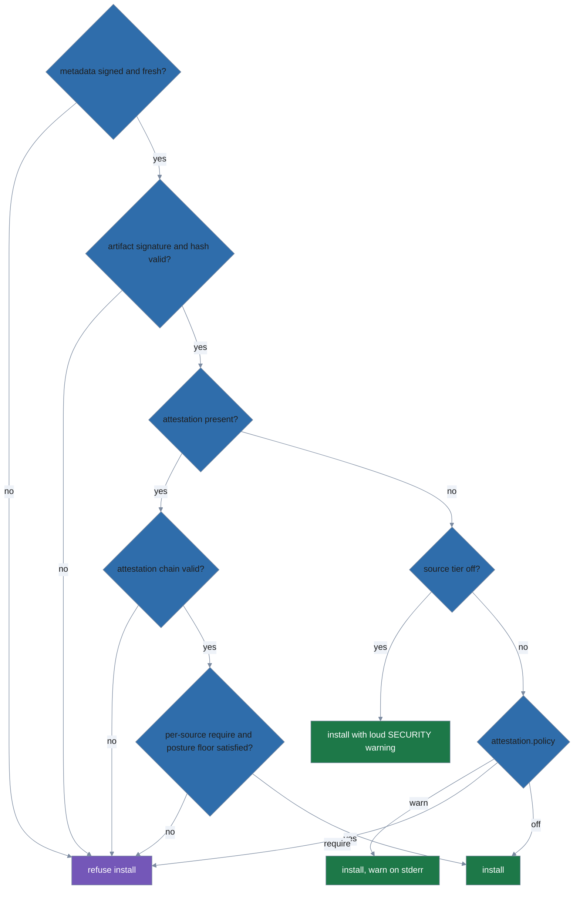

# Trust policy

> Consumer-side guide to what polypkg verifies before it installs anything, and
> the profile settings that tighten or relax that verification. New to polypkg?
> Start at the [README](../README.md). The producer side — signing the metadata
> checked here, and publishing revocations — is
> [Publishing a repository](publishing.md).

A refusal in practice. `hello` installs normally from the publisher whose key the
profile pinned; the published tree is then re-signed under an attacker's key, and
the next fetch is refused while the installed package keeps working:


<sub>Rendered from [`.taskfiles/demo/trust.tape`](../.taskfiles/demo/trust.tape); regenerate with `task demo:render SCENARIO=trust`.</sub>

> **Store the trust root outside the directory it validates.** The profile
> records `trust_root` as a *path*, and `init --trust-root-file` accepts any
> path — including one inside the repository's own published tree, which is
> exactly where `repo init` leaves the operator's copy. A key left there is not
> pinned at all: the same write that swaps the signed metadata swaps the key
> that metadata is checked against, and verification passes. Copy the `.pub`
> somewhere the repository operator cannot write, then point `init` at your
> copy. The demo above only works because the pinned key sits outside the tree
> being overwritten.

## What is verified, always

Everything a source serves is verified before it installs:

1. **Signed, fresh metadata.** A source's trust document and index are minisign-signed and carry a monotonic serial plus an `expires` bound. Metadata past its `expires` (with a small clock-skew tolerance) is refused; the error names the document and its expiry, then spells out the two ways forward — `set accept_expiry_until to grace a frozen mirror, or the publisher must re-sign`. A mirror cannot pin you to an old-but-validly-signed catalog.
2. **Artifact signatures.** Every downloaded artifact is verified against the source's signing key and its BLAKE3 content hash from the signed index.
3. **Attestations.** Publishers sign a per-package [in-toto](https://in-toto.io/) lint attestation and reference it from the signed index (so it cannot be stripped without invalidating the index signature). When an index entry carries attestations, polypkg verifies the whole chain — the attestation signature under the dedicated `attestation` key role, the content-addressed hash bindings, and that the statement's subject digest matches the artifact — in **every** policy mode.

**What an attestation proves: provenance, not benignity.** A verified attestation means the package was lint-checked and published by the holder of the source's signing key and has not been substituted or tampered with since. It does not mean the package is safe to run — vet your sources.

## Attestation policy

The `attestation.policy` setting only governs packages whose index entry carries *no* attestation. A present-but-invalid attestation is always fatal, in every mode:

```yaml
# profile.yaml
attestation:
  policy: warn   # warn (default) | require | off
```

| Policy | Attestation absent | Attestation present but invalid |
|---|---|---|
| `warn` (default) | installs, warns on stderr | **refuses — always** |
| `require` | refuses | **refuses — always** |
| `off` | installs silently | **refuses — always** |

The whole install decision, end to end. Two of its gates get sections of their
own below — a per-package anti-downgrade ratchet on provenance
([§ "Posture floor"](#posture-floor)) and the per-source `attestation.tier: off`
escape hatch ([§ "Disabling a source's gate"](#disabling-a-sources-gate)).



A present-but-invalid attestation lands on the `chain valid? → no` edge, so it
refuses in **every** policy mode; the policy setting is consulted only on the
attestation-*absent* branch.

**Strip-resistance ends at the signer.** In-index references defeat a mirror — it cannot remove an attestation without invalidating the index signature — but not the publisher key itself: a compromised key (or a publisher running `repo build --skip-attestations`) can sign a fresh index with no attestation refs, which the default `warn` policy installs with only a stderr warning. Operators who treat attestation presence as an acceptance criterion must set `policy: require`, which turns attestation disappearance into a refusal.

## Per-source requirements

Beyond the global presence gate, a source may require specific, verified provenance and pin the identities it trusts. The predicate types are the usual supply-chain ones — [SLSA](https://slsa.dev/) provenance in this example:

```yaml
sources:
  order: [acme]
  acme:
    type: polypkg-native
    url: https://packages.acme.example/repo
    trust_root: /etc/polypkg/acme.pub
    attestation:
      require:
        - https://slsa.dev/provenance/v1   # must be present AND builder/offline-verified
      builders:
        allow:
          - key: <base64 ed25519 builder public key>
          - sigstore:
              issuer: https://token.actions.githubusercontent.com
              san: https://github.com/acme/repo/.github/workflows/release.yml@*
```

Each `require` predicate type must be carried, digest-bound to the installed bytes, and verified at an *anchored* tier — a builder-signed [DSSE](https://github.com/secure-systems-lab/dsse) envelope (`builder-verified`) or an offline-verified sigstore bundle (`verified-offline`). A missing or only transport-verified predicate refuses the install. `builders.allow` is the identities you trust: a `key` entry matches a builder-signed attestation's signing key; a `sigstore` entry matches a bundle's Fulcio identity (`issuer` exact; `san` exact or with a single trailing `*`). An empty or omitted allow-list accepts any identity the source's signed trust bundle blesses.

A `key` allow-list defends against a compromised publisher unconditionally — it pins the actual public-key bytes, and a publisher cannot forge a signature under a key it does not hold. A `sigstore` allow-list is weaker on its own: it pins only issuer/SAN strings, whose authenticity otherwise rests on the source-mirrored Fulcio root, so a fully-compromised source could mint a certificate bearing any SAN. Close that gap by also pinning the source's `sigstore_root` ([§ "Pinning a source's sigstore root"](#pinning-a-sources-sigstore-root)): a consumer-side pin is authoritative, and the source-mirrored root is then never consulted. Prefer `key` entries where you can — they need no second pin.

## Pinning a source's sigstore root

**`sigstore_root`** (optional). A consumer-pinned sigstore trust root for this source: `valid_from` (RFC3339), optional `valid_until` (RFC3339, open-ended if absent), `fulcio_ca` (base64 DER Fulcio CA cert chain), `rekor_keys` (base64 Rekor public keys), optional `ctlog_keys`. When set, it is **authoritative** for verifying this source's sigstore-format carried attestations — the root mirrored in the source's trust bundle is **not** consulted.

```yaml
sources:
  acme:
    # ...
    sigstore_root:
      valid_from: "2024-01-01T00:00:00Z"
      fulcio_ca: ["<base64 DER Fulcio root cert>"]
      rekor_keys: ["<base64 Rekor public key>"]
```

This closes a chain-degradation gap: a mirror that controls its own trust bundle could otherwise stand up a Fulcio CA and mint a certificate bearing any identity, forging a `verified-offline` binding; pinning the root defeats that, exactly as pinning a builder key (`builders.allow.key`) defends the builder-signature path.

The pin is window-checked against each attestation's Rekor integrated time, so a pin whose window excludes the attestation is not used (the binding falls back to `verified-transport-only`). When absent, the mirrored root is used (the default).

## Posture floor

polypkg remembers, per package, which provenance predicate types were verified at install time. If a later install of that package would regress — a predicate type that was verified before is now missing, or only transport-verified — the apply is refused, even without an explicit `require`.

This is a trust-on-first-use ratchet against a silent provenance downgrade (a compromised or swapped source quietly dropping its SLSA provenance), and it is keyed by package name across sources, so moving a package to a lower-provenance source is caught too.

To accept a legitimate drop (a publisher genuinely stopped shipping a predicate), pin the exact version in the profile — the same escape hatch the version anti-downgrade guard takes ([§ "Downgrade guard"](#downgrade-guard)). Note that `upgrade` and `install <pkg>@<version>` write exact pins, so they also waive the floor for the packages they touch.

Moving an already-installed package onto a re-publishing mirror trips this floor
for a specific, expected reason; [Mirroring a repository](mirroring.md) covers
that case and how to re-baseline.

## Disabling a source's gate

A source's `attestation` block may set `tier: off` to disable that source's attestation gating — an unattested package installs even under a global `require`, and the per-predicate `require` and posture floor are skipped.

`tier: off` is mutually exclusive with `require`/`builders` (a config carrying both is rejected). Unlike the global `attestation.policy: off` (which quietly accepts unattested packages), a per-source `tier: off` is deliberately LOUD: every `apply` prints an unsuppressible `SECURITY:` warning, the disabled gate is written to the audit log, and each affected package is marked in the generation manifest so `polypkg status -vv` and `polypkg info` keep showing it.

This is a safety valve for a source you must temporarily trust without provenance — not a way to silence attestation.

It is NOT a verification bypass: a package that DOES carry an attestation is still fully verified (a tampered or revoked attestation still refuses the install, from an `off` source too).

## Reading carried provenance tiers

`polypkg status -vv` and `polypkg info` surface each carried attestation's tier (e.g. `builder-verified`, `verified-offline`, `verified-transport-only`). Treat only the anchored tiers (`builder-verified`, `verified-offline`) as trusted provenance; `verified-transport-only` and `bound-unverified` are for inspection only and carry no builder-identity assurance.

The install-time verdict is recorded in the generation manifest: `status -vv` tags each package `[attested]` (with its carried tiers), `[unattested]`, or `[attestation gate OFF]`, and `info <package>` shows an `attestation:` line with the verified predicate type(s) and the policy that was in force at install. Packages installed before attestations existed carry no record and no tag.

## Flagging retroactively revoked builders

`polypkg status` also flags installed packages whose `builder-verified` binding was signed by a builder key that has since been revoked — a key that was trusted at install but appears on a source's revocation list at the last fetch.

The default summary adds a `revoked builders: N package(s)` count, `status -vv` tags each affected package `[builder revoked: <keyid>]`, the `--format json` output carries a `revoked_builders` field, and the command exits non-zero (exit code 3).

This is an offline check: it reflects the revocation state recorded per source **as of the last `plan`/`apply` fetch**, not a live lookup, and it covers **builder-verified** bindings only (retroactive builder-key revocation).

## Flagging retroactively revoked attestations

`polypkg status` also flags installed packages carrying an attestation whose content-hash a configured source has since revoked — a hash that verified cleanly at install but appears on the source's revocation list at the last fetch. The check compares the revoked set against two recorded hashes:

- the top-level `attestation_hash` of a **native** attestation — one the source itself minted and signed. Every package a publisher builds from a source tree gets one by default, and an ingested pre-built artifact gets one when the publisher supplies a `native_attestation`.
- each carried binding's own recorded `attestation_hash`.

So a revoked native attestation is flagged just like a revoked carried one.

(`source:`, `prebuilt:`, and `native_attestation:` in that paragraph are publisher-side keys in a repository manifest — a package entry is built either from a local source tree or from a pre-built artifact. They are unrelated to the profile's per-package `source:` pin described under [Multiple sources](../README.md#multiple-sources). See [Publishing a repository](publishing.md).)

The default summary adds a `revoked attestations: N package(s)` segment (shown only when nonzero), `status -vv` tags each affected package `[attestation revoked: <hash>]`, and the `--format json` output carries a `revoked_attestations` array:

```
revoked attestations: 1 package(s)
```

```json
"revoked_attestations": [
  {"package": "hello", "version": "1.2.3", "attestation_hash": "blake3:445566"}
]
```

The command exits 5 when an installed package carries such a revoked attestation. This is the retroactive twin of install-time hash revocation, which refuses the install outright. Like the revoked-builder check, it is offline — the state recorded per source as of the last fetch, not a live lookup.

When more than one condition applies, the revoked-builder exit 3 takes precedence over the revoked-attestation exit 5, and exit 5 takes precedence over the expired-revocation-list exit 4 (3 > 5 > 4).

## Revocation-list freshness

A source's revocation list is itself signed with an expiry. polypkg records the expiry seen at the last fetch and reports, offline, how close it is to lapsing. Once any source is affected, the default `polypkg status` summary gains a segment:

```
revocation data: 1 expired, 2 expiring soon
```

`status -v` adds a `revocation freshness:` section — one line per non-fresh source with its expiry and an `[EXPIRED 5d ago]` or `[expiring in 9d]` tag. An expired list that an operator grace window (`accept_expiry_until`) still covers also carries `[grace acknowledged]`. Under `--format json` the same data lands in a `revocation_freshness` array:

```json
"revocation_freshness": [
  {"source": "native", "expires": "2026-07-15T00:00:00Z", "state": "expired", "acknowledged": true}
]
```

`state` is `near_expiry` or `expired`. `status` exits 4 when an installed source's enforced revocation list is expired and no open `accept_expiry_until` window covers it; a `near_expiry` list never changes the exit code. A revoked builder (exit 3) or a revoked attestation (exit 5) takes precedence over this expired-list exit 4 (3 > 5 > 4).

How early "expiring soon" fires is set by the `revocation.near_expiry_threshold` config key (default `14d`; accepts the same forms as other age settings — `14d`, `2w`, `12h`). The same threshold drives a fetch-time warning: when `plan` or `apply` fetches a still-valid revocation list already inside the window, it prints a stderr line so you can nudge the publisher before consumers begin rejecting it.

```
WARNING: native revocation list expires 2026-08-01T00:00:00Z (within near-expiry window) — publisher should re-sign
```

## Freshness grace

**`accept_expiry_until`** (optional, RFC3339, per source). Freshness grace for an air-gapped or frozen mirror: when this source's signed metadata (index, trust document, trust bundle, revocation list) has expired, polypkg still accepts it as long as the current time is at or before this deadline.

```yaml
sources:
  native:
    # ...
    accept_expiry_until: "2027-01-01T00:00:00Z"
```

Grace relaxes the wall-clock freshness bound **only** — the anti-rollback serial floor is still enforced, so a mirror can never be pinned to an *older* snapshot. Every `apply`/`plan` that uses grace prints an unsuppressible `SECURITY:` line, and each `apply` records a `metadata.expiry_graced` audit event.

`polypkg status` also surfaces the grace posture offline (recorded per source at the last fetch): a `grace: N source(s)` count on the default summary and, under `-v`, a `freshness grace:` section listing each source's graced documents and flagging `[window EXPIRED]` once the `accept_expiry_until` deadline itself has passed.

A graced revocation list is still fully enforced at its last-known state; only revocations published *after* the frozen snapshot are missed.

## Recovering after a repository is re-created

polypkg remembers the highest serial it has ever seen for a source's metadata (index, trust document, and — if published — trust bundle and revocation list) and refuses any fetch that looks like a rollback.

If a repository is legitimately rebuilt from scratch (new signing key, serials reset to 0), that protection will correctly but unhelpfully treat the rebuild as a downgrade and refuse it. `polypkg source remove <name>` clears the locally-remembered trust state for that source; re-adding it with `polypkg source add <name> ...` re-pins from scratch against the new trust root.

Publishers should never need this: always **increase** a serial to fix a bad release or ship an update — never reuse or lower one.

## Auditing recorded provenance across generations

`polypkg attestation report` aggregates this recorded evidence into a deterministic `polypkg.attestation-report/v1` JSON document, one entry per installed package across every retained generation: its content hash, verified predicate types, tier, verifying key id / builder identity / certificate identity+issuer, the policy in force at install, and the recorded install time.

```
polypkg attestation report --format json    # the canonical audit document
polypkg attestation report                   # a human-readable summary
polypkg attestation report --scope system    # audit the system-scope installs
```

The report is a faithful aggregation of evidence that was already recorded and individually anchored at install time — it is not signed by polypkg. Trust derives from the upstream signatures each recorded hash verifies against, not from any consumer signature. Output is reproducible: identical installed state yields identical bytes (packages are sorted; timestamps are the recorded install times, never the wall clock).

## Downgrade guard

polypkg remembers the highest version each source has offered for every package. A plan that resolves a package *below* that high-water mark is refused only when the source has **withdrawn** its top — the current signed index no longer offers any version at or above the mark. Picking an older version the index still carries (an upper-bounded range, a dependency constraint, a profile pin) is ordinary constraint resolution and is never refused. To knowingly accept a real withdrawal — say the publisher pulled a broken release — pin the exact version in the profile (`version: "=1.2.3"`).
